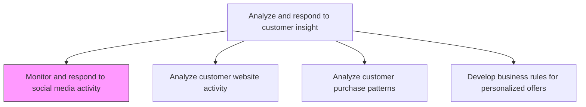
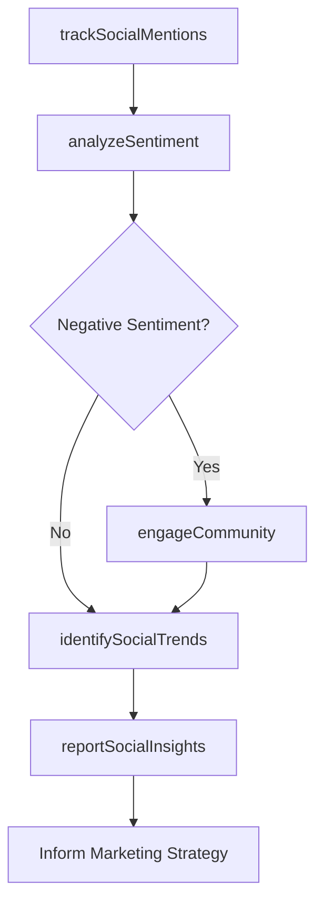

# Monitor and respond to social media activity

> Business-as-Code definition for social media monitoring and engagement. Models the tracking of social media conversations, sentiment analysis, community engagement, and brand reputation management across social platforms.

## Overview

Following postings on social media to promote offerings, raise brand awareness, interact with customers, increase customer engagement and brand loyalty, respond to queries, gauge sentiment regarding company's products or services, and to derive customer insight.

## Process Hierarchy



## GraphDL

```yaml
monitor:
  object: And Respond To Social Media Activity
  actor: SocialMediaManager
  result: SocialMediaInsightsReport
```

## Actions

| Action | Description |
|--------|-------------|
| trackSocialMentions | Monitor brand mentions, hashtags, and keywords across social media platforms in real time |
| analyzeSentiment | Evaluate the tone and sentiment of social conversations about the brand, products, and competitors |
| engageCommunity | Respond to customer queries, comments, and complaints on social platforms to build relationships |
| identifySocialTrends | Detect emerging topics, viral content, and trending conversations relevant to the brand |
| reportSocialInsights | Compile social media performance metrics and customer sentiment data into actionable reports |

## Events

| Event | Description |
|-------|-------------|
| socialMentionsTracked | Brand mentions and keyword alerts collected from social platforms |
| sentimentAnalyzed | Social conversation sentiment scores calculated and categorized |
| communityEngaged | Customer interactions responded to and engagement metrics updated |
| socialTrendsIdentified | Emerging topics and trending conversations flagged for action |
| socialInsightsReported | Social media performance and sentiment reports published |

## Searches

| Search | Description |
|--------|-------------|
| getSocialMentions | Retrieve brand mentions by platform, sentiment, or time period |
| getSentimentTrends | Query sentiment scores and trends over time by topic or product |
| getEngagementMetrics | Access community engagement rates, response times, and interaction volumes |

## Process Flow



## RACI Matrix

| Activity | Responsible | Accountable | Consulted | Informed |
|----------|-------------|-------------|-----------|----------|
| trackSocialMentions | SocialMediaAnalyst | SocialMediaManager | Marketing | PR |
| analyzeSentiment | SocialMediaAnalyst | SocialMediaManager | CustomerInsights | ProductManagement |
| engageCommunity | SocialMediaSpecialist | SocialMediaManager | CustomerService | Legal |
| reportSocialInsights | SocialMediaManager | VP Marketing | Sales | CMO |

## Related Processes

| Process | Relationship |
|---------|-------------|
| 3.3.8.2 Analyze customer website activity | Parallel - social referral traffic analyzed alongside direct website activity |
| 3.3.8.3 Analyze customer purchase patterns | Parallel - social engagement correlated with purchase behavior |
| 3.3.5.3 Execute promotional activities | Upstream - social media is a key promotional channel |

## Related Departments

| Department | Role |
|-----------|------|
| Social Media | Leads social monitoring, engagement, and insight generation |
| Public Relations | Coordinates crisis responses and brand reputation management |
| Customer Service | Escalates and resolves customer complaints surfaced on social media |
| Marketing | Uses social insights to optimize campaign messaging and targeting |

## Related Occupations

| Occupation | Involvement |
|-----------|-------------|
| Social Media Manager | Oversees social monitoring strategy and community engagement |
| Social Media Analyst | Conducts sentiment analysis and produces social performance reports |
| Community Manager | Manages day-to-day social interactions and brand voice |

## KPIs

| KPI | Description | Unit |
|-----|-------------|------|
| Social Sentiment Score | Aggregate positive-to-negative sentiment ratio across platforms | Ratio |
| Average Response Time | Mean time to respond to customer queries on social media | Minutes |
| Social Engagement Rate | Percentage of followers who interact with brand content | % |
| Share of Voice | Brand mention volume relative to competitors on social media | % |

## Usage

```typescript
import { monitorAndRespondToSocialMediaActivity } from '@headlessly/monitor-and-respond-to-social-media-activity'

const socialMonitor = monitorAndRespondToSocialMediaActivity()

// Track brand mentions across social platforms
const mentions = await socialMonitor.trackSocialMentions({
  platforms: ['twitter', 'instagram', 'linkedin', 'facebook', 'tiktok'],
  keywords: ['brand-name', 'product-name', 'competitor-name'],
  period: 'last-7-days',
  alertThreshold: { sentimentDrop: -0.2, volumeSpike: 3.0 }
})

// Analyze sentiment trends and generate insights
const insights = await socialMonitor.reportSocialInsights({
  mentionSetId: mentions.id,
  dimensions: ['platform', 'topic', 'product'],
  benchmarkAgainst: ['previous-period', 'competitor-average'],
  includeActionableRecommendations: true
})
```
