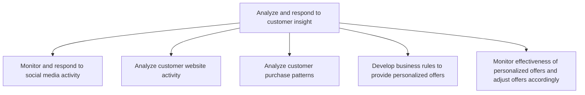
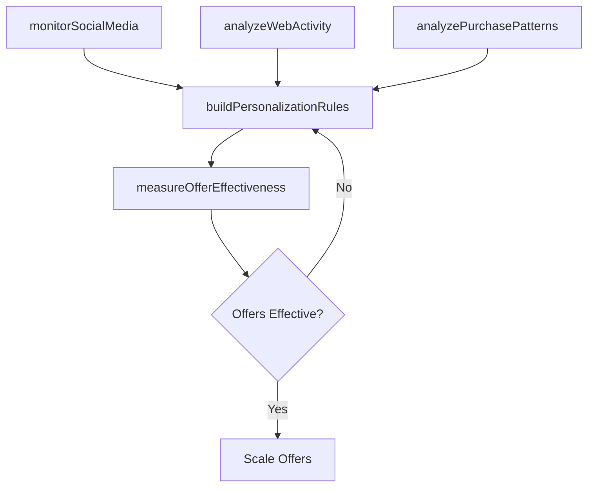

# Analyze and respond to customer insight

> Business-as-Code definition for customer insight analysis and response. Models the monitoring, analysis, and actioning of customer behavioral signals across social media, web activity, and purchase patterns to drive personalized engagement.

## Overview

Reviewing and responding to customer feedback. Create tickets to initiate bug fixes or to propose feature updates. Monitor and track progress.

## Process Hierarchy



## GraphDL

```yaml
analyze:
  object: And Respond To Customer Insight
  actor: CustomerInsightsAnalyst
  result: CustomerInsightActionPlan
```

## Actions

| Action | Description |
|--------|-------------|
| monitorSocialMedia | Track and respond to customer conversations on social media platforms |
| analyzeWebActivity | Examine website user behavior, traffic patterns, and conversion funnels |
| analyzePurchasePatterns | Study customer buying habits and transaction trends |
| buildPersonalizationRules | Create business rules for personalized offers and recommendations |
| measureOfferEffectiveness | Track conversion and revenue impact of personalized offers |

## Events

| Event | Description |
|-------|-------------|
| socialMediaMonitored | Social media sentiment and activity report delivered |
| webActivityAnalyzed | Website user behavior analysis completed |
| purchasePatternsAnalyzed | Customer purchase pattern insights generated |
| personalizationRulesBuilt | Personalization business rules configured and deployed |
| offerEffectivenessMeasured | Personalized offer performance metrics reported |

## Searches

| Search | Description |
|--------|-------------|
| getSocialSentiment | Retrieve social media sentiment and mention data by topic or brand |
| getWebAnalytics | Query website traffic and behavior analytics by page or funnel |
| getPurchaseInsights | Access customer purchase pattern analysis by segment |
| getOfferPerformance | Retrieve personalized offer conversion and revenue data |

## Process Flow



## RACI Matrix

| Activity | Responsible | Accountable | Consulted | Informed |
|----------|-------------|-------------|-----------|----------|
| monitorSocialMedia | SocialMediaManager | MarketingDirector | CustomerService | PR |
| analyzeWebActivity | DigitalAnalyst | VP Marketing | UXDesign | ProductManagement |
| analyzePurchasePatterns | CustomerInsightsAnalyst | CMO | Sales | Finance |
| buildPersonalizationRules | DataScientist | VP Marketing | Engineering | Sales |
| measureOfferEffectiveness | MarketingAnalyst | CMO | Finance | Sales |

## Sub-Processes

| ID | Name | Description |
|----|------|-------------|
| 3.3.8.1 | Monitor and respond to social media activity | Following postings on social media to promote offerings, raise brand awareness, interact with custom |
| 3.3.8.2 | Analyze customer website activity | Examining user activity on company, vendor or reseller websites to improve traffic on and to the web |
| 3.3.8.3 | Analyze customer purchase patterns | Conducting analyses to uncover customer purchasing habits. Detect patterns and categorize users base |
| 3.3.8.4 | Develop business rules to provide personalized offers | Creating formulas for personalized offers, purchasing recommendations and targeted advertisements fo |
| 3.3.8.5 | Monitor effectiveness of personalized offers and adjust offers accordingly | Analyzing how well the targeted offers perform to see whether they result in an increased conversion |

## Related Processes

| Process | Relationship |
|---------|-------------|
| 3.3.7 Track customer management measures | Upstream - customer metrics feed insight analysis |
| 3.2.7 Design and manage customer loyalty program | Parallel - loyalty data provides customer insight |
| 3.3.5 Develop and manage promotional activities | Downstream - insights inform promotional targeting |
| 5.0 Manage Customer Service | Upstream - service interactions generate customer signals |

## Related Departments

| Department | Role |
|-----------|------|
| Customer Insights | Leads customer behavior analysis and insight generation |
| Digital Marketing | Manages web analytics and social media monitoring |
| Data Science | Builds personalization models and recommendation engines |
| Product Management | Acts on customer feedback for feature development |
| Customer Success | Uses insights to improve customer engagement |

## Related Occupations

| Occupation | Involvement |
|-----------|-------------|
| Customer Insights Analyst | Analyzes customer behavior and generates actionable insights |
| Data Scientist | Builds predictive models and personalization algorithms |
| Social Media Manager | Monitors and responds to social media activity |
| Digital Marketing Analyst | Analyzes web traffic and conversion patterns |

## KPIs

| KPI | Description | Unit |
|-----|-------------|------|
| Social Sentiment Score | Average sentiment of social media mentions | Score (-1 to 1) |
| Personalization Conversion Rate | Conversion rate of personalized offers versus generic | % |
| Customer Engagement Score | Composite measure of customer interaction frequency and depth | Score (1-100) |
| Insight-to-Action Time | Average time from insight generation to business response | Days |
| Offer Revenue Uplift | Incremental revenue from personalized offers vs control | % |

## Usage

```typescript
import { analyzeAndRespondToCustomerInsight } from '@headlessly/analyze-and-respond-to-customer-insight'

const insights = analyzeAndRespondToCustomerInsight()

// Analyze purchase patterns by customer segment
const patterns = await insights.analyzePurchasePatterns({
  segments: ['enterprise', 'growth'],
  period: 'last-6-months',
  dimensions: ['frequency', 'recency', 'monetary-value']
})

// Build personalization rules based on insights
const rules = await insights.buildPersonalizationRules({
  insightIds: patterns.insights.map(i => i.id),
  offerTypes: ['discount', 'bundle', 'upgrade'],
  minConfidence: 0.85
})
```
