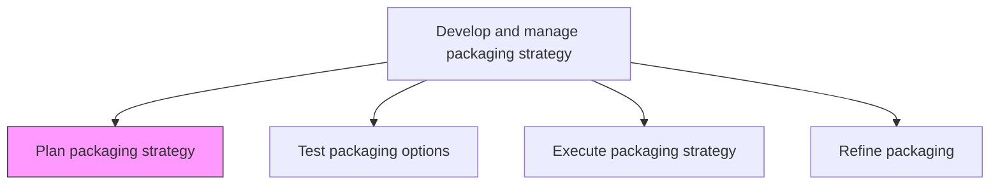
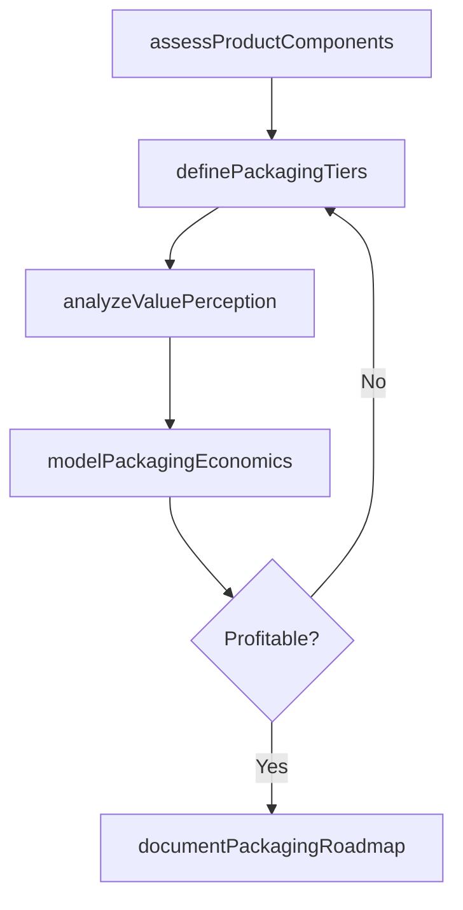

# Plan packaging strategy

> Business-as-Code definition for product and service packaging strategy planning. Models the design of bundling, tiering, and presentation approaches that maximize perceived customer value while optimizing revenue and profitability.

## Overview

Creating a strategic road map for how to package products/services into desirable solutions while increasing profitability. Create a scheme for how the organization will bundle and wrap its products/services into a presentable and sellable offering. Consider what aspects or components of an offering the organization can extract the maximum revenue from, and reduce the less profitable constituents while maintaining a high perceptible value for the customers. Balance maximizing profit with benefits to the customer.

## Process Hierarchy



## GraphDL

```yaml
plan:
  object: Packaging Strategy
  actor: ProductMarketingManager
  result: PackagingStrategyPlan
```

## Actions

| Action | Description |
|--------|-------------|
| assessProductComponents | Inventory product and service components to identify bundling candidates and value drivers |
| definePackagingTiers | Design tiered packaging structures that differentiate offerings by feature set, usage limits, and support levels |
| analyzeValuePerception | Research customer willingness to pay and perceived value for different packaging configurations |
| modelPackagingEconomics | Calculate revenue, margin, and cannibalization impacts for proposed packaging structures |
| documentPackagingRoadmap | Produce the strategic packaging plan with phased rollout timelines and success criteria |

## Events

| Event | Description |
|-------|-------------|
| productComponentsAssessed | Product and service components inventoried and categorized for bundling |
| packagingTiersDefined | Tiered packaging structures designed with feature and pricing differentiation |
| valuePerceptionAnalyzed | Customer value perception research completed for packaging options |
| packagingEconomicsModeled | Revenue and margin projections calculated for proposed packages |
| packagingRoadmapDocumented | Strategic packaging plan finalized with timelines and criteria |

## Searches

| Search | Description |
|--------|-------------|
| getPackagingOptions | Retrieve proposed packaging configurations and their economic projections |
| getComponentInventory | Query product and service components available for bundling |
| getValueResearch | Access customer value perception research data by segment |

## Process Flow



## RACI Matrix

| Activity | Responsible | Accountable | Consulted | Informed |
|----------|-------------|-------------|-----------|----------|
| assessProductComponents | ProductMarketingAnalyst | ProductMarketingManager | ProductManagement | Engineering |
| definePackagingTiers | ProductMarketingManager | VP Marketing | PricingManager | Sales |
| analyzeValuePerception | MarketResearchAnalyst | ProductMarketingManager | CustomerInsights | Finance |
| documentPackagingRoadmap | ProductMarketingManager | VP Marketing | Sales | CMO |

## Related Processes

| Process | Relationship |
|---------|-------------|
| 3.3.9.2 Test packaging options | Downstream - packaging plan is validated through market testing |
| 3.3.4.1 Develop pricing strategies and policies | Parallel - packaging tiers coordinate with pricing strategy |
| 2.1.3 Design and develop products/services | Upstream - product design informs packaging component options |

## Related Departments

| Department | Role |
|-----------|------|
| Product Marketing | Leads packaging strategy development and tier design |
| Product Management | Provides component specifications and feature roadmap input |
| Pricing | Models economic impact and ensures pricing alignment |
| Market Research | Conducts customer value perception studies |

## Related Occupations

| Occupation | Involvement |
|-----------|-------------|
| Product Marketing Manager | Leads packaging strategy design and stakeholder alignment |
| Pricing Analyst | Models revenue and margin impacts of packaging configurations |
| Market Research Analyst | Conducts willingness-to-pay and value perception research |

## KPIs

| KPI | Description | Unit |
|-----|-------------|------|
| Package Margin | Average gross margin across packaging tiers | % |
| Tier Distribution | Percentage of customers in each packaging tier | % |
| Value Perception Score | Customer-reported perceived value of packaging options | Score (1-10) |
| Bundle Attach Rate | Percentage of customers who select bundled versus standalone offerings | % |

## Usage

```typescript
import { planPackagingStrategy } from '@headlessly/plan-packaging-strategy'

const packagingPlan = planPackagingStrategy()

// Define packaging tiers based on component analysis
const tiers = await packagingPlan.definePackagingTiers({
  components: ['core-platform', 'analytics', 'integrations', 'support', 'training'],
  tierCount: 3,
  differentiators: ['feature-access', 'usage-limits', 'support-level', 'sla'],
  targetSegments: ['starter', 'professional', 'enterprise']
})

// Model economic impact of proposed packaging
const economics = await packagingPlan.modelPackagingEconomics({
  tierStructure: tiers.id,
  projectionPeriod: '12-months',
  assumptions: { conversionRate: 0.03, upgradeRate: 0.15, churnReduction: 0.1 },
  cannibalizationModel: 'segment-based'
})
```
