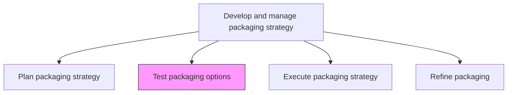
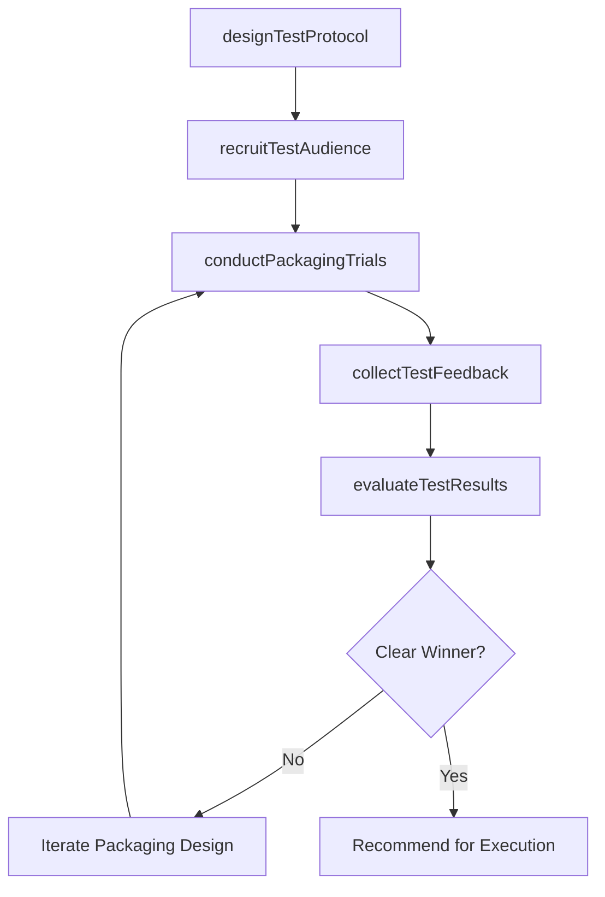

# Test packaging options

> Business-as-Code definition for packaging validation and market testing. Models the piloting of proposed product and service packaging configurations with target audiences through focus groups, A/B tests, and controlled market trials.

## Overview

Piloting the packaged products/services in the market with a test audience. Create trial runs using techniques such as focus groups of the final product, wrapped and bundled.

## Process Hierarchy



## GraphDL

```yaml
test:
  object: Packaging Options
  actor: MarketResearchManager
  result: PackagingTestResults
```

## Actions

| Action | Description |
|--------|-------------|
| designTestProtocol | Define testing methodology, sample size, test duration, and success criteria for packaging validation |
| recruitTestAudience | Select and enroll representative customer segments for packaging pilot testing |
| conductPackagingTrials | Execute focus groups, conjoint analyses, or live market A/B tests of packaging configurations |
| collectTestFeedback | Gather quantitative and qualitative data on customer preferences, willingness to pay, and purchase intent |
| evaluateTestResults | Analyze test outcomes against success criteria to determine which packaging options advance to execution |

## Events

| Event | Description |
|-------|-------------|
| testProtocolDesigned | Testing methodology and success criteria defined and approved |
| testAudienceRecruited | Representative customer segments enrolled for pilot testing |
| packagingTrialsConducted | Focus groups or market trials completed for packaging options |
| testFeedbackCollected | Customer preference and purchase intent data gathered from trials |
| testResultsEvaluated | Packaging test outcomes analyzed and winning options identified |

## Searches

| Search | Description |
|--------|-------------|
| getTestResults | Retrieve packaging test outcomes by option, segment, or test method |
| getTestFeedback | Query qualitative and quantitative feedback from packaging trials |
| getTestProtocols | Access active and historical test protocol definitions |

## Process Flow



## RACI Matrix

| Activity | Responsible | Accountable | Consulted | Informed |
|----------|-------------|-------------|-----------|----------|
| designTestProtocol | MarketResearchAnalyst | MarketResearchManager | ProductMarketing | Finance |
| recruitTestAudience | MarketResearchAnalyst | MarketResearchManager | Sales | CustomerInsights |
| conductPackagingTrials | MarketResearchAnalyst | MarketResearchManager | UXResearch | ProductManagement |
| evaluateTestResults | MarketResearchManager | VP Marketing | ProductMarketing | CMO |

## Related Processes

| Process | Relationship |
|---------|-------------|
| 3.3.9.1 Plan packaging strategy | Upstream - packaging plan defines configurations to be tested |
| 3.3.9.3 Execute packaging strategy | Downstream - winning test options advance to market execution |
| 3.3.4.3 Set and communicate volume and term-based pricing | Parallel - pricing tested alongside packaging configurations |

## Related Departments

| Department | Role |
|-----------|------|
| Market Research | Leads packaging test design, execution, and analysis |
| Product Marketing | Defines packaging options and interprets test results |
| UX Research | Conducts usability testing for packaging presentation |
| Sales | Provides field input on customer packaging preferences |

## Related Occupations

| Occupation | Involvement |
|-----------|-------------|
| Market Research Manager | Oversees packaging test program and validates methodology |
| Market Research Analyst | Designs and executes packaging trials and analyzes results |
| Product Marketing Manager | Defines packaging options to test and acts on findings |

## KPIs

| KPI | Description | Unit |
|-----|-------------|------|
| Test Completion Rate | Percentage of planned packaging tests executed successfully | % |
| Statistical Significance | Confidence level achieved in packaging preference tests | % |
| Purchase Intent Lift | Increase in stated purchase intent for winning packaging options | % |
| Time to Test Completion | Average calendar days from test design to results delivery | Days |

## Usage

```typescript
import { testPackagingOptions } from '@headlessly/test-packaging-options'

const packagingTest = testPackagingOptions()

// Design and conduct packaging A/B test
const trial = await packagingTest.conductPackagingTrials({
  options: ['tier-3-standard', 'tier-3-premium-bundle', 'tier-3-usage-based'],
  method: 'conjoint-analysis',
  sampleSize: 500,
  segments: ['smb', 'mid-market', 'enterprise'],
  duration: '14-days'
})

// Evaluate test results and identify winning configuration
const results = await packagingTest.evaluateTestResults({
  trialId: trial.id,
  successCriteria: { purchaseIntentLift: 0.1, willnessToPayIncrease: 0.05 },
  confidenceLevel: 0.95,
  includeSegmentBreakdown: true
})
```
