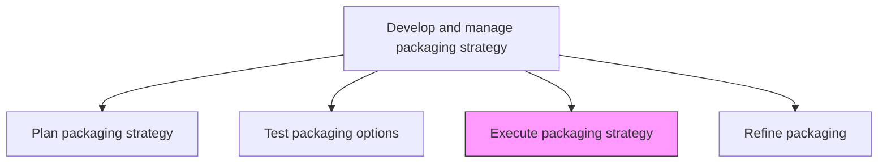
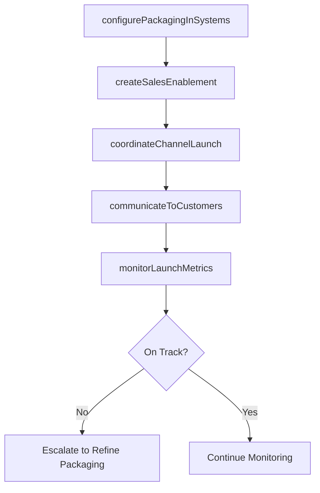

# Execute packaging strategy

> Business-as-Code definition for packaging strategy implementation. Models the deployment of validated packaging configurations into market, including sales enablement, system configuration, and coordinated launch across all customer-facing channels.

## Overview

Implementing the final packaging. Put into action the packaging strategy in light of the insights accumulated from testing various options.

## Process Hierarchy



## GraphDL

```yaml
execute:
  object: Packaging Strategy
  actor: ProductMarketingManager
  result: PackagingLaunchRecord
```

## Actions

| Action | Description |
|--------|-------------|
| configurePackagingInSystems | Set up approved packaging tiers, bundles, and configurations in billing, CRM, and e-commerce platforms |
| createSalesEnablement | Develop sales collateral, battle cards, and training materials for the new packaging structure |
| coordinateChannelLaunch | Synchronize packaging rollout across direct sales, partner channels, and self-service platforms |
| communicateToCustomers | Notify existing customers of packaging changes and provide migration paths where applicable |
| monitorLaunchMetrics | Track early adoption, conversion, and revenue metrics following packaging deployment |

## Events

| Event | Description |
|-------|-------------|
| packagingConfiguredInSystems | Packaging tiers and bundles configured in billing and sales platforms |
| salesEnablementCreated | Sales training materials and collateral produced for new packaging |
| channelLaunchCoordinated | Packaging rollout synchronized across all customer-facing channels |
| customersCommunicated | Existing customers notified of packaging changes with migration guidance |
| launchMetricsMonitored | Early post-launch performance metrics collected and reviewed |

## Searches

| Search | Description |
|--------|-------------|
| getLaunchStatus | Retrieve packaging launch progress by channel and system |
| getAdoptionMetrics | Query early adoption and conversion data for new packaging tiers |
| getMigrationStatus | Access customer migration progress from old to new packaging |

## Process Flow



## RACI Matrix

| Activity | Responsible | Accountable | Consulted | Informed |
|----------|-------------|-------------|-----------|----------|
| configurePackagingInSystems | SystemsAdmin | ProductMarketingManager | BillingOps | IT |
| createSalesEnablement | ProductMarketingAnalyst | ProductMarketingManager | SalesEnablement | Sales |
| coordinateChannelLaunch | ProductMarketingManager | VP Marketing | ChannelManagers | CMO |
| monitorLaunchMetrics | MarketingAnalyst | ProductMarketingManager | Finance | Sales |

## Related Processes

| Process | Relationship |
|---------|-------------|
| 3.3.9.2 Test packaging options | Upstream - validated test results inform which packages to launch |
| 3.3.9.4 Refine packaging | Downstream - post-launch performance triggers packaging refinement |
| 3.3.4.4 Communicate and implement price changes | Parallel - pricing changes coordinated with packaging rollout |

## Related Departments

| Department | Role |
|-----------|------|
| Product Marketing | Leads packaging execution and channel coordination |
| Sales Enablement | Trains sales teams on new packaging structures |
| Billing Operations | Configures packaging in billing and subscription systems |
| Channel Management | Coordinates rollout across partner and reseller channels |

## Related Occupations

| Occupation | Involvement |
|-----------|-------------|
| Product Marketing Manager | Leads packaging launch coordination and go-to-market execution |
| Sales Enablement Manager | Develops training and collateral for sales team readiness |
| Marketing Operations Analyst | Configures packaging in marketing automation and CRM systems |

## KPIs

| KPI | Description | Unit |
|-----|-------------|------|
| Launch On-Time Delivery | Percentage of packaging launches delivered on scheduled date | % |
| Sales Readiness Score | Percentage of sales reps certified on new packaging within launch window | % |
| New Package Adoption Rate | Percentage of new customers selecting updated packaging options | % |
| Customer Migration Rate | Percentage of existing customers migrated to new packaging within target period | % |

## Usage

```typescript
import { executePackagingStrategy } from '@headlessly/execute-packaging-strategy'

const packagingExecution = executePackagingStrategy()

// Configure packaging in billing and sales systems
const config = await packagingExecution.configurePackagingInSystems({
  tiers: ['starter', 'professional', 'enterprise'],
  systems: ['stripe-billing', 'salesforce-cpq', 'website-pricing-page'],
  effectiveDate: '2026-04-01',
  migrationRules: { grandfatherExisting: true, graceperiod: '90-days' }
})

// Monitor post-launch adoption metrics
const metrics = await packagingExecution.monitorLaunchMetrics({
  launchId: config.launchId,
  period: 'first-30-days',
  metrics: ['adoption-rate', 'tier-distribution', 'average-deal-size', 'conversion-rate'],
  compareAgainst: 'pre-launch-baseline'
})
```
