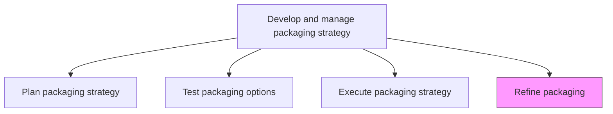
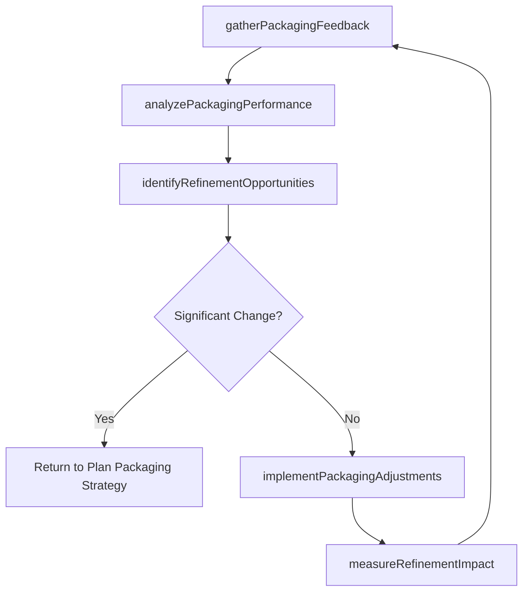

# Refine packaging

> Business-as-Code definition for packaging optimization and continuous improvement. Models the iterative adjustment of product and service packaging based on market feedback, sales performance data, and evolving customer needs.

## Overview

Fine-tuning the packaging that has been developed and tested using insights gleaned from feedback.

## Process Hierarchy



## GraphDL

```yaml
refine:
  object: Packaging
  actor: ProductMarketingManager
  result: RefinedPackagingSpecification
```

## Actions

| Action | Description |
|--------|-------------|
| gatherPackagingFeedback | Collect customer feedback, sales team input, and market data on current packaging performance |
| analyzePackagingPerformance | Evaluate packaging tier adoption, upgrade and downgrade patterns, and revenue contribution |
| identifyRefinementOpportunities | Pinpoint specific packaging elements that can be improved based on performance and feedback data |
| implementPackagingAdjustments | Deploy incremental changes to packaging tiers, bundling, naming, or feature allocation |
| measureRefinementImpact | Track the performance impact of packaging adjustments on conversion, revenue, and customer satisfaction |

## Events

| Event | Description |
|-------|-------------|
| packagingFeedbackGathered | Customer and sales feedback on packaging collected and organized |
| packagingPerformanceAnalyzed | Tier adoption and revenue contribution data evaluated |
| refinementOpportunitiesIdentified | Specific packaging improvement areas documented |
| packagingAdjustmentsImplemented | Incremental packaging changes deployed to market |
| refinementImpactMeasured | Performance impact of packaging adjustments quantified |

## Searches

| Search | Description |
|--------|-------------|
| getPackagingFeedback | Retrieve customer and sales team feedback on current packaging by tier or segment |
| getRefinementHistory | Query historical packaging adjustments and their measured outcomes |
| getPackagingPerformance | Access packaging tier performance metrics by adoption, revenue, and satisfaction |

## Process Flow



## RACI Matrix

| Activity | Responsible | Accountable | Consulted | Informed |
|----------|-------------|-------------|-----------|----------|
| gatherPackagingFeedback | ProductMarketingAnalyst | ProductMarketingManager | Sales | CustomerSuccess |
| analyzePackagingPerformance | MarketingAnalyst | ProductMarketingManager | Finance | Pricing |
| identifyRefinementOpportunities | ProductMarketingManager | VP Marketing | ProductManagement | Sales |
| measureRefinementImpact | MarketingAnalyst | ProductMarketingManager | Finance | CMO |

## Related Processes

| Process | Relationship |
|---------|-------------|
| 3.3.9.3 Execute packaging strategy | Upstream - post-launch performance data triggers refinement cycles |
| 3.3.9.1 Plan packaging strategy | Feedback - major refinements may require returning to strategic planning |
| 3.3.7.4 Analyze customer metrics | Parallel - customer metrics inform packaging refinement priorities |

## Related Departments

| Department | Role |
|-----------|------|
| Product Marketing | Leads packaging refinement cycles and implements adjustments |
| Sales | Provides frontline feedback on packaging effectiveness and customer objections |
| Customer Success | Reports packaging-related friction and expansion barriers |
| Finance | Validates revenue impact of packaging refinements |

## Related Occupations

| Occupation | Involvement |
|-----------|-------------|
| Product Marketing Manager | Leads packaging refinement strategy and prioritization |
| Marketing Analyst | Analyzes packaging performance data and measures refinement impact |
| Customer Success Manager | Provides customer perspective on packaging fit and friction points |

## KPIs

| KPI | Description | Unit |
|-----|-------------|------|
| Refinement Cycle Frequency | Number of packaging refinement iterations per year | Count |
| Refinement Revenue Impact | Revenue change attributable to packaging adjustments | % |
| Customer Satisfaction Delta | Change in packaging-related satisfaction scores after refinements | Points |
| Upgrade Rate Improvement | Increase in tier upgrade rate following packaging refinement | % |

## Usage

```typescript
import { refinePackaging } from '@headlessly/refine-packaging'

const packagingRefinement = refinePackaging()

// Gather and analyze packaging feedback
const feedback = await packagingRefinement.gatherPackagingFeedback({
  sources: ['customer-surveys', 'sales-team-input', 'support-tickets', 'usage-analytics'],
  tiers: ['starter', 'professional', 'enterprise'],
  period: 'last-quarter'
})

// Identify and implement refinement opportunities
const refinements = await packagingRefinement.implementPackagingAdjustments({
  feedbackId: feedback.id,
  adjustmentTypes: ['feature-reallocation', 'tier-naming', 'bundle-composition'],
  rolloutStrategy: 'gradual',
  measurementPeriod: '30-days'
})
```
