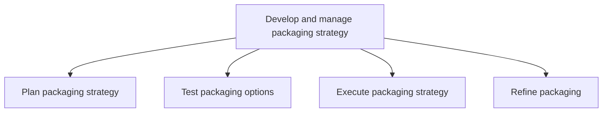
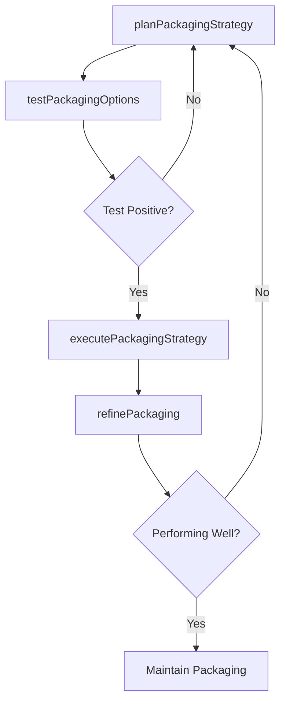

# Develop and manage packaging strategy

> Business-as-Code definition for product and service packaging strategy. Models the strategic planning, testing, execution, and refinement of how products and services are bundled, presented, and delivered to maximize market appeal and customer value.

## Overview

Creating, executing, and administering a strategic road map for packaging products/services. Determine how to package products/services into finished offerings that can be directly marketed to prospective customers. Consider physicality, perishability, and shelf-life. Develop a strategy for packaging products/services. Test alternatives. Collect feedback. Refine the option chosen for execution. Have marketing, product development, and supply chain functions work together to develop sound packaging.

## Process Hierarchy



## GraphDL

```yaml
develop:
  object: And Manage Packaging Strategy
  actor: PackagingStrategyManager
  result: PackagingPlan
```

## Actions

| Action | Description |
|--------|-------------|
| planPackagingStrategy | Define packaging objectives, bundles, and go-to-market presentation |
| testPackagingOptions | Pilot packaging alternatives with target customer segments |
| executePackagingStrategy | Implement approved packaging across all channels and SKUs |
| refinePackaging | Optimize packaging based on market feedback and performance data |

## Events

| Event | Description |
|-------|-------------|
| packagingStrategyPlanned | Packaging strategy and bundle definitions approved |
| packagingOptionsTested | Packaging pilot tests completed with results |
| packagingStrategyExecuted | New packaging launched across channels |
| packagingRefined | Packaging optimizations implemented based on feedback |

## Searches

| Search | Description |
|--------|-------------|
| getPackagingOptions | Retrieve current and proposed packaging configurations |
| getPackagingTestResults | Access packaging test data and customer feedback |
| getPackagingPerformance | Query packaging performance metrics by product or channel |

## Process Flow



## RACI Matrix

| Activity | Responsible | Accountable | Consulted | Informed |
|----------|-------------|-------------|-----------|----------|
| planPackagingStrategy | PackagingStrategyManager | VP Marketing | ProductManagement | SupplyChain |
| testPackagingOptions | ProductMarketingManager | PackagingStrategyManager | UXResearch | Sales |
| executePackagingStrategy | PackagingStrategyManager | VP Marketing | Operations | Sales |
| refinePackaging | PackagingStrategyManager | VP Marketing | CustomerInsights | ProductManagement |

## Sub-Processes

| ID | Name | Description |
|----|------|-------------|
| 3.3.9.1 | Plan packaging strategy | Creating a strategic road map for how to package products/services into desirable solutions while in |
| 3.3.9.2 | Test packaging options | Piloting the packaged products/services in the market with a test audience. Create trial runs using  |
| 3.3.9.3 | Execute packaging strategy | Implementing the final packaging. Put into action the packaging strategy in light of the insights ac |
| 3.3.9.4 | Refine packaging | Fine-tuning the packaging that has been developed and tested using insights gleaned from feedback. |

## Related Processes

| Process | Relationship |
|---------|-------------|
| 3.2.1 Define offering and customer value proposition | Upstream - value proposition shapes packaging design |
| 3.3.4 Develop and manage pricing | Parallel - pricing tiers align with packaging bundles |
| 3.3.10 Manage product marketing content | Downstream - packaging informs content requirements |
| 4.0 Deliver Products and Services | Downstream - packaging decisions affect fulfillment |

## Related Departments

| Department | Role |
|-----------|------|
| Product Marketing | Leads packaging strategy and bundle definition |
| Product Management | Defines product features within each package tier |
| Design | Creates visual and structural packaging designs |
| Supply Chain | Manages packaging production and logistics |
| Sales | Provides customer feedback on packaging effectiveness |

## Related Occupations

| Occupation | Involvement |
|-----------|-------------|
| Packaging Strategy Manager | Designs and oversees packaging strategy lifecycle |
| Product Marketing Manager | Defines bundle configurations and market positioning |
| UX Researcher | Tests packaging concepts with target audiences |
| Operations Manager | Ensures packaging feasibility in production and delivery |

## KPIs

| KPI | Description | Unit |
|-----|-------------|------|
| Package Adoption Rate | Percentage of customers selecting each package tier | % |
| Bundle Attach Rate | Frequency of add-on items purchased with primary package | % |
| Packaging Test Win Rate | Percentage of packaging tests producing positive results | % |
| Average Revenue Per Package | Mean revenue generated by each packaging option | USD |

## Usage

```typescript
import { developAndManagePackagingStrategy } from '@headlessly/develop-and-manage-packaging-strategy'

const packaging = developAndManagePackagingStrategy()

// Plan packaging strategy for a product line
const strategy = await packaging.planPackagingStrategy({
  productLine: 'platform',
  tiers: ['starter', 'professional', 'enterprise'],
  bundleOptions: ['core', 'analytics-addon', 'support-addon']
})

// Test packaging with target segment
const testResults = await packaging.testPackagingOptions({
  strategyId: strategy.id,
  testSegment: 'mid-market',
  sampleSize: 500,
  duration: { weeks: 4 }
})
```
