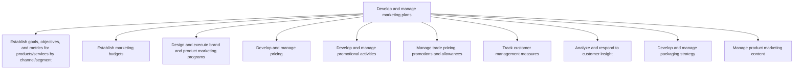
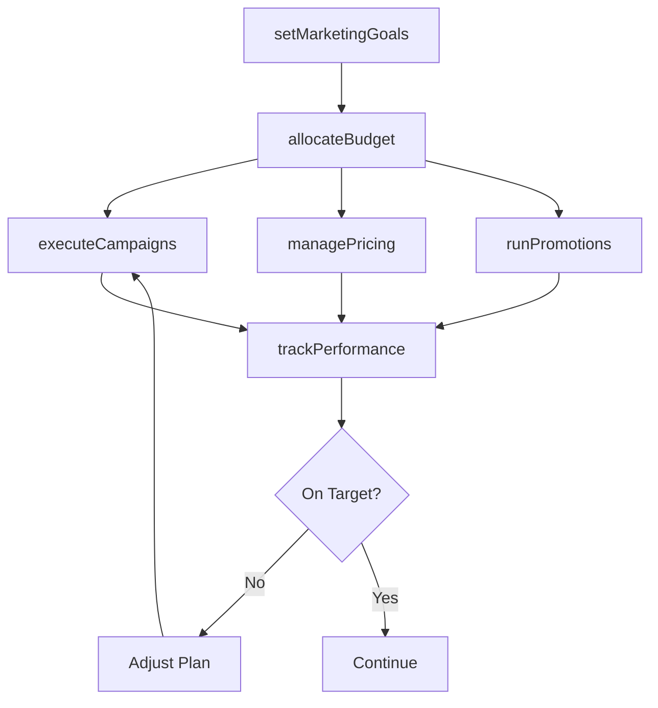

# Develop and manage marketing plans

> Business-as-Code definition for operational marketing plan management. Models the execution of marketing strategies through goal setting, budgeting, campaign design, pricing management, promotions, customer analytics, and content management.

## Overview

Translating marketing strategy into executable operational plans. Setting channel and segment-specific goals, allocating budgets, designing and executing campaigns, managing pricing and promotions, tracking customer metrics, responding to customer insights, managing packaging, and maintaining product marketing content across all customer touchpoints.

## Process Hierarchy



## GraphDL

```yaml
develop:
  object: And Manage Marketing Plans
  actor: MarketingPlanningManager
  result: MarketingExecutionPlan
```

## Actions

| Action | Description |
|--------|-------------|
| setMarketingGoals | Define measurable objectives for products by channel and segment |
| allocateBudget | Distribute marketing budget across campaigns and channels |
| executeCampaigns | Design and launch brand and product marketing programs |
| managePricing | Implement and monitor pricing across product portfolio |
| runPromotions | Plan, test, and execute promotional activities |
| trackPerformance | Measure customer metrics and marketing plan effectiveness |

## Events

| Event | Description |
|-------|-------------|
| marketingGoalsSet | Marketing objectives approved for all channels and segments |
| budgetAllocated | Marketing budget distributed and approved |
| campaignsExecuted | Marketing campaigns launched across channels |
| pricingManaged | Pricing plan implemented and monitored |
| promotionsRun | Promotional activities executed and measured |
| performanceTracked | Marketing performance metrics reported to stakeholders |

## Searches

| Search | Description |
|--------|-------------|
| getMarketingPlan | Retrieve current marketing plan by product or segment |
| getCampaignPerformance | Query campaign metrics and ROI data |
| getBudgetUtilization | Retrieve budget allocation and spend data by channel |
| getPromotionResults | Access promotional campaign results and learnings |

## Process Flow



## RACI Matrix

| Activity | Responsible | Accountable | Consulted | Informed |
|----------|-------------|-------------|-----------|----------|
| setMarketingGoals | MarketingPlanningManager | CMO | Sales | Finance |
| allocateBudget | MarketingPlanningManager | CFO | CMO | ExecutiveTeam |
| executeCampaigns | CampaignManager | MarketingDirector | Creative | Sales |
| managePricing | PricingManager | CMO | Finance | Sales |
| trackPerformance | MarketingAnalyst | CMO | Finance | ExecutiveTeam |

## Sub-Processes

| ID | Name | Description |
|----|------|-------------|
| 3.3.1 | Establish goals, objectives, and metrics for products/services by channel/segment | Determining what to achieve by marketing. Create qualitative and quantitative targets. Establish met |
| 3.3.2 | Establish marketing budgets | Creating a budget for the organization's marketing efforts, in line with the business-wide strategic |
| 3.3.3 | Design and execute brand and product marketing programs | Designing, developing, and executing integrated brand and product marketing programs across all channels including advertising, collateral, media planning, and campaign performance assessment. |
| 3.3.4 | Develop and manage pricing | Determining and maintaining a pricing mechanism based on forecasted sales and that enables a pricing |
| 3.3.5 | Develop and manage promotional activities | Conceptualizing, testing, and executing product/service/brand promotions. Once a promotion has launc |
| 3.3.6 | Manage trade pricing, promotions and allowances | Managing pricing, promotional programs, and allowances offered to trade customers including distributors, wholesalers, and retail partners through investment planning, execution, and profitability analysis. |
| 3.3.7 | Track customer management measures | Collating all customer-centered metrics. The objective is to create a big-picture view of the custom |
| 3.3.8 | Analyze and respond to customer insight | Reviewing and responding to customer feedback. Create tickets to initiate bug fixes or to propose fe |
| 3.3.9 | Develop and manage packaging strategy | Creating, executing, and administering a strategic road map for packaging products/services. Determi |
| 3.3.10 | Manage product marketing content | Creating descriptions of products that are promotional and informative in content in order to initia |

## Related Processes

| Process | Relationship |
|---------|-------------|
| 3.2 Develop marketing strategy | Upstream - strategy provides direction for plan execution |
| 3.4 Develop trade customer sales strategy | Parallel - marketing and sales plans must be coordinated |
| 3.5 Develop and manage sales plans | Downstream - marketing plans generate demand for sales |

## Related Departments

| Department | Role |
|-----------|------|
| Marketing | Owns plan development, campaign execution, and performance tracking |
| Finance | Controls budget allocation and ROI measurement |
| Sales | Provides demand feedback and coordinates with sales plans |
| Creative | Produces campaign assets and content |
| Pricing | Manages pricing execution and competitive monitoring |

## Related Occupations

| Occupation | Involvement |
|-----------|-------------|
| Marketing Planning Manager | Develops and coordinates marketing execution plans |
| Campaign Manager | Designs and executes marketing campaigns |
| Pricing Analyst | Implements and monitors pricing strategies |
| Marketing Analyst | Tracks performance metrics and generates insights |

## KPIs

| KPI | Description | Unit |
|-----|-------------|------|
| Marketing ROI | Return on total marketing investment | % |
| Budget Utilization | Percentage of marketing budget spent vs planned | % |
| Campaign Conversion Rate | Percentage of campaign targets achieving desired action | % |
| Customer Acquisition Cost | Average cost to acquire a new customer | USD |
| Marketing Qualified Leads | Number of leads meeting marketing qualification criteria | Count |

## Usage

```typescript
import { developAndManageMarketingPlans } from '@headlessly/develop-and-manage-marketing-plans'

const plans = developAndManageMarketingPlans()

// Set marketing goals for the quarter
const goals = await plans.setMarketingGoals({
  quarter: 'Q1-2026',
  targets: {
    leadGeneration: 5000,
    brandAwareness: 0.45,
    campaignROI: 3.5
  }
})

// Track performance across all active campaigns
const performance = await plans.trackPerformance({
  period: 'Q1-2026',
  breakdownBy: ['channel', 'segment', 'campaign']
})
```
