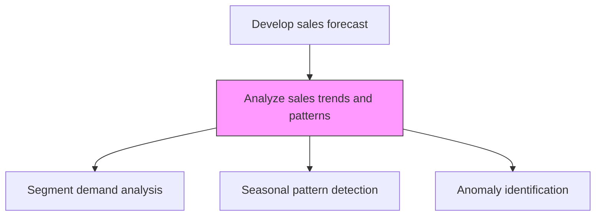
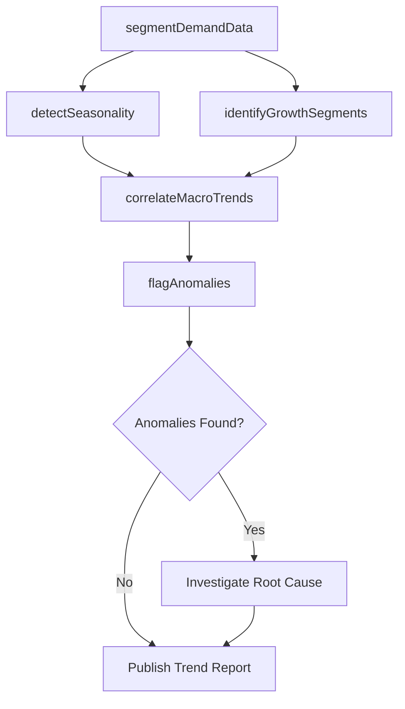

# Analyze sales trends and patterns

> Business-as-Code definition for sales trend and pattern analysis. Models the examination of historical sales order data to identify demand patterns, seasonal cycles, segment growth trajectories, and anomalies that inform forecasting.

## Overview

Analyzing sales order data to identify patterns in order to capitalize on emerging trends in the industry or the economy. Closely examine the directory of sales orders. Discern any patterns from this index, which is representative of the demand for the organization's offerings. Identify trends among the various segments of the organization's customer base to create forecasts. Glean patterns from this analysis, including the triangulation of segments that are showing the most growth in demand or those that represent the highest decline revenue, industry-wide trends such as decline/boost in overall demand, and any unusual trends that lie outside of the organization's expectations.

## Process Hierarchy



## GraphDL

```yaml
analyze:
  object: Sales Trends And Patterns
  actor: SalesForecastAnalyst
  result: TrendAnalysisReport
```

## Actions

| Action | Description |
|--------|-------------|
| segmentDemandData | Break down sales data by customer segment, product line, and geography |
| detectSeasonality | Identify recurring seasonal and cyclical patterns in order volume |
| identifyGrowthSegments | Pinpoint customer segments showing accelerating demand |
| flagAnomalies | Detect unusual spikes or declines outside expected variance |
| correlateMacroTrends | Map sales patterns against industry and economic indicators |

## Events

| Event | Description |
|-------|-------------|
| demandDataSegmented | Sales data segmented and ready for pattern analysis |
| seasonalityDetected | Seasonal and cyclical patterns identified and documented |
| growthSegmentsIdentified | High-growth and declining segments flagged |
| anomaliesFlagged | Unusual trends identified for further investigation |
| trendReportPublished | Complete trend analysis report delivered to stakeholders |

## Searches

| Search | Description |
|--------|-------------|
| getSalesTrends | Retrieve trend data by product, segment, or time period |
| getSeasonalPatterns | Access identified seasonal patterns for a product or region |
| getGrowthSegments | List segments ranked by demand growth rate |
| getAnomalyLog | Retrieve flagged anomalies with contextual data |

## Process Flow



## RACI Matrix

| Activity | Responsible | Accountable | Consulted | Informed |
|----------|-------------|-------------|-----------|----------|
| segmentDemandData | SalesForecastAnalyst | SalesOperationsManager | IT | Sales |
| detectSeasonality | SalesForecastAnalyst | SalesOperationsManager | Marketing | Finance |
| identifyGrowthSegments | SalesForecastAnalyst | VP Sales | ProductManagement | ExecutiveTeam |
| flagAnomalies | SalesForecastAnalyst | SalesOperationsManager | Finance | VP Sales |

## Related Processes

| Process | Relationship |
|---------|-------------|
| 3.4.1.1 Gather current and historic order information | Upstream - provides raw order data for analysis |
| 3.4.1.3 Generate sales forecast | Downstream - trend insights feed forecast models |
| 3.4.1.5 Analyze historical and planned promotions and events | Parallel - promotional effects contextualize trends |
| 3.1.1 Perform customer and market intelligence analysis | Upstream - market intelligence enriches trend interpretation |

## Related Departments

| Department | Role |
|-----------|------|
| Sales Operations | Owns the trend analysis process and tools |
| Finance | Validates revenue trends against financial records |
| Marketing | Provides campaign data that explains demand shifts |
| Product Management | Uses segment growth data for portfolio decisions |

## Related Occupations

| Occupation | Involvement |
|-----------|-------------|
| Sales Forecast Analyst | Performs statistical trend analysis |
| Data Scientist | Builds predictive models from sales patterns |
| Revenue Operations Analyst | Integrates trend data with pipeline metrics |
| Market Research Analyst | Provides industry context for observed trends |

## KPIs

| KPI | Description | Unit |
|-----|-------------|------|
| Trend Detection Accuracy | Percentage of predicted trends that materialize | % |
| Segment Coverage | Percentage of revenue-generating segments analyzed | % |
| Anomaly Detection Rate | Number of significant anomalies identified per cycle | Count |
| Analysis Cycle Time | Time to complete a full trend analysis iteration | Days |

## Usage

```typescript
import { analyzeSalesTrendsAndPatterns } from '@headlessly/analyze-sales-trends-and-patterns'

const trends = analyzeSalesTrendsAndPatterns()

// Segment demand data across product lines
const segments = await trends.segmentDemandData({
  dimensions: ['product-line', 'region', 'customer-tier'],
  period: 'last-24-months',
  granularity: 'monthly'
})

// Identify high-growth segments
const growth = await trends.identifyGrowthSegments({
  minGrowthRate: 0.10,
  minRevenueThreshold: 50000
})
```
