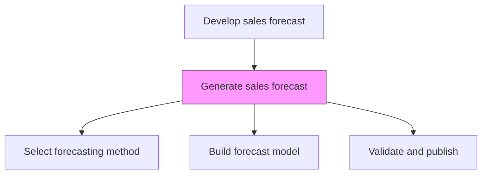
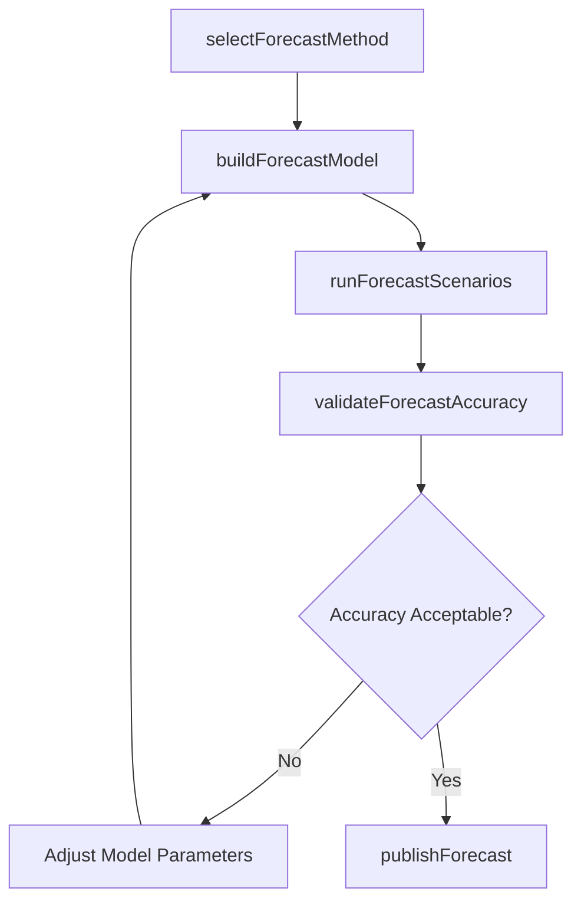

# Generate sales forecast

> Business-as-Code definition for sales forecast generation. Models the creation of demand projections using statistical methods, pipeline data, and judgmental inputs to estimate future sales across products, territories, and time horizons.

## Overview

Calculating the future demand for the organization's products/services. Use the trends and patterns identified in the sales data to estimate future demand. Use forecast to prepare for future customer demand and to recalibrate the strategic course of functions and business units.

## Process Hierarchy



## GraphDL

```yaml
generate:
  object: Sales Forecast
  actor: SalesForecastAnalyst
  result: SalesForecastModel
```

## Actions

| Action | Description |
|--------|-------------|
| selectForecastMethod | Choose statistical, pipeline-weighted, or judgmental forecasting approach |
| buildForecastModel | Construct the forecast model using historical data and trend inputs |
| runForecastScenarios | Execute best-case, worst-case, and most-likely demand scenarios |
| validateForecastAccuracy | Compare forecast outputs against known benchmarks and sanity checks |
| publishForecast | Distribute approved forecast to planning and operations teams |

## Events

| Event | Description |
|-------|-------------|
| forecastMethodSelected | Forecasting methodology chosen and configured |
| forecastModelBuilt | Forecast model constructed with input data |
| forecastScenariosRun | Multiple demand scenarios generated |
| forecastValidated | Forecast accuracy verified against benchmarks |
| forecastPublished | Final forecast approved and distributed |

## Searches

| Search | Description |
|--------|-------------|
| getForecastByProduct | Retrieve demand forecast for specific products or SKUs |
| getForecastByTerritory | Access territorial sales projections |
| getScenarioComparison | Compare outputs across different forecast scenarios |
| getForecastAccuracyHistory | Retrieve historical forecast accuracy metrics |

## Process Flow



## RACI Matrix

| Activity | Responsible | Accountable | Consulted | Informed |
|----------|-------------|-------------|-----------|----------|
| selectForecastMethod | SalesForecastAnalyst | SalesOperationsManager | Finance | VP Sales |
| buildForecastModel | SalesForecastAnalyst | SalesOperationsManager | DataScience | Marketing |
| runForecastScenarios | SalesForecastAnalyst | VP Sales | Finance | ExecutiveTeam |
| publishForecast | SalesOperationsManager | VP Sales | Finance | AllDepartments |

## Related Processes

| Process | Relationship |
|---------|-------------|
| 3.4.1.2 Analyze sales trends and patterns | Upstream - trend analysis feeds forecast inputs |
| 3.4.1.5 Analyze historical and planned promotions and events | Upstream - promotional lift adjustments |
| 3.4.4 Establish overall sales budgets | Downstream - forecast drives budget planning |
| 3.5.1 Manage leads/opportunities | Upstream - pipeline data informs forecast models |

## Related Departments

| Department | Role |
|-----------|------|
| Sales Operations | Builds and maintains forecast models |
| Finance | Integrates sales forecast into financial planning |
| Marketing | Provides demand generation pipeline projections |
| Supply Chain | Uses forecast for inventory and capacity planning |

## Related Occupations

| Occupation | Involvement |
|-----------|-------------|
| Sales Forecast Analyst | Builds and validates forecast models |
| Data Scientist | Develops statistical forecasting algorithms |
| Financial Planning Analyst | Aligns forecast with revenue projections |
| Sales Operations Manager | Oversees forecast process and approvals |

## KPIs

| KPI | Description | Unit |
|-----|-------------|------|
| Forecast Accuracy | Variance between forecasted and actual sales | % |
| Forecast Bias | Systematic tendency to over or under-forecast | % |
| Model Refresh Frequency | How often forecast models are recalibrated | Per Quarter |
| Scenario Utilization | Percentage of decisions using scenario analysis | % |

## Usage

```typescript
import { generateSalesForecast } from '@headlessly/generate-sales-forecast'

const forecast = generateSalesForecast()

// Build a 12-month forecast model
const model = await forecast.buildForecastModel({
  horizon: '12-months',
  products: ['platform-standard', 'platform-enterprise'],
  methods: ['time-series', 'pipeline-weighted'],
  includePromotionalEffects: true
})

// Run demand scenarios
const scenarios = await forecast.runForecastScenarios({
  modelId: model.id,
  scenarios: ['optimistic', 'baseline', 'conservative']
})
```
