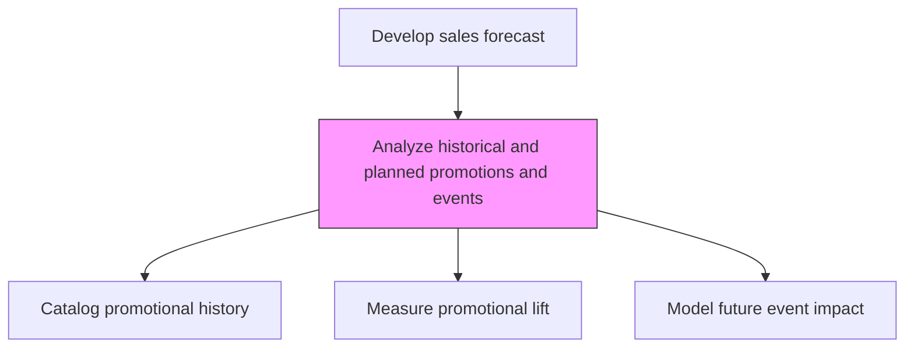
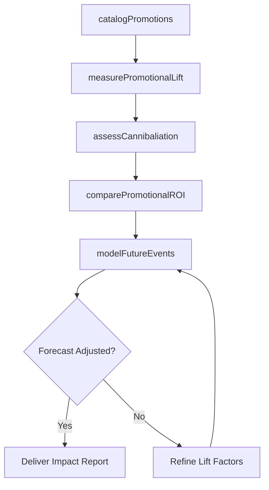

# Analyze historical and planned promotions and events

> Business-as-Code definition for promotional impact analysis. Models the review of past and upcoming promotional events and campaigns to quantify their effect on sales demand and incorporate lift factors into forecasting.

## Overview

Reviewing promotional activities' effect on the sales orders. Analyze all promotional events and campaigns that the organization has already employed or is planning to deploy.

## Process Hierarchy



## GraphDL

```yaml
analyze:
  object: Historical And Planned Promotions And Events
  actor: TradeMarketingAnalyst
  result: PromotionalImpactReport
```

## Actions

| Action | Description |
|--------|-------------|
| catalogPromotions | Compile a record of all past promotional events with dates, channels, and spend |
| measurePromotionalLift | Quantify the incremental sales generated by each promotion |
| assessCannibaliation | Evaluate whether promotions displaced sales from non-promoted products |
| modelFutureEvents | Project the expected demand impact of planned promotions and events |
| comparePromotionalROI | Rank promotions by return on investment to guide future planning |

## Events

| Event | Description |
|-------|-------------|
| promotionsCataloged | Historical promotional event inventory completed |
| promotionalLiftMeasured | Incremental sales impact calculated for past promotions |
| cannibalizationAssessed | Cross-product displacement effects evaluated |
| futureEventsModeled | Expected demand impact of upcoming promotions projected |
| promotionalROICompared | Promotional effectiveness rankings published |

## Searches

| Search | Description |
|--------|-------------|
| getPromotionHistory | Retrieve past promotions by type, channel, or date range |
| getPromotionalLift | Access incremental lift data for specific promotions |
| getPlannedPromotions | List upcoming promotional events with projected impact |
| getPromotionalROI | Retrieve ROI rankings across promotion types |

## Process Flow



## RACI Matrix

| Activity | Responsible | Accountable | Consulted | Informed |
|----------|-------------|-------------|-----------|----------|
| catalogPromotions | TradeMarketingAnalyst | TradeMarketingManager | Marketing | Sales |
| measurePromotionalLift | TradeMarketingAnalyst | SalesOperationsManager | Finance | VP Sales |
| modelFutureEvents | SalesForecastAnalyst | SalesOperationsManager | TradeMarketing | Marketing |
| comparePromotionalROI | TradeMarketingAnalyst | VP Marketing | Finance | Sales |

## Related Processes

| Process | Relationship |
|---------|-------------|
| 3.4.1.2 Analyze sales trends and patterns | Parallel - promotional effects explain observed trends |
| 3.4.1.3 Generate sales forecast | Downstream - promotional lift factors adjust forecast |
| 3.3.6 Manage trade pricing, promotions and allowances | Upstream - promotional calendar provides event data |
| 3.3.3 Develop marketing communications strategy | Upstream - campaign plans inform promotional analysis |

## Related Departments

| Department | Role |
|-----------|------|
| Trade Marketing | Owns promotional planning and historical records |
| Sales Operations | Integrates promotional impact into forecasts |
| Finance | Validates promotional spend and ROI calculations |
| Marketing | Provides campaign execution data and creative context |

## Related Occupations

| Occupation | Involvement |
|-----------|-------------|
| Trade Marketing Analyst | Catalogs promotions and measures lift |
| Sales Forecast Analyst | Incorporates promotional effects into demand models |
| Marketing Analytics Manager | Evaluates campaign performance metrics |
| Revenue Operations Analyst | Connects promotional data to pipeline outcomes |

## KPIs

| KPI | Description | Unit |
|-----|-------------|------|
| Average Promotional Lift | Mean incremental sales generated per promotion | % |
| Promotion ROI | Revenue generated per dollar of promotional spend | Ratio |
| Cannibalization Rate | Percentage of promotional sales displacing regular sales | % |
| Forecast Lift Accuracy | Accuracy of predicted vs. actual promotional lift | % |

## Usage

```typescript
import { analyzeHistoricalAndPlannedPromotionsAndEvents } from '@headlessly/analyze-historical-and-planned-promotions-and-events'

const promoAnalysis = analyzeHistoricalAndPlannedPromotionsAndEvents()

// Measure lift from past promotions
const lift = await promoAnalysis.measurePromotionalLift({
  promotionType: 'seasonal-discount',
  period: 'last-12-months',
  productLines: ['platform-standard']
})

// Model impact of planned events
const impact = await promoAnalysis.modelFutureEvents({
  events: ['spring-sale', 'annual-conference', 'product-launch'],
  horizon: 'next-6-months'
})
```
