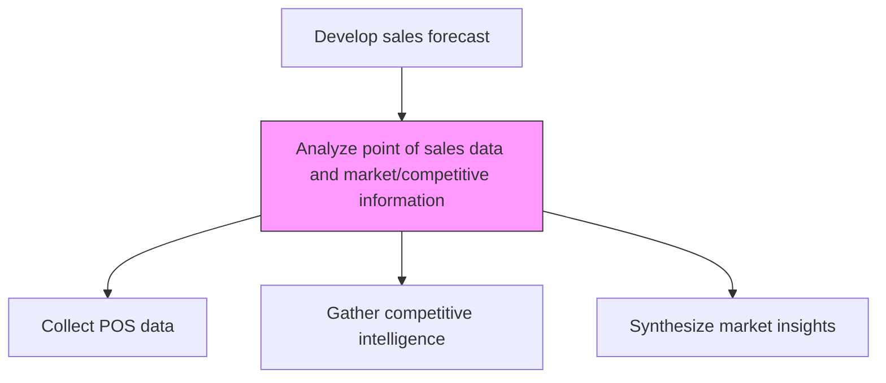
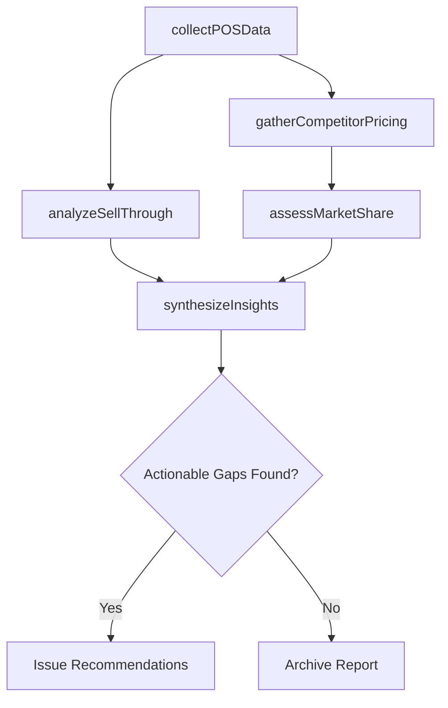

# Analyze point of sales (POS) data and market/competitive information

> Business-as-Code definition for POS and competitive market analysis. Models the collection and examination of point-of-sale transaction data alongside competitive market intelligence to inform demand planning and positioning.

## Overview

Analyzing point-of-sale transaction data from retail channels together with market and competitive intelligence. Extract sell-through rates, price elasticity, and shelf velocity from POS systems. Cross-reference with competitor pricing, market share data, and industry benchmarks to identify positioning opportunities and demand signals that inform sales forecasting.

## Process Hierarchy



## GraphDL

```yaml
analyze:
  object: Point Of Sales (POS) Data And Market/competitive Information
  actor: MarketAnalyst
  result: MarketIntelligenceReport
```

## Actions

| Action | Description |
|--------|-------------|
| collectPOSData | Extract transaction-level sell-through data from retail POS systems |
| analyzeSellThrough | Calculate sell-through rates, velocity, and price elasticity by SKU |
| gatherCompetitorPricing | Collect competitor price points and promotional activity data |
| assessMarketShare | Estimate market share positions using syndicated and internal data |
| synthesizeInsights | Combine POS and competitive data into actionable market intelligence |

## Events

| Event | Description |
|-------|-------------|
| posDataCollected | Point-of-sale data extracted from retail channels |
| sellThroughAnalyzed | Sell-through rates and velocity metrics calculated |
| competitorPricingGathered | Competitor pricing and promotional data compiled |
| marketShareAssessed | Market share estimates updated |
| insightsSynthesized | Combined market intelligence report delivered |

## Searches

| Search | Description |
|--------|-------------|
| getPOSData | Retrieve POS transaction data by retailer, product, or period |
| getSellThroughRates | Access sell-through velocity by SKU or category |
| getCompetitorPricing | Query competitor price points and promotional history |
| getMarketShareData | Retrieve market share estimates by product and geography |

## Process Flow



## RACI Matrix

| Activity | Responsible | Accountable | Consulted | Informed |
|----------|-------------|-------------|-----------|----------|
| collectPOSData | RetailAnalyst | SalesOperationsManager | IT | Sales |
| analyzeSellThrough | MarketAnalyst | SalesOperationsManager | ProductManagement | Marketing |
| gatherCompetitorPricing | MarketResearcher | VP Sales | Strategy | Finance |
| synthesizeInsights | MarketAnalyst | VP Sales | Marketing | ExecutiveTeam |

## Related Processes

| Process | Relationship |
|---------|-------------|
| 3.4.1.1 Gather current and historic order information | Upstream - order data supplements POS analysis |
| 3.4.1.2 Analyze sales trends and patterns | Parallel - POS data validates trend observations |
| 3.4.1.3 Generate sales forecast | Downstream - market intelligence refines forecasts |
| 1.1.1 Assess the external environment | Upstream - competitive landscape context |

## Related Departments

| Department | Role |
|-----------|------|
| Sales Operations | Manages POS data collection and integration |
| Marketing | Provides competitive intelligence and positioning context |
| Product Management | Uses sell-through data for product decisions |
| Strategy | Incorporates market share data into strategic planning |

## Related Occupations

| Occupation | Involvement |
|-----------|-------------|
| Market Analyst | Synthesizes POS and competitive data |
| Retail Analyst | Extracts and interprets POS transaction data |
| Competitive Intelligence Analyst | Tracks competitor pricing and activity |
| Category Manager | Uses insights for category positioning decisions |

## KPIs

| KPI | Description | Unit |
|-----|-------------|------|
| POS Data Coverage | Percentage of retail channels providing POS data feeds | % |
| Sell-Through Rate | Units sold as percentage of units shipped to retail | % |
| Competitive Price Index | Own price position relative to key competitors | Index |
| Market Share Accuracy | Variance between estimated and actual market share | % |

## Usage

```typescript
import { analyzePointOfSalesPosDataAndMarketCompetitiveInformation } from '@headlessly/analyze-point-of-sales-pos-data-and-market-competitive-information'

const posAnalysis = analyzePointOfSalesPosDataAndMarketCompetitiveInformation()

// Analyze sell-through by retailer
const sellThrough = await posAnalysis.analyzeSellThrough({
  retailers: ['retailer-a', 'retailer-b'],
  products: ['sku-1001', 'sku-1002'],
  period: 'last-13-weeks'
})

// Assess current market share position
const share = await posAnalysis.assessMarketShare({
  category: 'enterprise-software',
  geography: 'north-america',
  dataSources: ['syndicated', 'internal']
})
```
