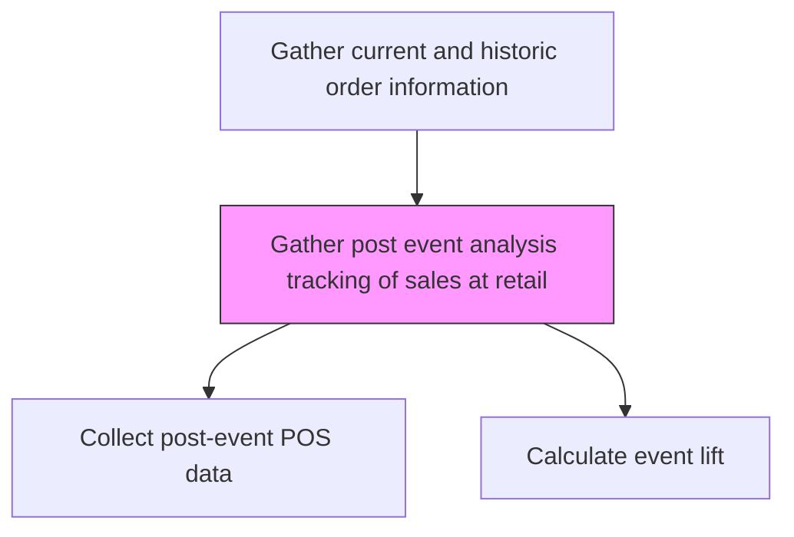
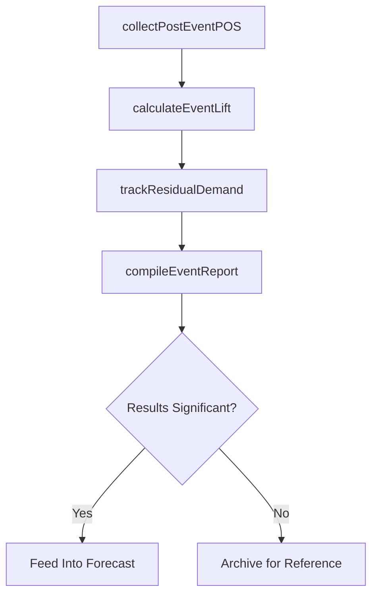

# Gather post event analysis tracking of sales at retail

> Business-as-Code definition for post-event retail sales tracking. Models the collection of sales performance data following promotional events, in-store activations, and marketing campaigns at retail locations.

## Overview

Collecting and consolidating sales performance data from retail locations following promotional events, seasonal campaigns, and in-store activations. Track pre-event, during-event, and post-event sales volumes to measure promotional effectiveness, calculate incremental lift, and identify residual demand effects that persist after the event concludes.

## Process Hierarchy



## GraphDL

```yaml
gather:
  object: Post Event Analysis Tracking Of Sales At Retail
  actor: RetailAnalyst
  result: PostEventSalesReport
```

## Actions

| Action | Description |
|--------|-------------|
| collectPostEventPOS | Extract POS transaction data for the post-event measurement window |
| calculateEventLift | Compare post-event sales to baseline to determine incremental lift |
| trackResidualDemand | Monitor sales in weeks following event to detect lasting effects |
| compileEventReport | Assemble post-event analysis with lift, ROI, and recommendations |

## Events

| Event | Description |
|-------|-------------|
| postEventPOSCollected | Post-event point-of-sale data extracted from retail systems |
| eventLiftCalculated | Incremental sales lift from the event quantified |
| residualDemandTracked | Post-event demand decay curve documented |
| eventReportCompiled | Complete post-event analysis report delivered |

## Searches

| Search | Description |
|--------|-------------|
| getPostEventSales | Retrieve sales data for a specific event and retail location |
| getEventLiftHistory | Access historical promotional lift data by event type |
| getResidualDemandCurve | Retrieve post-event demand decay data |

## Process Flow



## RACI Matrix

| Activity | Responsible | Accountable | Consulted | Informed |
|----------|-------------|-------------|-----------|----------|
| collectPostEventPOS | RetailAnalyst | SalesOperationsManager | IT | TradeMarketing |
| calculateEventLift | RetailAnalyst | TradeMarketingManager | Finance | Sales |
| compileEventReport | RetailAnalyst | SalesOperationsManager | Marketing | VP Sales |

## Related Processes

| Process | Relationship |
|---------|-------------|
| 3.4.1.1.2 Gather sales/inventory data from retail for trade wide sales forecast | Parallel - retail data collection |
| 3.4.1.5 Analyze historical and planned promotions and events | Downstream - post-event data feeds promotional analysis |
| 3.3.6 Manage trade pricing, promotions and allowances | Upstream - promotional events being tracked |

## Related Departments

| Department | Role |
|-----------|------|
| Sales Operations | Manages data collection from retail channels |
| Trade Marketing | Defines events and reviews effectiveness |
| IT | Maintains POS data integration pipelines |
| Finance | Validates promotional spend and ROI |

## Related Occupations

| Occupation | Involvement |
|-----------|-------------|
| Retail Analyst | Collects and analyzes post-event sales data |
| Trade Marketing Analyst | Reviews event effectiveness metrics |
| Data Engineer | Maintains retail data feeds and pipelines |

## KPIs

| KPI | Description | Unit |
|-----|-------------|------|
| Post-Event Lift | Incremental sales volume attributable to the event | % |
| Data Collection Timeliness | Days from event end to data availability | Days |
| Event ROI | Return on investment for the promotional event | Ratio |

## Usage

```typescript
import { gatherPostEventAnalysisTrackingOfSalesAtRetail } from '@headlessly/gather-post-event-analysis-tracking-of-sales-at-retail'

const postEvent = gatherPostEventAnalysisTrackingOfSalesAtRetail()

// Collect post-event POS data
const posData = await postEvent.collectPostEventPOS({
  eventId: 'spring-promo-2026',
  retailers: ['retailer-a', 'retailer-b'],
  measurementWindow: { days: 14 }
})

// Calculate promotional lift
const lift = await postEvent.calculateEventLift({
  eventId: 'spring-promo-2026',
  baselinePeriod: 'pre-event-4-weeks'
})
```
