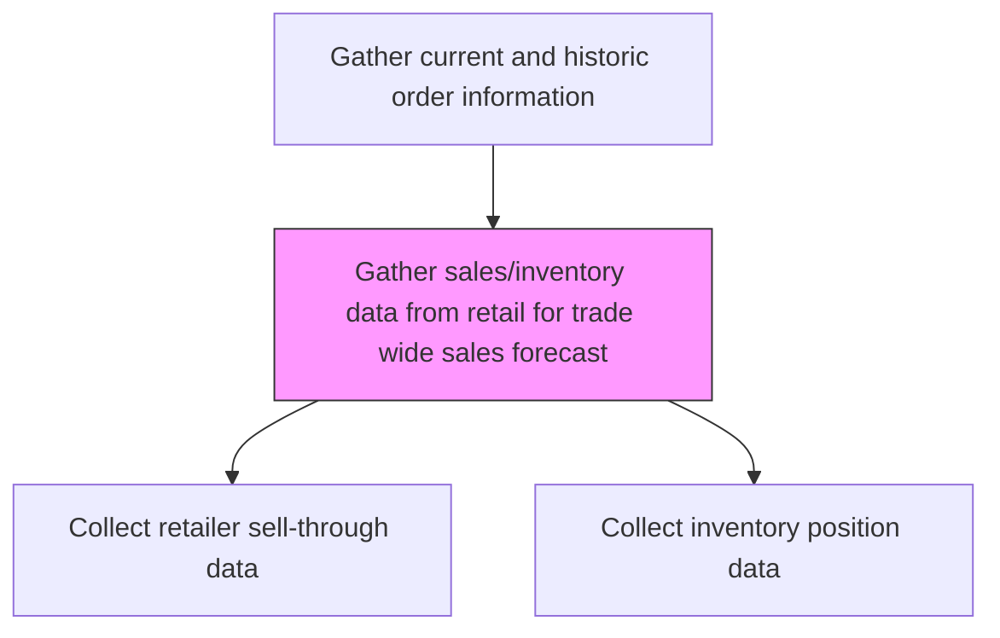
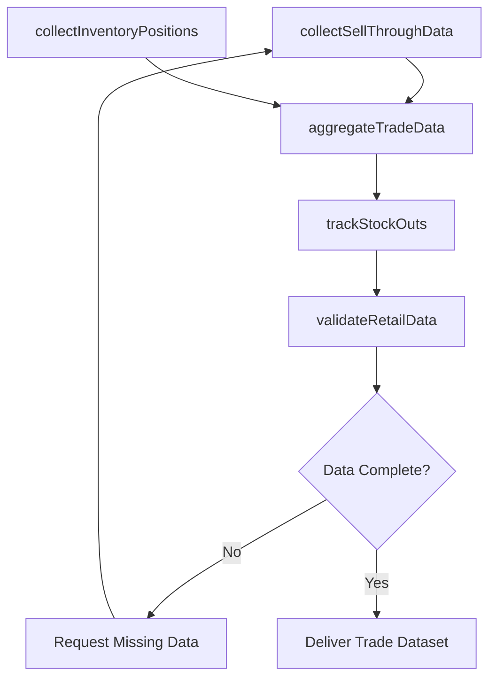

# Gather sales/inventory data from retail for trade wide sales forecast

> Business-as-Code definition for retail sales and inventory data collection. Models the aggregation of sell-through volumes, on-hand inventory levels, and replenishment data from retail partners to build a trade-wide demand picture for forecasting.

## Overview

Collecting sales transaction and inventory position data from retail partners to construct a trade-wide view of product demand. Aggregate sell-through volumes, weeks of supply, stock-out frequency, and replenishment rates across retail channels. This consolidated dataset enables trade-wide sales forecasting by revealing true consumer demand beyond what internal shipment data alone can show.

## Process Hierarchy



## GraphDL

```yaml
gather:
  object: Sales/inventory Data From Retail For Trade Wide Sales Forecast
  actor: RetailDataAnalyst
  result: TradeWideDemandDataset
```

## Actions

| Action | Description |
|--------|-------------|
| collectSellThroughData | Extract unit and revenue sell-through data from retail partners |
| collectInventoryPositions | Gather on-hand inventory levels and weeks of supply from retailers |
| trackStockOuts | Monitor stock-out events and duration across retail locations |
| aggregateTradeData | Consolidate multi-retailer data into a unified trade-wide dataset |
| validateRetailData | Cross-check retail-reported data against shipment and invoice records |

## Events

| Event | Description |
|-------|-------------|
| sellThroughDataCollected | Retail sell-through transaction data received and processed |
| inventoryPositionsCollected | Retailer inventory levels captured |
| stockOutsTracked | Stock-out events identified and logged |
| tradeDataAggregated | Multi-retailer data consolidated into trade-wide view |
| retailDataValidated | Retail data verified against internal shipment records |

## Searches

| Search | Description |
|--------|-------------|
| getSellThroughByRetailer | Retrieve sell-through data by retailer, SKU, or time period |
| getInventoryPositions | Access current inventory levels by retailer and product |
| getStockOutHistory | Query stock-out events by retailer, product, and date range |
| getTradeWideDemand | Retrieve aggregated trade-wide demand data |

## Process Flow



## RACI Matrix

| Activity | Responsible | Accountable | Consulted | Informed |
|----------|-------------|-------------|-----------|----------|
| collectSellThroughData | RetailDataAnalyst | SalesOperationsManager | IT | Sales |
| collectInventoryPositions | RetailDataAnalyst | SalesOperationsManager | SupplyChain | Finance |
| aggregateTradeData | RetailDataAnalyst | SalesOperationsManager | DataEngineering | SalesForecastAnalyst |
| validateRetailData | DataQualityAnalyst | SalesOperationsManager | Finance | Sales |

## Related Processes

| Process | Relationship |
|---------|-------------|
| 3.4.1.1.1 Gather post event analysis tracking of sales at retail | Parallel - both collect retail channel data |
| 3.4.1.3 Generate sales forecast | Downstream - trade-wide data feeds forecast models |
| 3.4.1.4 Analyze point of sales (POS) data and market/competitive information | Downstream - provides POS data for analysis |
| 4.3.4 Manage demand for products and services | Parallel - demand planning uses trade-wide data |

## Related Departments

| Department | Role |
|-----------|------|
| Sales Operations | Manages retail data collection programs |
| Supply Chain | Uses inventory data for replenishment planning |
| IT | Maintains EDI and data integration with retailers |
| Finance | Validates trade-wide revenue figures |

## Related Occupations

| Occupation | Involvement |
|-----------|-------------|
| Retail Data Analyst | Collects and processes retail sales and inventory data |
| Data Engineer | Builds and maintains retail data integration pipelines |
| Supply Chain Analyst | Interprets inventory positions and stock-out data |
| Sales Forecast Analyst | Uses trade-wide data in demand models |

## KPIs

| KPI | Description | Unit |
|-----|-------------|------|
| Retailer Data Coverage | Percentage of retail partners providing data feeds | % |
| Data Timeliness | Lag between retail transaction and data availability | Days |
| Stock-Out Rate | Frequency of out-of-stock events across retail locations | % |
| Data Reconciliation Accuracy | Match rate between retail and internal shipment data | % |

## Usage

```typescript
import { gatherSalesInventoryDataFromRetailForTradeWideSalesForecast } from '@headlessly/gather-sales-inventory-data-from-retail-for-trade-wide-sales-forecast'

const retailData = gatherSalesInventoryDataFromRetailForTradeWideSalesForecast()

// Collect sell-through from retail partners
const sellThrough = await retailData.collectSellThroughData({
  retailers: ['retailer-a', 'retailer-b', 'retailer-c'],
  products: ['sku-1001', 'sku-1002'],
  period: 'last-13-weeks'
})

// Aggregate into trade-wide dataset
const tradeView = await retailData.aggregateTradeData({
  includeInventoryPositions: true,
  includeStockOuts: true
})
```
