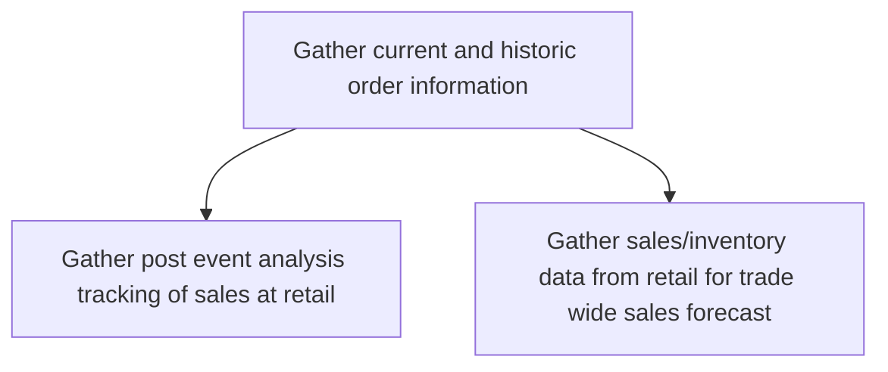
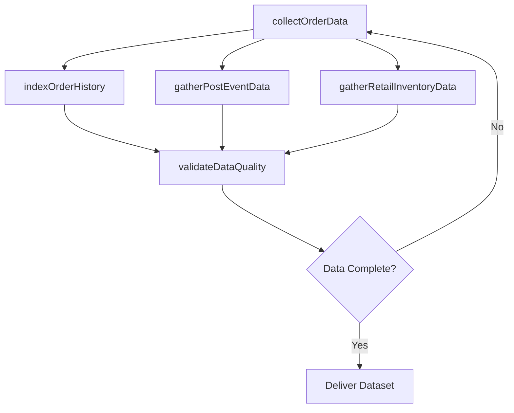

# Gather current and historic order information

> Business-as-Code definition for order information collection. Models the gathering, indexing, and consolidation of current and historical sales order data including post-event retail tracking and inventory data for trade-wide forecasting.

## Overview

Gathering all information about sales orders into an index. Create a directory of all sales orders, whether open or those which have been fulfilled. Track what product/service was ordered, the quantity ordered, who ordered it, the delivery date, the shipping method, the unit price and line total, payment terms, and any discount applied.

## Process Hierarchy



## GraphDL

```yaml
gather:
  object: Current And Historic Order Information
  actor: SalesDataAnalyst
  result: ConsolidatedOrderDataset
```

## Actions

| Action | Description |
|--------|-------------|
| collectOrderData | Extract current and historical sales order records from all systems |
| indexOrderHistory | Organize order data into a searchable, structured index |
| gatherPostEventData | Collect post-promotion sales tracking data from retail channels |
| gatherRetailInventoryData | Collect retail sales and inventory data for trade forecasting |
| validateDataQuality | Verify completeness and accuracy of gathered order information |

## Events

| Event | Description |
|-------|-------------|
| orderDataCollected | Sales order data extracted from source systems |
| orderHistoryIndexed | Historical order data organized and indexed |
| postEventDataGathered | Post-event retail sales tracking data collected |
| retailInventoryDataGathered | Retail inventory and sales data consolidated |
| dataQualityValidated | Order data quality checks completed |

## Searches

| Search | Description |
|--------|-------------|
| getOrderHistory | Retrieve historical orders by product, customer, or date range |
| getPostEventSales | Access post-promotion sales data by event and retail location |
| getRetailInventory | Query retail inventory levels and sell-through data |
| getDataQualityReport | Retrieve data completeness and accuracy metrics |

## Process Flow



## RACI Matrix

| Activity | Responsible | Accountable | Consulted | Informed |
|----------|-------------|-------------|-----------|----------|
| collectOrderData | SalesDataAnalyst | SalesOperationsManager | IT | Sales |
| gatherPostEventData | RetailAnalyst | SalesOperationsManager | TradeMarketing | Sales |
| gatherRetailInventoryData | RetailAnalyst | SalesOperationsManager | SupplyChain | Finance |
| validateDataQuality | DataQualityAnalyst | SalesOperationsManager | IT | SalesForecastAnalyst |

## Sub-Processes

| ID | Name | Description |
|----|------|-------------|
| 3.4.1.1.1 | Gather post event analysis tracking of sales at retail | Collecting sales performance data from retail locations following promotional events to measure lift  |
| 3.4.1.1.2 | Gather sales/inventory data from retail for trade wide sales forecast | Aggregating sell-through volumes and inventory position data from retail partners for trade-wide dem |

## Related Processes

| Process | Relationship |
|---------|-------------|
| 3.4.1.2 Analyze sales trends and patterns | Downstream - gathered data feeds trend analysis |
| 3.5.4 Manage sales orders | Upstream - sales order system provides source data |
| 3.4.1.3 Generate sales forecast | Downstream - consolidated data enables forecast generation |
| 3.5.4.2 Collect and maintain account information | Parallel - account data enriches order information |

## Related Departments

| Department | Role |
|-----------|------|
| Sales Operations | Manages data collection processes and systems |
| IT | Provides data extraction and integration infrastructure |
| Retail Operations | Supplies point-of-sale and inventory data |
| Finance | Validates revenue data accuracy |

## Related Occupations

| Occupation | Involvement |
|-----------|-------------|
| Sales Data Analyst | Collects, organizes, and validates order data |
| Database Administrator | Manages order data storage and access |
| Retail Analyst | Gathers and interprets retail channel data |
| Data Quality Analyst | Ensures order data completeness and accuracy |

## KPIs

| KPI | Description | Unit |
|-----|-------------|------|
| Data Completeness | Percentage of order records with all required fields populated | % |
| Data Freshness | Average lag between order creation and data availability | Hours |
| Source System Coverage | Percentage of order sources integrated into data collection | % |
| Data Quality Score | Composite accuracy and consistency measure for order data | Score (1-100) |

## Usage

```typescript
import { gatherCurrentAndHistoricOrderInformation } from '@headlessly/gather-current-and-historic-order-information'

const orderData = gatherCurrentAndHistoricOrderInformation()

// Collect order data from all sources
const dataset = await orderData.collectOrderData({
  sources: ['crm', 'erp', 'ecommerce', 'retail-pos'],
  dateRange: { from: '2024-01-01', to: '2026-01-31' },
  includeOpenOrders: true
})

// Validate data quality
const quality = await orderData.validateDataQuality({
  datasetId: dataset.id,
  checks: ['completeness', 'accuracy', 'consistency']
})
```
