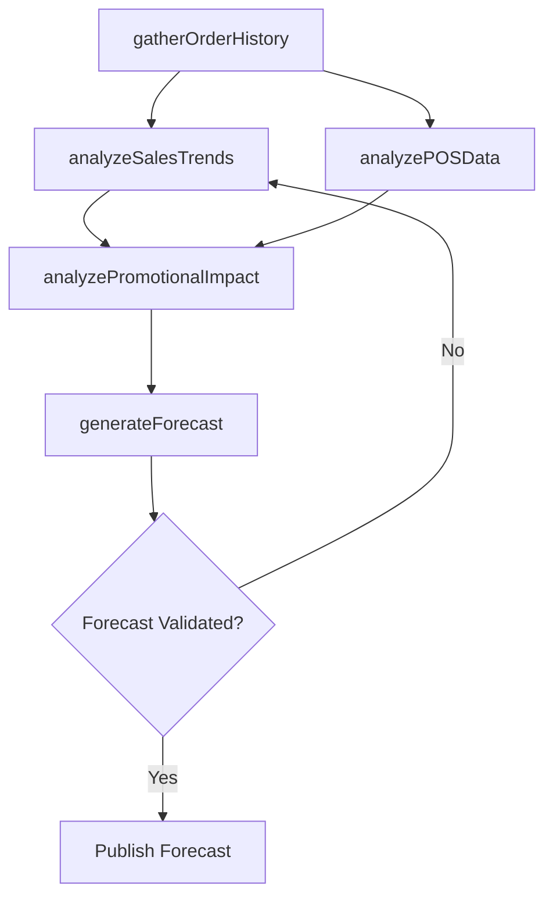

# Develop sales forecast

> Business-as-Code definition for sales forecast development. Models the collection of historical order data, trend analysis, demand modeling, and forecast generation to project future sales performance across the product portfolio.

## Overview

Developing a sales forecast for the organization's portfolio of offerings, bearing in mind the effect of promotional events, and fine-tuning these in the context of the new forecast. Estimate the future demand for the organization's products/services by analyzing historical information and any promotional activity.

## Process Hierarchy

```mermaid
graph TD
    A[Develop sales forecast]
    A --> B[Gather current and historic order information]
    A --> C[Analyze sales trends and patterns]
    A --> D[Generate sales forecast]
    A --> E[Analyze point of sales (POS) data and market/competitive information]
    A --> F[Analyze historical and planned promotions and events]
```

## GraphDL

```yaml
develop:
  object: Sales Forecast
  actor: SalesForecastAnalyst
  result: SalesForecastModel
```

## Actions

| Action | Description |
|--------|-------------|
| gatherOrderHistory | Collect current and historical sales order data for analysis |
| analyzeSalesTrends | Identify patterns, seasonality, and trends in sales data |
| generateForecast | Build sales forecast models using statistical and pipeline methods |
| analyzePOSData | Examine point-of-sale and competitive market data |
| analyzePromotionalImpact | Assess how historical and planned promotions affect demand |

## Events

| Event | Description |
|-------|-------------|
| orderHistoryGathered | Historical and current order data consolidated for analysis |
| salesTrendsAnalyzed | Sales trend and pattern analysis completed |
| forecastGenerated | Sales forecast model produced and published |
| posDataAnalyzed | Point-of-sale and market data analysis delivered |
| promotionalImpactAnalyzed | Promotional effect on demand quantified |

## Searches

| Search | Description |
|--------|-------------|
| getSalesForecast | Retrieve sales forecast by product, territory, or period |
| getHistoricalOrders | Query historical order data with filtering by product or channel |
| getSalesTrends | Access trend analysis data for specified products or periods |
| getPromotionalLift | Retrieve estimated demand lift from promotional events |

## Process Flow



## RACI Matrix

| Activity | Responsible | Accountable | Consulted | Informed |
|----------|-------------|-------------|-----------|----------|
| gatherOrderHistory | SalesAnalyst | SalesOperationsManager | IT | Finance |
| analyzeSalesTrends | SalesForecastAnalyst | VP Sales | Marketing | ProductManagement |
| generateForecast | SalesForecastAnalyst | VP Sales | Finance | ExecutiveTeam |
| analyzePOSData | MarketAnalyst | SalesOperationsManager | Marketing | Sales |
| analyzePromotionalImpact | SalesForecastAnalyst | VP Sales | TradeMarketing | Finance |

## Sub-Processes

| ID | Name | Description |
|----|------|-------------|
| 3.4.1.1 | Gather current and historic order information | Gathering all information about sales orders into an index. Create a directory of all sales orders,  |
| 3.4.1.2 | Analyze sales trends and patterns | Analyzing sales order data to identify patterns in order to capitalize on emerging trends in the ind |
| 3.4.1.3 | Generate sales forecast | Calculating the future demand for the organization's products/services. Use the trends and patterns  |
| 3.4.1.4 | Analyze point of sales (POS) data and market/competitive information | Analyzing POS transaction data and competitive market intelligence to inform demand planning and pos |
| 3.4.1.5 | Analyze historical and planned promotions and events | Reviewing promotional activities' effect on the sales orders. Analyze all promotional events and cam |

## Related Processes

| Process | Relationship |
|---------|-------------|
| 3.4.4 Establish overall sales budgets | Downstream - forecast drives budget planning |
| 3.4.2 Develop sales partner/alliance relationships | Parallel - partner forecasts contribute to total forecast |
| 3.3.7 Track customer management measures | Upstream - customer metrics inform demand projections |
| 3.5.1 Manage leads/opportunities | Upstream - pipeline data feeds forecast models |

## Related Departments

| Department | Role |
|-----------|------|
| Sales Operations | Develops and maintains forecast models |
| Finance | Validates forecast assumptions and integrates with financial plans |
| Marketing | Provides promotional calendar and demand generation data |
| Sales | Supplies pipeline data and territory-level estimates |
| Product Management | Contributes product lifecycle data affecting demand |

## Related Occupations

| Occupation | Involvement |
|-----------|-------------|
| Sales Forecast Analyst | Builds and maintains statistical forecast models |
| Sales Operations Manager | Oversees forecast process and accuracy tracking |
| Revenue Operations Analyst | Integrates pipeline data into forecast models |
| Financial Planning Analyst | Aligns sales forecast with financial projections |

## KPIs

| KPI | Description | Unit |
|-----|-------------|------|
| Forecast Accuracy | Variance between forecasted and actual sales | % |
| Forecast Bias | Systematic tendency to over or under-forecast | % |
| Forecast Cycle Time | Time required to produce each forecast iteration | Days |
| Pipeline Coverage Ratio | Pipeline value relative to quota or forecast target | Ratio |
| Weighted Pipeline Accuracy | Accuracy of stage-weighted pipeline forecasts | % |

## Usage

```typescript
import { developSalesForecast } from '@headlessly/develop-sales-forecast'

const forecast = developSalesForecast()

// Gather and analyze historical order data
const trends = await forecast.analyzeSalesTrends({
  products: ['platform-standard', 'platform-enterprise'],
  period: 'last-24-months',
  granularity: 'monthly'
})

// Generate sales forecast
const model = await forecast.generateForecast({
  horizon: '12-months',
  methods: ['time-series', 'pipeline-weighted', 'judgmental'],
  includePromotionalEffects: true
})
```
