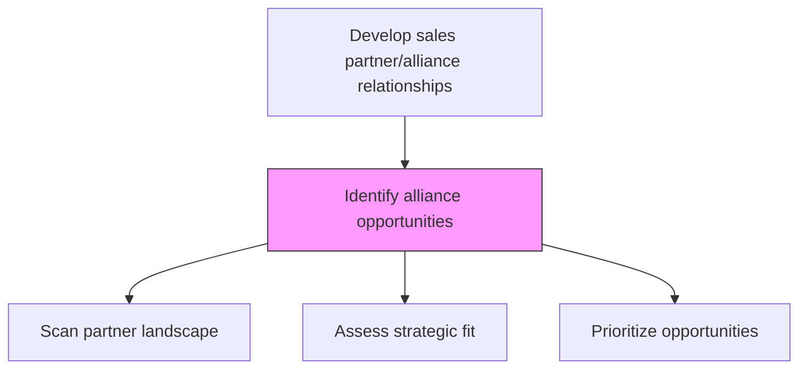
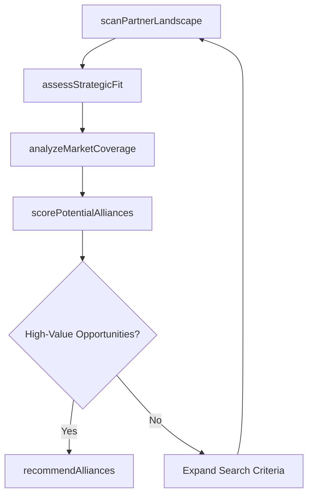

# Identify alliance opportunities

> Business-as-Code definition for alliance opportunity identification. Models the discovery and evaluation of potential collaboration partners for selling, marketing, and distributing products and services.

## Overview

Identifying collaboration opportunities for selling, marketing, and distributing the organization's products/services. Determine any scope for partnering with other economic agents, with synergies for the marketing, sales, and/or distribution of the organization's products/services. Identify alliance opportunities that target customer segments who would be interested.

## Process Hierarchy



## GraphDL

```yaml
identify:
  object: Alliance Opportunities
  actor: PartnerDevelopmentManager
  result: AllianceOpportunityList
```

## Actions

| Action | Description |
|--------|-------------|
| scanPartnerLandscape | Survey the market for potential alliance partners across channels |
| assessStrategicFit | Evaluate alignment between potential partner capabilities and organizational goals |
| analyzeMarketCoverage | Determine geographic and segment coverage gaps a partner could fill |
| scorePotentialAlliances | Rank potential partners using weighted criteria including revenue potential |
| recommendAlliances | Present shortlisted alliance opportunities for leadership review |

## Events

| Event | Description |
|-------|-------------|
| partnerLandscapeScanned | Market scan for potential partners completed |
| strategicFitAssessed | Partner alignment evaluation finished |
| marketCoverageAnalyzed | Coverage gap analysis completed |
| alliancesScored | Potential partners ranked and scored |
| alliancesRecommended | Alliance shortlist presented for approval |

## Searches

| Search | Description |
|--------|-------------|
| getPotentialPartners | List potential alliance partners filtered by type, geography, or capability |
| getPartnerScorecard | Retrieve scoring details for a specific potential partner |
| getCoverageGaps | Access market coverage gap analysis by region or segment |

## Process Flow



## RACI Matrix

| Activity | Responsible | Accountable | Consulted | Informed |
|----------|-------------|-------------|-----------|----------|
| scanPartnerLandscape | PartnerDevelopmentManager | VP Sales | Marketing | Strategy |
| assessStrategicFit | PartnerDevelopmentManager | VP Sales | ProductManagement | Finance |
| scorePotentialAlliances | PartnerDevelopmentManager | VP Sales | Finance | Legal |
| recommendAlliances | PartnerDevelopmentManager | VP Sales | ExecutiveTeam | ChannelSales |

## Related Processes

| Process | Relationship |
|---------|-------------|
| 3.4.2.3 Design alliance programs and methods for selecting and managing relationships | Downstream - opportunities feed into program design |
| 3.4.2.4 Select alliances | Downstream - identified opportunities are formally selected |
| 1.1.1 Assess the external environment | Upstream - market intelligence informs opportunity identification |
| 3.2.4 Define and manage channel strategy | Upstream - channel strategy guides partner types sought |

## Related Departments

| Department | Role |
|-----------|------|
| Partner Development | Leads the identification and evaluation of alliance opportunities |
| Marketing | Provides market coverage data and brand alignment insights |
| Strategy | Ensures alliance opportunities align with corporate strategy |
| Finance | Evaluates financial viability of potential partnerships |

## Related Occupations

| Occupation | Involvement |
|-----------|-------------|
| Partner Development Manager | Leads alliance opportunity identification |
| Business Development Representative | Sources and qualifies potential partners |
| Market Research Analyst | Provides market coverage and competitive data |

## KPIs

| KPI | Description | Unit |
|-----|-------------|------|
| Alliance Pipeline Size | Number of potential alliance opportunities under evaluation | Count |
| Strategic Fit Score | Average alignment score of identified opportunities | Score (1-10) |
| Opportunity Conversion Rate | Percentage of identified opportunities that become active alliances | % |

## Usage

```typescript
import { identifyAllianceOpportunities } from '@headlessly/identify-alliance-opportunities'

const alliances = identifyAllianceOpportunities()

// Scan for potential partners
const opportunities = await alliances.scanPartnerLandscape({
  partnerTypes: ['reseller', 'technology', 'consulting'],
  regions: ['north-america', 'europe'],
  minMarketPresence: 'established'
})

// Score and rank opportunities
const ranked = await alliances.scorePotentialAlliances({
  candidates: opportunities.map(o => o.id),
  criteria: ['revenue-potential', 'strategic-fit', 'market-coverage']
})
```
