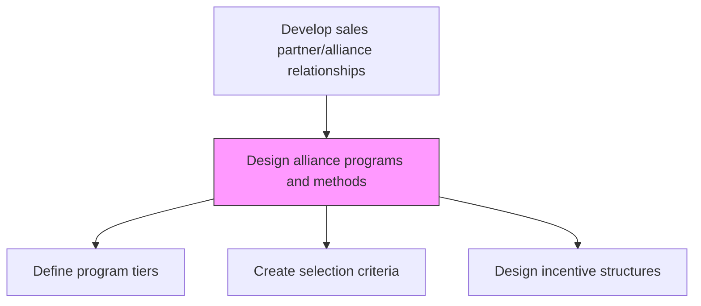
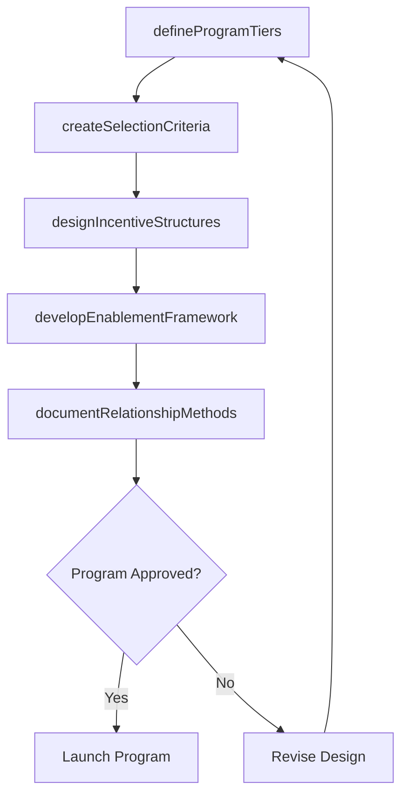

# Design alliance programs and methods for selecting and managing relationships

> Business-as-Code definition for alliance program design. Models the creation of structured partner programs, tiering frameworks, selection criteria, incentive structures, and relationship management methodologies.

## Overview

Creating the frameworks needed to select alliance partners, and maintaining relationships with them. Create a framework for structured programs that can receive and support multiple alliances. Clearly outline the responsibilities and benefits of the alliance partners. Create frameworks for selecting the right alliance partners, and maintain a relationship with them. Create or repurpose teams of relationship managers and outline a methodology for selecting alliance partners.

## Process Hierarchy



## GraphDL

```yaml
design:
  object: Alliance Programs And Methods For Selecting And Managing Relationships
  actor: ChannelProgramManager
  result: AllianceProgramFramework
```

## Actions

| Action | Description |
|--------|-------------|
| defineProgramTiers | Create partner tiers with differentiated benefits and requirements |
| createSelectionCriteria | Establish weighted criteria for evaluating and selecting partners |
| designIncentiveStructures | Build commission, rebate, and co-marketing incentive models |
| developEnablementFramework | Design training, certification, and support programs for partners |
| documentRelationshipMethods | Codify processes for ongoing partner relationship management |

## Events

| Event | Description |
|-------|-------------|
| programTiersDefined | Partner tier structure approved and published |
| selectionCriteriaCreated | Partner selection criteria finalized |
| incentiveStructuresDesigned | Incentive models approved by finance and leadership |
| enablementFrameworkDeveloped | Partner enablement programs designed and resourced |
| relationshipMethodsDocumented | Relationship management playbook completed |

## Searches

| Search | Description |
|--------|-------------|
| getProgramTiers | Retrieve partner program tier definitions and requirements |
| getSelectionCriteria | Access partner evaluation criteria and weighting |
| getIncentiveModels | Query available incentive structures by tier or partner type |

## Process Flow



## RACI Matrix

| Activity | Responsible | Accountable | Consulted | Informed |
|----------|-------------|-------------|-----------|----------|
| defineProgramTiers | ChannelProgramManager | VP Sales | Finance | Marketing |
| createSelectionCriteria | ChannelProgramManager | VP Sales | Legal | PartnerDevelopment |
| designIncentiveStructures | ChannelProgramManager | VP Sales | Finance | Sales |
| developEnablementFramework | PartnerEnablementManager | ChannelProgramManager | Training | Sales |

## Related Processes

| Process | Relationship |
|---------|-------------|
| 3.4.2.2 Identify alliance opportunities | Upstream - identified opportunities inform program design |
| 3.4.2.4 Select alliances | Downstream - selection criteria applied to choose partners |
| 3.4.2.9 Develop partner and alliance management strategies | Downstream - program design feeds management strategy |
| 3.4.2.10 Establish partner and alliance management goals | Downstream - program metrics align with goals |

## Related Departments

| Department | Role |
|-----------|------|
| Channel Programs | Designs and maintains partner program frameworks |
| Finance | Approves incentive economics and program budgets |
| Legal | Reviews program terms and compliance requirements |
| Training | Develops partner enablement and certification content |

## Related Occupations

| Occupation | Involvement |
|-----------|-------------|
| Channel Program Manager | Designs partner programs and selection methods |
| Partner Enablement Manager | Builds partner training and certification programs |
| Financial Analyst | Models incentive economics and program ROI |

## KPIs

| KPI | Description | Unit |
|-----|-------------|------|
| Program Adoption Rate | Percentage of eligible partners enrolled in the program | % |
| Partner Satisfaction Score | Partner survey rating of program value and support | Score (1-10) |
| Program Design Cycle Time | Time from program concept to launch | Weeks |

## Usage

```typescript
import { designAllianceProgramsAndMethodsForSelectingAndManagingRelationships } from '@headlessly/design-alliance-programs-and-methods-for-selecting-and-managing-relationships'

const programs = designAllianceProgramsAndMethodsForSelectingAndManagingRelationships()

// Define partner program tiers
const tiers = await programs.defineProgramTiers({
  tiers: ['silver', 'gold', 'platinum'],
  criteria: ['revenue-commitment', 'certifications', 'co-marketing-investment']
})

// Design incentive structures
const incentives = await programs.designIncentiveStructures({
  tierId: 'gold',
  commissionRate: 0.20,
  coMarketingFund: 25000
})
```
