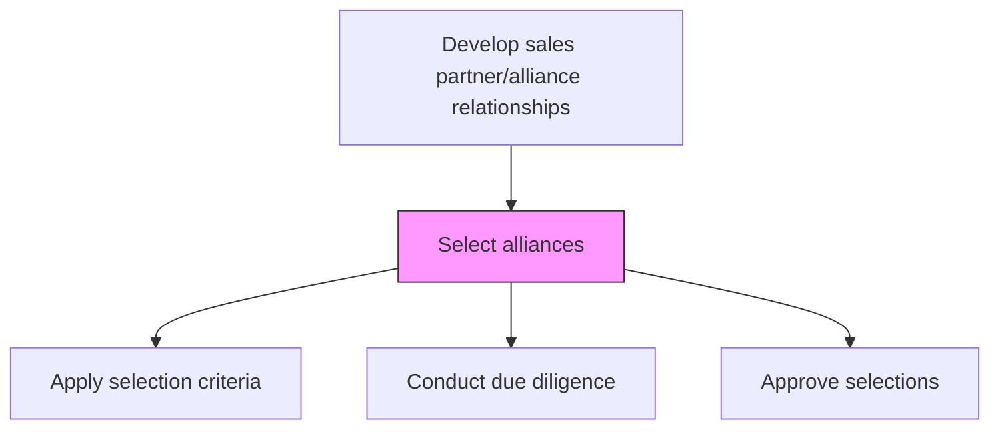
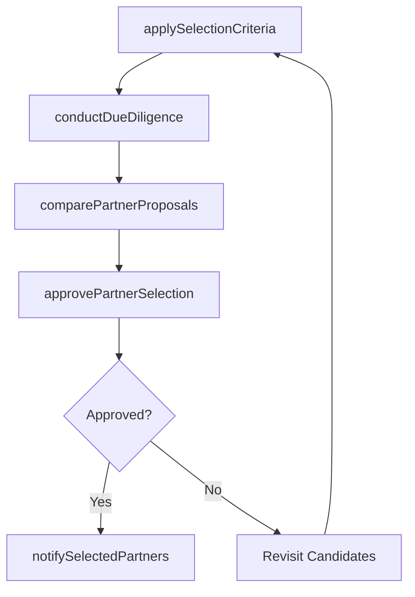

# Select alliances

> Business-as-Code definition for alliance selection. Models the evaluation, scoring, and formal selection of alliance partners using established program criteria and methodology.

## Overview

Choosing alliance partners using the selected programs and methodology. Select the most feasible and profitable alliance partners, based on Design alliance programs and methods for selecting and managing relationships [10139] and through a careful scrutiny of the potential alliance.

## Process Hierarchy



## GraphDL

```yaml
select:
  object: Alliances
  actor: PartnerDevelopmentManager
  result: SelectedAlliancePartners
```

## Actions

| Action | Description |
|--------|-------------|
| applySelectionCriteria | Score potential partners against established program criteria |
| conductDueDiligence | Verify financial stability, reputation, and capabilities of candidates |
| comparePartnerProposals | Evaluate partnership proposals and terms from candidate partners |
| approvePartnerSelection | Obtain leadership approval for recommended alliance partners |
| notifySelectedPartners | Communicate selection decisions and next steps to chosen partners |

## Events

| Event | Description |
|-------|-------------|
| selectionCriteriaApplied | Partner candidates scored and ranked |
| dueDiligenceCompleted | Background checks and financial reviews finished |
| proposalsCompared | Partnership proposals evaluated and ranked |
| selectionApproved | Alliance partner selections approved by leadership |
| partnersNotified | Selected partners informed of decision |

## Searches

| Search | Description |
|--------|-------------|
| getCandidateScores | Retrieve partner candidate scores by criteria |
| getDueDiligenceReport | Access due diligence findings for a specific candidate |
| getSelectionHistory | Query past partner selection decisions and outcomes |

## Process Flow



## RACI Matrix

| Activity | Responsible | Accountable | Consulted | Informed |
|----------|-------------|-------------|-----------|----------|
| applySelectionCriteria | PartnerDevelopmentManager | VP Sales | ChannelProgramManager | Finance |
| conductDueDiligence | PartnerDevelopmentManager | VP Sales | Legal | Risk |
| approvePartnerSelection | VP Sales | CRO | Finance | ExecutiveTeam |

## Related Processes

| Process | Relationship |
|---------|-------------|
| 3.4.2.3 Design alliance programs and methods for selecting and managing relationships | Upstream - selection criteria from program design |
| 3.4.2.11 Establish partner and alliance agreements | Downstream - selected partners proceed to agreement |
| 3.4.2.2 Identify alliance opportunities | Upstream - identified opportunities become candidates |

## Related Departments

| Department | Role |
|-----------|------|
| Partner Development | Manages the partner selection process |
| Legal | Conducts due diligence and reviews compliance |
| Finance | Evaluates financial viability of selected partners |
| Risk Management | Assesses reputational and operational risks |

## Related Occupations

| Occupation | Involvement |
|-----------|-------------|
| Partner Development Manager | Leads the partner evaluation and selection process |
| Legal Counsel | Conducts due diligence on partner candidates |
| Financial Analyst | Evaluates partner financial stability |

## KPIs

| KPI | Description | Unit |
|-----|-------------|------|
| Selection Cycle Time | Time from candidate identification to selection decision | Days |
| Due Diligence Pass Rate | Percentage of candidates passing due diligence | % |
| Selection Accuracy | Percentage of selected partners achieving year-one targets | % |

## Usage

```typescript
import { selectAlliances } from '@headlessly/select-alliances'

const selection = selectAlliances()

// Score candidates against criteria
const scores = await selection.applySelectionCriteria({
  candidates: ['partner-a', 'partner-b', 'partner-c'],
  criteriaWeights: { revenueCapacity: 0.4, marketCoverage: 0.3, strategicFit: 0.3 }
})

// Conduct due diligence on top candidates
const diligence = await selection.conductDueDiligence({
  candidateId: scores[0].id,
  checks: ['financial', 'legal', 'references']
})
```
