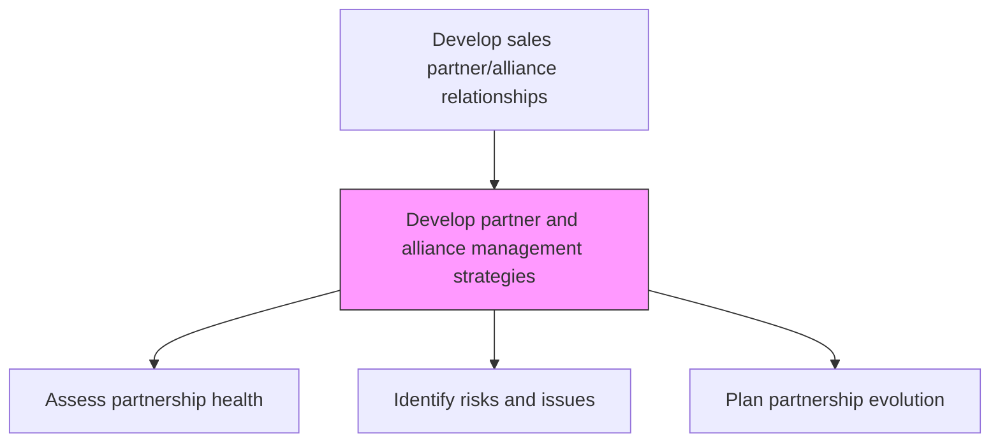
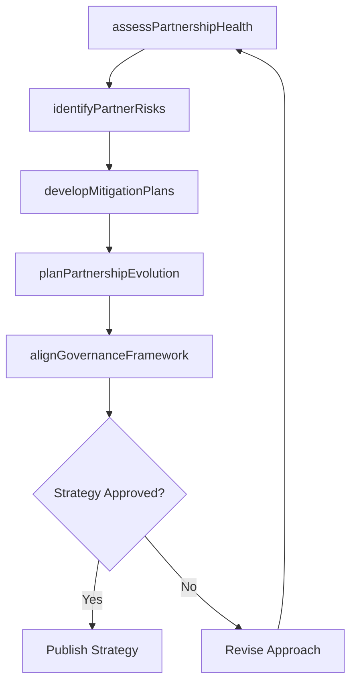

# Develop partner and alliance management strategies

> Business-as-Code definition for partner management strategy development. Models the creation of strategic roadmaps for managing alliance partnerships, anticipating issues, and planning for partnership evolution.

## Overview

Designing strategies for effectively managing, identifying, and countering any possible issues from the alliance partnerships formed. Create a strategic road map for managing the partnerships forged through Design alliance programs and methods for selecting and managing relationships [10139]. Determine where the alliance partnerships are headed, possible problems or pushback from the partners, how these issues might be countered, how these alliance partnerships would evolve in the future, any other business cases where these partnerships might be deployed, etc.

## Process Hierarchy



## GraphDL

```yaml
develop:
  object: Partner And Alliance Management Strategies
  actor: AllianceManager
  result: PartnerManagementStrategy
```

## Actions

| Action | Description |
|--------|-------------|
| assessPartnershipHealth | Evaluate the current state and trajectory of each alliance partnership |
| identifyPartnerRisks | Anticipate potential conflicts, performance gaps, or competitive threats |
| developMitigationPlans | Create contingency plans to address identified partnership risks |
| planPartnershipEvolution | Chart the future direction and expansion opportunities for alliances |
| alignGovernanceFramework | Establish governance structures and escalation procedures for partnerships |

## Events

| Event | Description |
|-------|-------------|
| partnershipHealthAssessed | Alliance health evaluation completed |
| partnerRisksIdentified | Partnership risks cataloged and prioritized |
| mitigationPlansDeveloped | Risk mitigation strategies created for at-risk partnerships |
| partnershipEvolutionPlanned | Future partnership roadmap defined |
| governanceFrameworkAligned | Partnership governance model approved |

## Searches

| Search | Description |
|--------|-------------|
| getPartnershipHealth | Retrieve health scores and assessments for alliance partnerships |
| getPartnerRisks | Access identified risks by partner or risk category |
| getEvolutionRoadmap | Query planned evolution milestones for a partnership |

## Process Flow



## RACI Matrix

| Activity | Responsible | Accountable | Consulted | Informed |
|----------|-------------|-------------|-----------|----------|
| assessPartnershipHealth | AllianceManager | VP Sales | Finance | PartnerDevelopment |
| identifyPartnerRisks | AllianceManager | VP Sales | Legal | Risk |
| planPartnershipEvolution | AllianceManager | VP Sales | Strategy | ExecutiveTeam |

## Related Processes

| Process | Relationship |
|---------|-------------|
| 3.4.2.10 Establish partner and alliance management goals | Downstream - strategy informs goal setting |
| 3.4.2.3 Design alliance programs and methods for selecting and managing relationships | Upstream - program design provides management framework |
| 3.5.5 Manage sales partners and alliances | Downstream - strategy guides operational management |

## Related Departments

| Department | Role |
|-----------|------|
| Partner Management | Develops and implements partner management strategies |
| Strategy | Aligns partnership evolution with corporate strategy |
| Legal | Reviews governance structures and contract implications |
| Risk Management | Supports partnership risk identification and mitigation |

## Related Occupations

| Occupation | Involvement |
|-----------|-------------|
| Alliance Manager | Leads partner management strategy development |
| Partner Development Manager | Contributes partnership growth insights |
| Strategic Planner | Aligns partnership strategies with business objectives |

## KPIs

| KPI | Description | Unit |
|-----|-------------|------|
| Partnership Health Score | Composite measure of alliance relationship quality | Score (1-10) |
| Risk Mitigation Effectiveness | Percentage of identified risks successfully mitigated | % |
| Strategy Refresh Frequency | How often partner management strategies are updated | Per Year |

## Usage

```typescript
import { developPartnerAndAllianceManagementStrategies } from '@headlessly/develop-partner-and-alliance-management-strategies'

const partnerStrategy = developPartnerAndAllianceManagementStrategies()

// Assess partnership health
const health = await partnerStrategy.assessPartnershipHealth({
  partnerId: 'tech-partner-a',
  dimensions: ['revenue-performance', 'engagement', 'satisfaction', 'strategic-alignment']
})

// Identify and mitigate risks
const risks = await partnerStrategy.identifyPartnerRisks({
  partnerId: 'tech-partner-a',
  riskCategories: ['competitive', 'financial', 'operational']
})
```
