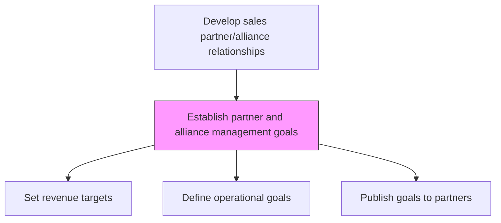
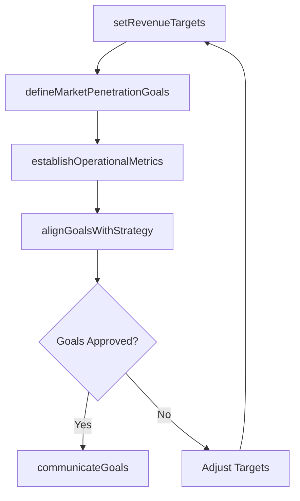

# Establish partner and alliance management goals

> Business-as-Code definition for partner management goal setting. Models the establishment of revenue targets, market penetration objectives, and operational metrics for individual partners and the alliance portfolio as a whole.

## Overview

Setting targets for organizational achievement. This includes what the organization aims to achieve from and how it wishes to manage both the individual partners and the alliance as a whole. Set immediate through long-term goals including revenue targets, market penetration, footfall numbers, and geographical coverage.

## Process Hierarchy



## GraphDL

```yaml
establish:
  object: Partner And Alliance Management Goals
  actor: ChannelProgramManager
  result: PartnerManagementGoals
```

## Actions

| Action | Description |
|--------|-------------|
| setRevenueTargets | Establish revenue and bookings goals for each partner and the alliance portfolio |
| defineMarketPenetrationGoals | Set targets for geographic coverage, market share, and customer acquisition through partners |
| establishOperationalMetrics | Define partner activity targets including deal registration and certification rates |
| alignGoalsWithStrategy | Ensure partner goals support overall sales strategy and business objectives |
| communicateGoals | Share approved goals with partner teams and individual partner organizations |

## Events

| Event | Description |
|-------|-------------|
| revenueTargetsSet | Partner revenue targets approved and allocated |
| marketPenetrationGoalsDefined | Market coverage and penetration targets published |
| operationalMetricsEstablished | Partner operational activity goals finalized |
| goalsAlignedWithStrategy | Partner goals validated against corporate strategy |
| goalsCommunicated | Approved goals distributed to partner teams |

## Searches

| Search | Description |
|--------|-------------|
| getPartnerGoals | Retrieve goals and targets for a specific partner |
| getPortfolioTargets | Access aggregate partner portfolio revenue targets |
| getGoalProgress | Track partner progress against established goals |

## Process Flow



## RACI Matrix

| Activity | Responsible | Accountable | Consulted | Informed |
|----------|-------------|-------------|-----------|----------|
| setRevenueTargets | ChannelProgramManager | VP Sales | Finance | PartnerDevelopment |
| defineMarketPenetrationGoals | ChannelProgramManager | VP Sales | Marketing | Strategy |
| communicateGoals | PartnerDevelopmentManager | VP Sales | HR | PartnerTeams |

## Related Processes

| Process | Relationship |
|---------|-------------|
| 3.4.2.9 Develop partner and alliance management strategies | Upstream - management strategy informs goal setting |
| 3.4.5 Establish sales goals and measures | Parallel - partner goals align with overall sales goals |
| 3.5.5 Manage sales partners and alliances | Downstream - goals guide operational partner management |

## Related Departments

| Department | Role |
|-----------|------|
| Channel Programs | Sets and manages partner goals |
| Finance | Validates revenue targets and financial assumptions |
| Partner Development | Communicates goals and tracks partner progress |
| Strategy | Ensures goal alignment with corporate objectives |

## Related Occupations

| Occupation | Involvement |
|-----------|-------------|
| Channel Program Manager | Establishes partner management goals and metrics |
| Partner Development Manager | Communicates and tracks goal progress |
| Financial Analyst | Models revenue targets and financial projections |

## KPIs

| KPI | Description | Unit |
|-----|-------------|------|
| Goal Attainment Rate | Percentage of partners achieving their assigned goals | % |
| Portfolio Revenue Achievement | Aggregate partner revenue vs. portfolio target | % |
| Goal Communication Timeliness | Days from goal approval to partner notification | Days |

## Usage

```typescript
import { establishPartnerAndAllianceManagementGoals } from '@headlessly/establish-partner-and-alliance-management-goals'

const goals = establishPartnerAndAllianceManagementGoals()

// Set partner revenue targets
const revenueGoals = await goals.setRevenueTargets({
  partnerId: 'reseller-a',
  annualTarget: 2000000,
  quarterlyMilestones: [400000, 500000, 500000, 600000]
})

// Define market penetration goals
const marketGoals = await goals.defineMarketPenetrationGoals({
  partnerId: 'reseller-a',
  newCustomerTarget: 50,
  geographicExpansion: ['midwest', 'southeast']
})
```
