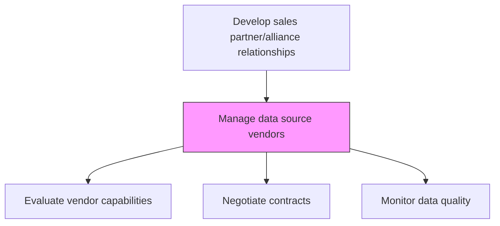
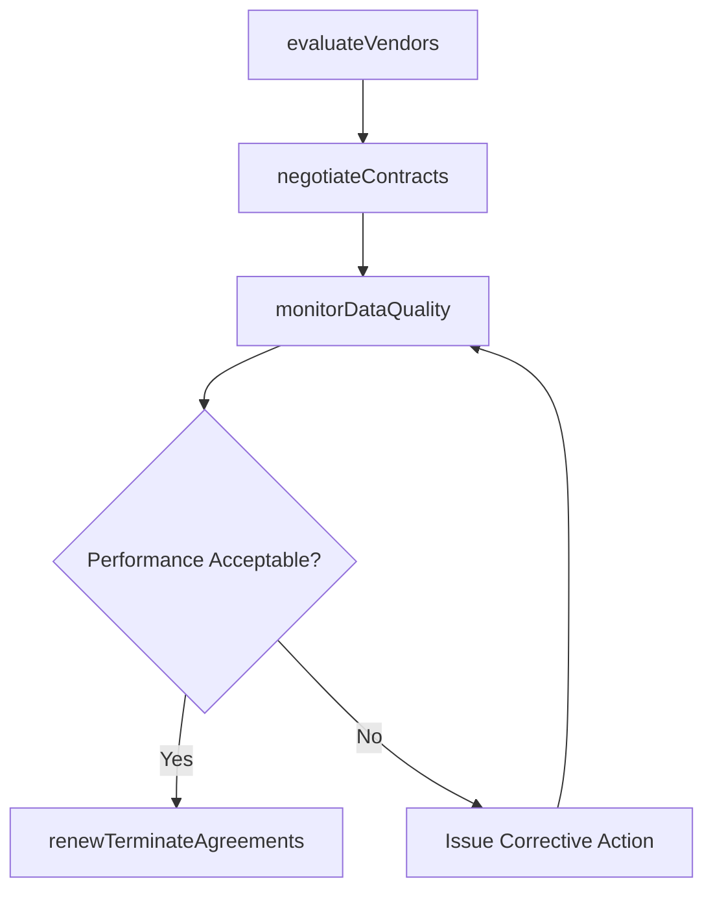

# Manage data source vendors

> Business-as-Code definition for data source vendor management. Models the selection, contracting, performance monitoring, and renewal of vendors that supply market data, consumer insights, and competitive intelligence.

## Overview

Selecting, contracting, and overseeing vendors that provide market data, consumer insights, and competitive intelligence used for sales strategy and trade planning. Evaluate vendor data quality, negotiate pricing and service level agreements, and ensure timely delivery of syndicated and custom data products.

## Process Hierarchy



## GraphDL

```yaml
manage:
  object: Data Source Vendors
  actor: VendorManager
  result: DataSourceVendorPortfolio
```

## Actions

| Action | Description |
|--------|-------------|
| evaluateVendors | Assess data source vendors on quality, coverage, and cost |
| negotiateContracts | Negotiate pricing, SLAs, and data delivery terms with vendors |
| monitorDataQuality | Track accuracy, timeliness, and completeness of vendor data feeds |
| renewTerminateAgreements | Renew or terminate vendor contracts based on performance reviews |

## Events

| Event | Description |
|-------|-------------|
| vendorsEvaluated | Vendor assessment completed and scored |
| contractsNegotiated | Vendor contract terms agreed and signed |
| dataQualityMonitored | Data quality metrics reviewed for the period |
| agreementsRenewed | Vendor contracts renewed or terminated |

## Searches

| Search | Description |
|--------|-------------|
| getVendorList | Retrieve current data source vendors with contract status |
| getVendorPerformance | Access vendor performance and data quality metrics |
| getContractTerms | Query vendor contract details and renewal dates |

## Process Flow



## RACI Matrix

| Activity | Responsible | Accountable | Consulted | Informed |
|----------|-------------|-------------|-----------|----------|
| evaluateVendors | VendorManager | SalesOperationsManager | IT | Finance |
| negotiateContracts | VendorManager | VP Sales | Procurement | Legal |
| monitorDataQuality | DataQualityAnalyst | VendorManager | IT | SalesAnalyst |

## Related Processes

| Process | Relationship |
|---------|-------------|
| 3.4.1.4 Analyze point of sales (POS) data and market/competitive information | Downstream - vendor data used in POS and market analysis |
| 3.4.2.2 Identify alliance opportunities | Parallel - vendor data informs alliance decisions |
| 7.3.1 Plan for and source materials and services | Upstream - procurement framework for vendor selection |

## Related Departments

| Department | Role |
|-----------|------|
| Sales Operations | Primary consumer of vendor data products |
| Procurement | Manages vendor selection and contract negotiation |
| IT | Integrates vendor data feeds into internal systems |
| Finance | Approves vendor spend and tracks ROI |

## Related Occupations

| Occupation | Involvement |
|-----------|-------------|
| Vendor Manager | Manages vendor relationships and contracts |
| Data Quality Analyst | Monitors and evaluates vendor data accuracy |
| Procurement Specialist | Handles vendor sourcing and negotiations |

## KPIs

| KPI | Description | Unit |
|-----|-------------|------|
| Vendor Data Quality Score | Composite accuracy and timeliness measure for vendor data | Score (1-100) |
| Contract Compliance Rate | Percentage of SLA terms met by vendors | % |
| Cost Per Data Point | Average cost for each data record or insight delivered | USD |

## Usage

```typescript
import { manageDataSourceVendors } from '@headlessly/manage-data-source-vendors'

const vendors = manageDataSourceVendors()

// Evaluate current vendor performance
const performance = await vendors.monitorDataQuality({
  vendorId: 'syndicated-data-co',
  metrics: ['accuracy', 'timeliness', 'completeness'],
  period: 'last-quarter'
})

// Negotiate contract renewal
const contract = await vendors.negotiateContracts({
  vendorId: 'syndicated-data-co',
  targetDiscount: 0.10,
  term: { months: 12 }
})
```
