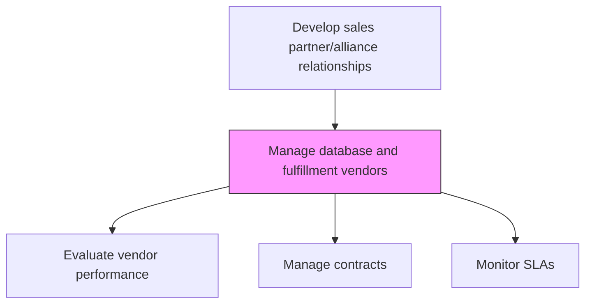
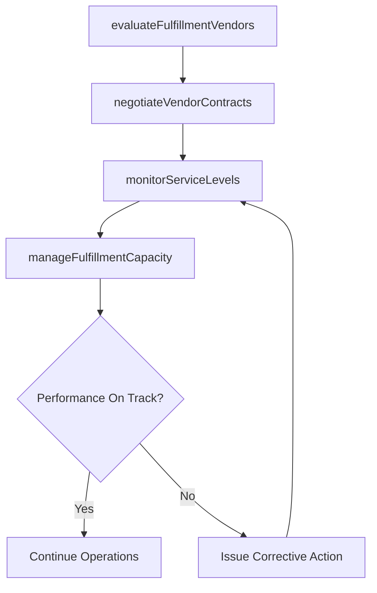

# Manage database and fulfillment vendors

> Business-as-Code definition for database and fulfillment vendor management. Models the oversight of vendors responsible for customer databases, mailing lists, order fulfillment, and logistics support for trade sales activities.

## Overview

Overseeing vendors that provide customer database management, direct mail fulfillment, order processing, and logistics services. Evaluate vendor capabilities, negotiate contracts, monitor service levels, and ensure vendor operations support trade marketing and sales execution effectively.

## Process Hierarchy



## GraphDL

```yaml
manage:
  object: Database And Fulfillment Vendors
  actor: VendorManager
  result: FulfillmentVendorPortfolio
```

## Actions

| Action | Description |
|--------|-------------|
| evaluateFulfillmentVendors | Assess database and fulfillment vendor capabilities and performance |
| negotiateVendorContracts | Negotiate pricing, service levels, and delivery terms with fulfillment vendors |
| monitorServiceLevels | Track vendor adherence to agreed service level agreements |
| manageFulfillmentCapacity | Ensure vendor capacity aligns with planned promotional and sales volumes |

## Events

| Event | Description |
|-------|-------------|
| fulfillmentVendorsEvaluated | Vendor assessment and scoring completed |
| vendorContractsNegotiated | Fulfillment vendor contracts finalized |
| serviceLevelsMonitored | SLA compliance metrics reviewed for the period |
| fulfillmentCapacityManaged | Vendor capacity aligned with upcoming demand |

## Searches

| Search | Description |
|--------|-------------|
| getFulfillmentVendors | List current database and fulfillment vendors with status |
| getVendorSLAMetrics | Retrieve service level performance data by vendor |
| getVendorCapacity | Query available vendor capacity for upcoming periods |

## Process Flow



## RACI Matrix

| Activity | Responsible | Accountable | Consulted | Informed |
|----------|-------------|-------------|-----------|----------|
| evaluateFulfillmentVendors | VendorManager | SalesOperationsManager | Procurement | IT |
| negotiateVendorContracts | VendorManager | VP Sales | Legal | Finance |
| monitorServiceLevels | VendorManager | SalesOperationsManager | Operations | Sales |

## Related Processes

| Process | Relationship |
|---------|-------------|
| 3.4.2.1 Manage data source vendors | Parallel - both manage vendor relationships for trade operations |
| 3.5.4 Manage sales orders | Downstream - fulfillment vendors support order processing |
| 7.3.1 Plan for and source materials and services | Upstream - procurement framework guides vendor selection |

## Related Departments

| Department | Role |
|-----------|------|
| Sales Operations | Primary stakeholder for fulfillment vendor services |
| Procurement | Manages vendor sourcing and contracting |
| IT | Integrates vendor systems with internal databases |
| Operations | Coordinates fulfillment logistics with vendors |

## Related Occupations

| Occupation | Involvement |
|-----------|-------------|
| Vendor Manager | Oversees fulfillment vendor relationships |
| Supply Chain Coordinator | Manages logistics and fulfillment operations |
| Database Administrator | Ensures vendor database quality and integration |

## KPIs

| KPI | Description | Unit |
|-----|-------------|------|
| Fulfillment Accuracy | Percentage of orders fulfilled correctly by vendors | % |
| SLA Compliance Rate | Percentage of service level targets met | % |
| Vendor Cost Efficiency | Cost per unit fulfilled relative to benchmark | USD |

## Usage

```typescript
import { manageDatabaseAndFulfillmentVendors } from '@headlessly/manage-database-and-fulfillment-vendors'

const fulfillment = manageDatabaseAndFulfillmentVendors()

// Monitor vendor service levels
const sla = await fulfillment.monitorServiceLevels({
  vendorId: 'fulfillment-vendor-a',
  metrics: ['order-accuracy', 'on-time-delivery', 'response-time'],
  period: 'last-quarter'
})

// Manage capacity for upcoming campaign
const capacity = await fulfillment.manageFulfillmentCapacity({
  vendorId: 'fulfillment-vendor-a',
  expectedVolume: 50000,
  period: 'next-month'
})
```
