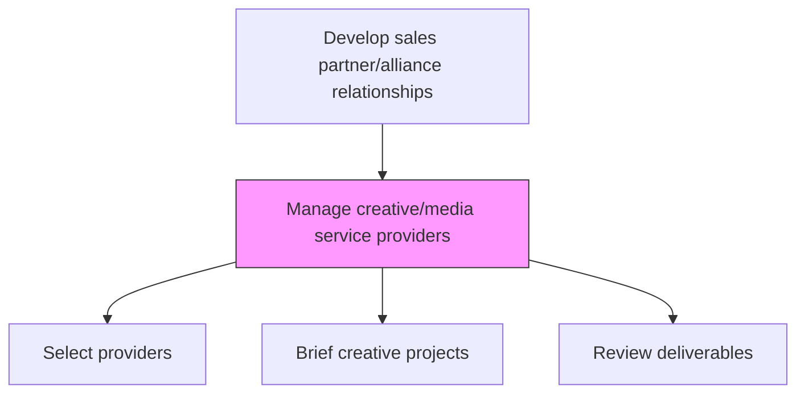
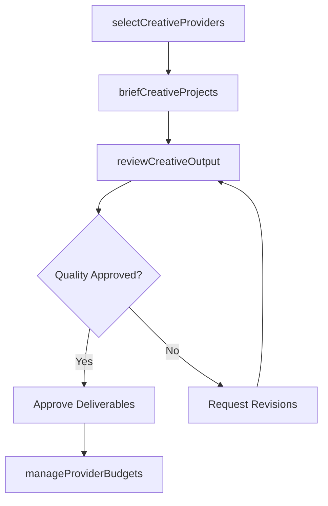

# Manage creative/media service providers

> Business-as-Code definition for creative and media service provider management. Models the oversight of advertising agencies, media buying firms, and creative production companies that support trade marketing and sales communications.

## Overview

Managing relationships with advertising agencies, media buying firms, graphic design studios, and creative production companies. Select and evaluate providers, negotiate scopes of work, review creative output quality, and ensure provider deliverables align with brand guidelines and trade marketing objectives.

## Process Hierarchy



## GraphDL

```yaml
manage:
  object: Creative/media Service Providers
  actor: TradeMarketingManager
  result: CreativeServiceProviderPortfolio
```

## Actions

| Action | Description |
|--------|-------------|
| selectCreativeProviders | Evaluate and select agencies and production companies for trade marketing work |
| briefCreativeProjects | Develop creative briefs and scopes of work for provider engagements |
| reviewCreativeOutput | Assess deliverable quality against brand guidelines and brief requirements |
| manageProviderBudgets | Track spend against approved budgets for creative and media services |

## Events

| Event | Description |
|-------|-------------|
| creativeProvidersSelected | Agency or production company selected for engagement |
| creativeProjectsBriefed | Creative briefs issued to providers |
| creativeOutputReviewed | Deliverable quality review completed |
| providerBudgetsManaged | Creative service spend tracked and reconciled |

## Searches

| Search | Description |
|--------|-------------|
| getCreativeProviders | List current creative and media service providers |
| getProjectStatus | Retrieve status of active creative projects by provider |
| getCreativeBudget | Access budget allocation and spend for creative services |

## Process Flow



## RACI Matrix

| Activity | Responsible | Accountable | Consulted | Informed |
|----------|-------------|-------------|-----------|----------|
| selectCreativeProviders | TradeMarketingManager | VP Marketing | Procurement | BrandManager |
| briefCreativeProjects | TradeMarketingManager | VP Marketing | Sales | BrandManager |
| reviewCreativeOutput | TradeMarketingManager | BrandManager | Legal | Sales |

## Related Processes

| Process | Relationship |
|---------|-------------|
| 3.3.3 Develop marketing communications strategy | Upstream - communications strategy guides creative direction |
| 3.4.2.14 Develop promotional and category management calendars | Downstream - creative assets support planned promotions |
| 3.4.2.1 Manage data source vendors | Parallel - both manage external service providers |

## Related Departments

| Department | Role |
|-----------|------|
| Trade Marketing | Manages creative provider relationships and briefs |
| Brand Management | Ensures creative output meets brand standards |
| Procurement | Handles provider selection and contract negotiation |
| Legal | Reviews creative content for compliance and IP issues |

## Related Occupations

| Occupation | Involvement |
|-----------|-------------|
| Trade Marketing Manager | Oversees creative service provider relationships |
| Brand Manager | Reviews creative output for brand compliance |
| Creative Project Manager | Coordinates creative production timelines |

## KPIs

| KPI | Description | Unit |
|-----|-------------|------|
| Creative Delivery On-Time Rate | Percentage of projects delivered by deadline | % |
| Revision Rate | Average number of revision rounds per deliverable | Count |
| Creative Budget Variance | Actual vs. budgeted spend for creative services | % |

## Usage

```typescript
import { manageCreativeMediaServiceProviders } from '@headlessly/manage-creative-media-service-providers'

const creative = manageCreativeMediaServiceProviders()

// Brief a new creative project
const brief = await creative.briefCreativeProjects({
  providerId: 'agency-a',
  projectType: 'trade-promotion-materials',
  deliverables: ['point-of-sale-display', 'digital-banner-set'],
  deadline: '2026-03-15'
})

// Review creative output
const review = await creative.reviewCreativeOutput({
  projectId: brief.projectId,
  checkBrandCompliance: true,
  reviewers: ['brand-manager', 'trade-marketing-lead']
})
```
