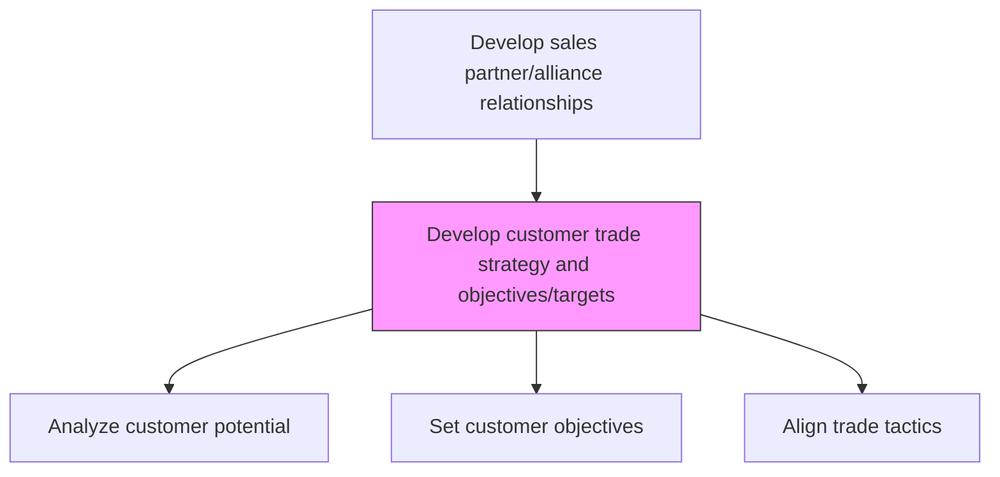
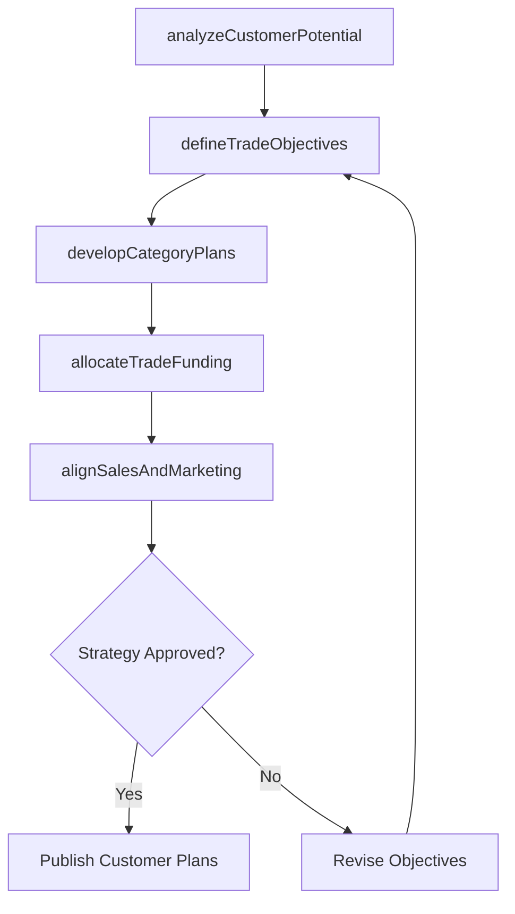

# Develop customer trade strategy and customer objectives/targets

> Business-as-Code definition for customer trade strategy development. Models the creation of customer-specific trade strategies, objectives, and targets using consumer insights and category management approaches.

## Overview

Implementing category management strategies for customers through the use of consumer insights and understanding of customer specifics. Develop consumer and channel insights. Establish long term strategies, objectives and targets across the brand.

## Process Hierarchy



## GraphDL

```yaml
develop:
  object: Customer Trade Strategy And Customer Objectives/targets
  actor: TradeMarketingManager
  result: CustomerTradeStrategyPlan
```

## Actions

| Action | Description |
|--------|-------------|
| analyzeCustomerPotential | Evaluate customer size, growth trajectory, and strategic importance |
| defineTradeObjectives | Set revenue, share, and distribution targets by customer |
| developCategoryPlans | Create category-level strategies aligned with customer goals |
| allocateTradeFunding | Distribute trade funds and resources across customer accounts |
| alignSalesAndMarketing | Ensure trade tactics align with brand and marketing strategy |

## Events

| Event | Description |
|-------|-------------|
| customerPotentialAnalyzed | Customer evaluation and segmentation completed |
| tradeObjectivesDefined | Customer-specific trade targets approved |
| categoryPlansDeveloped | Category strategies for key customers finalized |
| tradeFundingAllocated | Trade investment distributed across accounts |
| salesMarketingAligned | Trade tactics validated against marketing strategy |

## Searches

| Search | Description |
|--------|-------------|
| getCustomerTradeStrategy | Retrieve trade strategy for a specific customer account |
| getTradeObjectives | Access trade targets by customer, category, or period |
| getTradeFundingAllocation | Query trade fund distribution across accounts |

## Process Flow



## RACI Matrix

| Activity | Responsible | Accountable | Consulted | Informed |
|----------|-------------|-------------|-----------|----------|
| analyzeCustomerPotential | TradeMarketingManager | VP Sales | Finance | Sales |
| defineTradeObjectives | TradeMarketingManager | VP Sales | CategoryManager | Finance |
| allocateTradeFunding | TradeMarketingManager | VP Sales | Finance | AccountManagers |

## Related Processes

| Process | Relationship |
|---------|-------------|
| 3.4.2.6 Define trade programs and funding options | Downstream - strategy drives program and funding design |
| 3.4.2.7 Conduct planning activities for major trade customers | Downstream - strategy informs customer planning |
| 3.4.3 Perform category management | Parallel - category strategies align with trade objectives |
| 3.4.1 Develop sales forecast | Upstream - forecast data informs customer targets |

## Related Departments

| Department | Role |
|-----------|------|
| Trade Marketing | Develops customer trade strategies and objectives |
| Sales | Executes trade strategies at the customer level |
| Category Management | Provides category insights for trade planning |
| Finance | Approves trade investment levels and tracks ROI |

## Related Occupations

| Occupation | Involvement |
|-----------|-------------|
| Trade Marketing Manager | Leads customer trade strategy development |
| Key Account Manager | Translates trade strategy into customer plans |
| Category Manager | Provides category-level insights and recommendations |

## KPIs

| KPI | Description | Unit |
|-----|-------------|------|
| Trade Objective Achievement | Percentage of customer trade targets met | % |
| Trade ROI | Return on trade investment by customer | Ratio |
| Share of Shelf | Product shelf space attained at key customer locations | % |

## Usage

```typescript
import { developCustomerTradeStrategyAndCustomerObjectivesTargets } from '@headlessly/develop-customer-trade-strategy-and-customer-objectives-targets'

const tradeStrategy = developCustomerTradeStrategyAndCustomerObjectivesTargets()

// Analyze customer potential
const potential = await tradeStrategy.analyzeCustomerPotential({
  customerId: 'retailer-a',
  metrics: ['revenue-size', 'growth-rate', 'category-share']
})

// Define trade objectives
const objectives = await tradeStrategy.defineTradeObjectives({
  customerId: 'retailer-a',
  revenueTarget: 5000000,
  shareTarget: 0.25,
  period: 'fiscal-year-2026'
})
```
