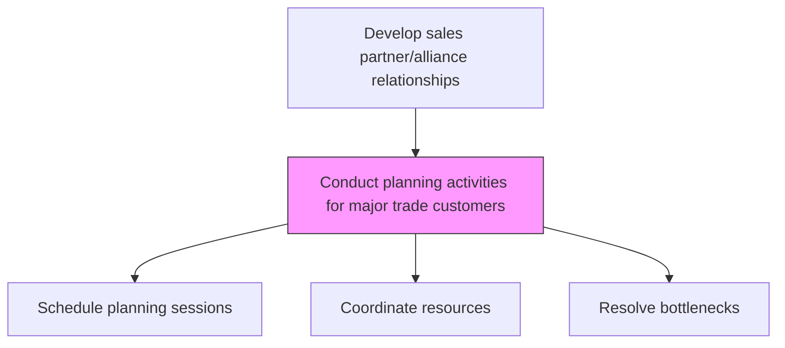
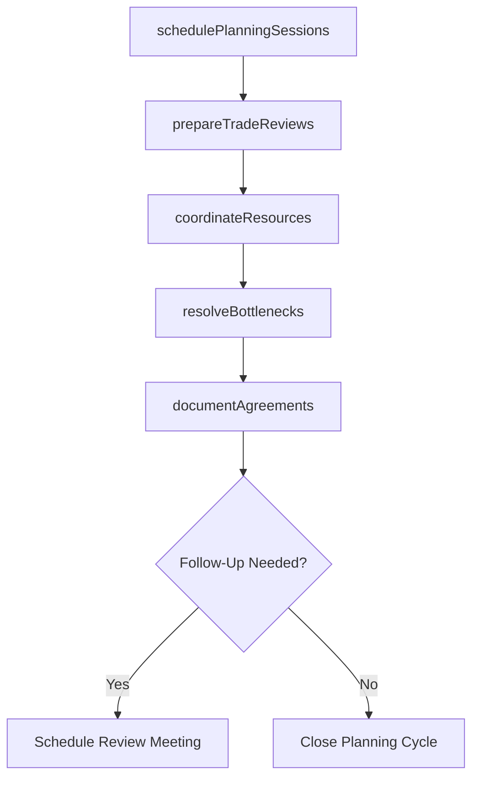

# Conduct planning activities for major trade customers

> Business-as-Code definition for major trade customer planning. Models the coordination of planning meetings, resource allocation, and logistics management with key trade partners.

## Overview

Arranging meetings with trade partners to coordinate logistics, manage critical resources, resolve bottlenecks, and schedule urgent or time-sensitive matters.

## Process Hierarchy



## GraphDL

```yaml
conduct:
  object: Planning Activities For Major Trade Customers
  actor: KeyAccountManager
  result: TradeCustomerPlanningOutcome
```

## Actions

| Action | Description |
|--------|-------------|
| schedulePlanningSessions | Arrange planning meetings with major trade customer stakeholders |
| prepareTradeReviews | Compile performance data and insights for customer business reviews |
| coordinateResources | Allocate cross-functional resources to support trade customer needs |
| resolveBottlenecks | Identify and address supply chain, merchandising, or operational issues |
| documentAgreements | Record planning session outcomes and action items |

## Events

| Event | Description |
|-------|-------------|
| planningSessionsScheduled | Trade customer planning meetings confirmed |
| tradeReviewsPrepared | Customer review materials compiled and distributed |
| resourcesCoordinated | Cross-functional resources allocated to customer plans |
| bottlenecksResolved | Operational issues with trade customers addressed |
| agreementsDocumented | Planning session decisions and action items recorded |

## Searches

| Search | Description |
|--------|-------------|
| getPlanningCalendar | Retrieve scheduled planning sessions by customer or period |
| getCustomerReviewData | Access performance review materials for a trade customer |
| getOpenActionItems | List unresolved action items from planning sessions |

## Process Flow



## RACI Matrix

| Activity | Responsible | Accountable | Consulted | Informed |
|----------|-------------|-------------|-----------|----------|
| schedulePlanningSessions | KeyAccountManager | VP Sales | TradeMarketing | Sales |
| prepareTradeReviews | KeyAccountManager | SalesOperationsManager | Finance | Marketing |
| resolveBottlenecks | KeyAccountManager | VP Sales | SupplyChain | Operations |

## Related Processes

| Process | Relationship |
|---------|-------------|
| 3.4.2.5 Develop customer trade strategy and customer objectives/targets | Upstream - trade strategy guides planning activities |
| 3.4.2.8 Collaborate with trade customers to create sales and promo plan | Downstream - planning activities lead to joint plans |
| 3.5.2 Manage customers and accounts | Parallel - account management activities overlap |

## Related Departments

| Department | Role |
|-----------|------|
| Sales | Leads planning sessions with trade customers |
| Trade Marketing | Provides category and promotional insights for planning |
| Supply Chain | Addresses logistics and fulfillment issues |
| Finance | Provides financial data for customer reviews |

## Related Occupations

| Occupation | Involvement |
|-----------|-------------|
| Key Account Manager | Facilitates trade customer planning activities |
| Trade Marketing Manager | Contributes category and promotional planning |
| Supply Chain Planner | Supports logistics and fulfillment coordination |

## KPIs

| KPI | Description | Unit |
|-----|-------------|------|
| Planning Session Completion Rate | Percentage of major customers with completed planning sessions | % |
| Action Item Resolution Rate | Percentage of planning action items resolved on time | % |
| Customer Satisfaction Score | Trade customer rating of planning process effectiveness | Score (1-10) |

## Usage

```typescript
import { conductPlanningActivitiesForMajorTradeCustomers } from '@headlessly/conduct-planning-activities-for-major-trade-customers'

const planning = conductPlanningActivitiesForMajorTradeCustomers()

// Schedule planning session
const session = await planning.schedulePlanningSessions({
  customerId: 'retailer-a',
  attendees: ['key-account-mgr', 'trade-marketing', 'supply-chain'],
  agenda: ['performance-review', 'promo-calendar', 'logistics']
})

// Prepare trade review materials
const review = await planning.prepareTradeReviews({
  customerId: 'retailer-a',
  period: 'last-quarter',
  includeCompetitorBenchmarks: true
})
```
