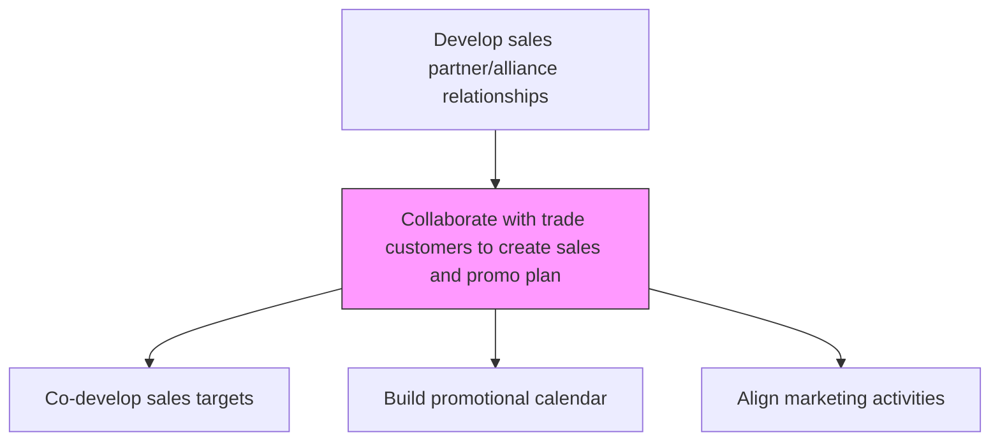
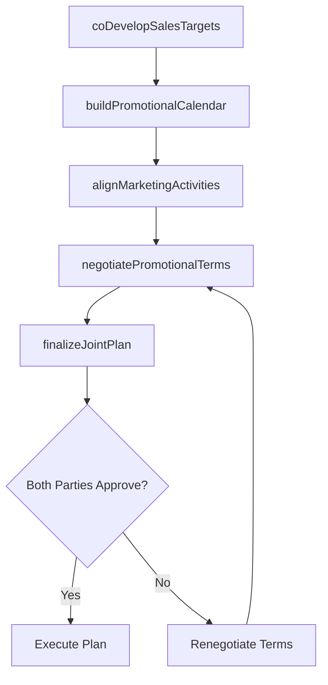

# Collaborate with trade customers to create sales and promo plan

> Business-as-Code definition for collaborative trade sales and promotion planning. Models the joint development of sales targets, promotional calendars, and marketing activities with trade customers.

## Overview

Partnering with trade customers (retailers, distributors, wholesalers) to jointly develop sales targets, promotional calendars, and co-marketing activities. Aligning manufacturer brand objectives with trade partner category goals to create mutually beneficial sell-through plans that drive volume, share, and margin for both parties.

## Process Hierarchy



## GraphDL

```yaml
collaborate:
  object: With Trade Customers To Create Sales And Promo Plan
  actor: KeyAccountManager
  result: JointSalesAndPromoPlan
```

## Actions

| Action | Description |
|--------|-------------|
| coDevelopSalesTargets | Jointly set mutual sales volume and revenue targets with the trade customer |
| buildPromotionalCalendar | Co-create a shared promotional event calendar with timing and tactics |
| alignMarketingActivities | Coordinate marketing campaigns and in-store activations with the customer |
| negotiatePromotionalTerms | Agree on promotional funding, pricing, and execution responsibilities |
| finalizeJointPlan | Document and sign off on the co-developed sales and promotional plan |

## Events

| Event | Description |
|-------|-------------|
| salesTargetsCoDeveloped | Mutual sales targets agreed with trade customer |
| promotionalCalendarBuilt | Joint promotional calendar finalized |
| marketingActivitiesAligned | Marketing campaigns coordinated with trade customer |
| promotionalTermsNegotiated | Promotional funding and execution terms agreed |
| jointPlanFinalized | Co-developed sales and promo plan signed off |

## Searches

| Search | Description |
|--------|-------------|
| getJointPlan | Retrieve the co-developed sales and promo plan for a customer |
| getPromotionalCalendar | Access the joint promotional calendar by customer |
| getMutualTargets | Query agreed sales targets by customer and product |

## Process Flow



## RACI Matrix

| Activity | Responsible | Accountable | Consulted | Informed |
|----------|-------------|-------------|-----------|----------|
| coDevelopSalesTargets | KeyAccountManager | VP Sales | TradeMarketing | Finance |
| buildPromotionalCalendar | TradeMarketingManager | KeyAccountManager | Marketing | Sales |
| finalizeJointPlan | KeyAccountManager | VP Sales | Legal | Finance |

## Related Processes

| Process | Relationship |
|---------|-------------|
| 3.4.2.7 Conduct planning activities for major trade customers | Upstream - planning sessions lead to collaborative plan creation |
| 3.4.2.14 Develop promotional and category management calendars | Parallel - promotional calendars inform joint plans |
| 3.4.2.6 Define trade programs and funding options | Upstream - trade programs fund promotional activities |

## Related Departments

| Department | Role |
|-----------|------|
| Sales | Leads the collaborative planning process with trade customers |
| Trade Marketing | Provides promotional concepts and funding options |
| Marketing | Aligns brand campaigns with joint promotional activities |
| Finance | Approves promotional investment and tracks spend |

## Related Occupations

| Occupation | Involvement |
|-----------|-------------|
| Key Account Manager | Facilitates joint planning with trade customers |
| Trade Marketing Manager | Designs promotional concepts for joint plans |
| Category Manager | Provides category insights for promotional planning |

## KPIs

| KPI | Description | Unit |
|-----|-------------|------|
| Joint Plan Completion Rate | Percentage of major customers with finalized joint plans | % |
| Promotional Compliance | Percentage of planned promotions executed as agreed | % |
| Joint Target Achievement | Percentage of co-developed sales targets met | % |

## Usage

```typescript
import { collaborateWithTradeCustomersToCreateSalesAndPromoPlan } from '@headlessly/collaborate-with-trade-customers-to-create-sales-and-promo-plan'

const collab = collaborateWithTradeCustomersToCreateSalesAndPromoPlan()

// Co-develop sales targets
const targets = await collab.coDevelopSalesTargets({
  customerId: 'retailer-a',
  revenueTarget: 3000000,
  volumeTarget: 150000,
  period: 'fiscal-year-2026'
})

// Build joint promotional calendar
const calendar = await collab.buildPromotionalCalendar({
  customerId: 'retailer-a',
  events: ['spring-sale', 'back-to-school', 'holiday-season'],
  fundingPool: 200000
})
```
