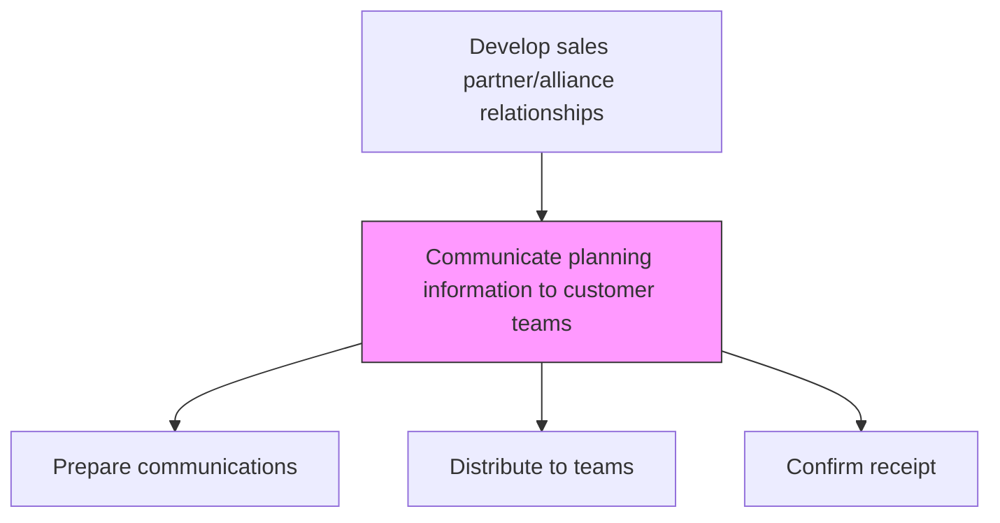
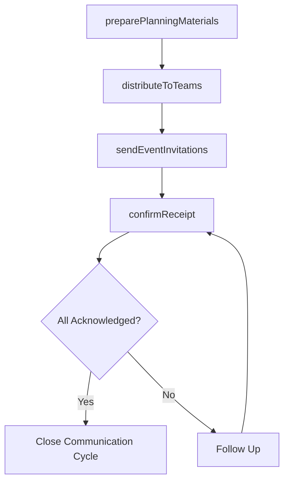

# Communicate planning information to customer teams

> Business-as-Code definition for planning information communication. Models the distribution of event invitations, planning documents, and strategic information to customer-facing teams and trade partners.

## Overview

Sending invitations and distributing information about upcoming events to customer teams and other involved entities.

## Process Hierarchy



## GraphDL

```yaml
communicate:
  object: Planning Information To Customer Teams
  actor: SalesOperationsManager
  result: PlanningCommunicationRecord
```

## Actions

| Action | Description |
|--------|-------------|
| preparePlanningMaterials | Compile planning documents, calendars, and briefing packages for distribution |
| distributeToTeams | Send planning information to customer-facing sales teams and support staff |
| sendEventInvitations | Issue invitations for upcoming planning sessions, reviews, and trade events |
| confirmReceipt | Verify that customer teams have received and acknowledged planning materials |

## Events

| Event | Description |
|-------|-------------|
| planningMaterialsPrepared | Planning documents compiled and ready for distribution |
| materialsDistributed | Planning information sent to customer teams |
| eventInvitationsSent | Event invitations distributed to relevant stakeholders |
| receiptConfirmed | Acknowledgment received from customer team members |

## Searches

| Search | Description |
|--------|-------------|
| getPlanningCommunications | Retrieve planning communications by customer or period |
| getDistributionStatus | Track delivery and acknowledgment status of planning materials |
| getEventInvitations | List sent event invitations with RSVP status |

## Process Flow



## RACI Matrix

| Activity | Responsible | Accountable | Consulted | Informed |
|----------|-------------|-------------|-----------|----------|
| preparePlanningMaterials | SalesOperationsManager | VP Sales | TradeMarketing | Sales |
| distributeToTeams | SalesOperationsManager | VP Sales | IT | KeyAccountManagers |
| confirmReceipt | SalesCoordinator | SalesOperationsManager | Sales | HR |

## Related Processes

| Process | Relationship |
|---------|-------------|
| 3.4.2.15 Create strategic and tactical sales plans by customer | Upstream - completed plans are communicated |
| 3.4.2.7 Conduct planning activities for major trade customers | Upstream - planning session outcomes distributed |
| 3.5.2 Manage customers and accounts | Downstream - teams use planning info in account management |

## Related Departments

| Department | Role |
|-----------|------|
| Sales Operations | Manages planning information distribution |
| Sales | Receives and acts on planning information |
| Trade Marketing | Contributes promotional planning materials |
| IT | Supports communication platform and delivery tracking |

## Related Occupations

| Occupation | Involvement |
|-----------|-------------|
| Sales Operations Manager | Coordinates planning information distribution |
| Sales Coordinator | Manages communication logistics and follow-up |
| Key Account Manager | Primary recipient of customer-specific planning info |

## KPIs

| KPI | Description | Unit |
|-----|-------------|------|
| Distribution Timeliness | Percentage of materials distributed before deadline | % |
| Acknowledgment Rate | Percentage of recipients who confirmed receipt | % |
| Communication Satisfaction | Team rating of planning communication quality | Score (1-5) |

## Usage

```typescript
import { communicatePlanningInformationToCustomerTeams } from '@headlessly/communicate-planning-information-to-customer-teams'

const comms = communicatePlanningInformationToCustomerTeams()

// Distribute planning materials
await comms.distributeToTeams({
  materials: ['q2-trade-calendar', 'customer-plan-retailer-a'],
  recipients: ['midwest-sales-team', 'key-account-managers'],
  deadline: '2026-03-01'
})

// Send event invitations
await comms.sendEventInvitations({
  event: 'annual-trade-planning-session',
  invitees: ['sales-directors', 'category-managers', 'trade-marketing'],
  date: '2026-04-15'
})
```
