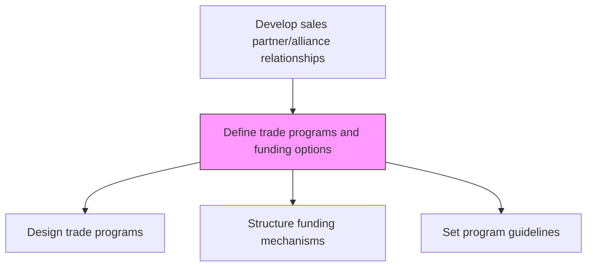
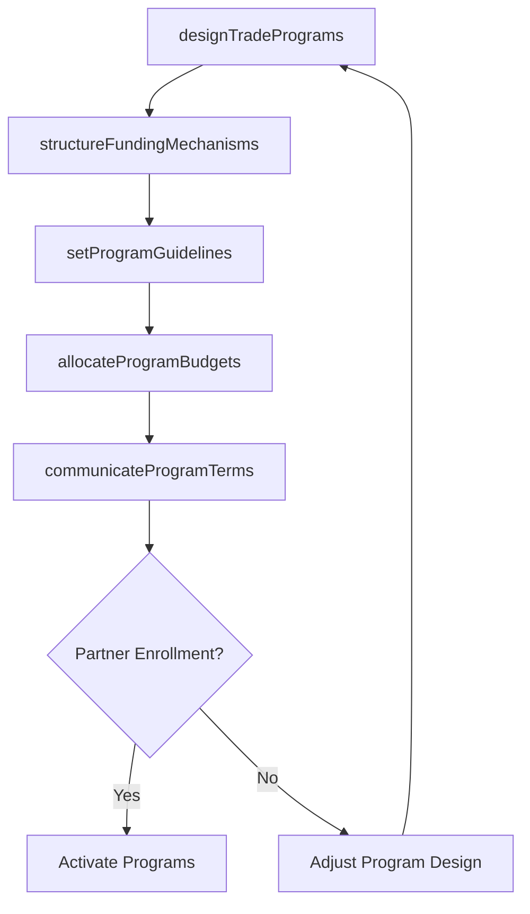

# Define trade programs and funding options

> Business-as-Code definition for trade program and funding design. Models the creation of B2B marketing programs, financial incentives, and funding mechanisms for wholesalers, dealers, and retail partners.

## Overview

Establishing business-to-business marketing campaigns and financial incentives for wholesalers, dealers, distributors and other intermediaries that the company uses to distribute its products or services.

## Process Hierarchy



## GraphDL

```yaml
define:
  object: Trade Programs And Funding Options
  actor: TradeMarketingManager
  result: TradeProgramPortfolio
```

## Actions

| Action | Description |
|--------|-------------|
| designTradePrograms | Create B2B marketing programs including promotions, incentives, and allowances |
| structureFundingMechanisms | Define co-op, MDF, and accrual-based funding models for partners |
| setProgramGuidelines | Establish eligibility, approval workflows, and compliance rules |
| allocateProgramBudgets | Distribute trade program funds across partner tiers and geographies |
| communicateProgramTerms | Publish program details, terms, and enrollment processes to partners |

## Events

| Event | Description |
|-------|-------------|
| tradeProgramsDesigned | Trade program structures finalized and approved |
| fundingMechanismsStructured | Funding models defined and budgeted |
| programGuidelinesSet | Program rules and compliance requirements published |
| programBudgetsAllocated | Trade program funds distributed to regions and tiers |
| programTermsCommunicated | Program details shared with eligible partners |

## Searches

| Search | Description |
|--------|-------------|
| getTradePrograms | List available trade programs by type, tier, or region |
| getFundingOptions | Retrieve funding mechanisms and available balances by partner |
| getProgramGuidelines | Access program eligibility and compliance requirements |

## Process Flow



## RACI Matrix

| Activity | Responsible | Accountable | Consulted | Informed |
|----------|-------------|-------------|-----------|----------|
| designTradePrograms | TradeMarketingManager | VP Sales | Finance | ChannelSales |
| structureFundingMechanisms | TradeMarketingManager | VP Sales | Finance | Accounting |
| allocateProgramBudgets | TradeMarketingManager | CFO | Finance | VP Sales |

## Related Processes

| Process | Relationship |
|---------|-------------|
| 3.4.2.5 Develop customer trade strategy and customer objectives/targets | Upstream - trade strategy guides program design |
| 3.4.2.8 Collaborate with trade customers to create sales and promo plan | Downstream - programs fund collaborative plans |
| 3.3.6 Manage trade pricing, promotions and allowances | Parallel - trade programs align with pricing strategy |

## Related Departments

| Department | Role |
|-----------|------|
| Trade Marketing | Designs and manages trade programs |
| Finance | Approves budgets and manages fund accounting |
| Channel Sales | Enrolls partners and manages program participation |
| Accounting | Tracks trade spend and accruals |

## Related Occupations

| Occupation | Involvement |
|-----------|-------------|
| Trade Marketing Manager | Designs trade programs and funding structures |
| Channel Program Manager | Manages partner enrollment and program execution |
| Financial Analyst | Models trade program economics and ROI |

## KPIs

| KPI | Description | Unit |
|-----|-------------|------|
| Program Utilization Rate | Percentage of allocated trade funds actually claimed by partners | % |
| Trade Program ROI | Revenue generated per dollar of trade program investment | Ratio |
| Partner Enrollment Rate | Percentage of eligible partners enrolled in programs | % |

## Usage

```typescript
import { defineTradeProgramsAndFundingOptions } from '@headlessly/define-trade-programs-and-funding-options'

const tradePrograms = defineTradeProgramsAndFundingOptions()

// Design a co-op marketing program
const program = await tradePrograms.designTradePrograms({
  type: 'co-op-marketing',
  eligibleTiers: ['gold', 'platinum'],
  maxFundPerPartner: 50000
})

// Allocate budgets across regions
const allocation = await tradePrograms.allocateProgramBudgets({
  programId: program.id,
  regions: { 'north-america': 500000, 'europe': 300000 }
})
```
