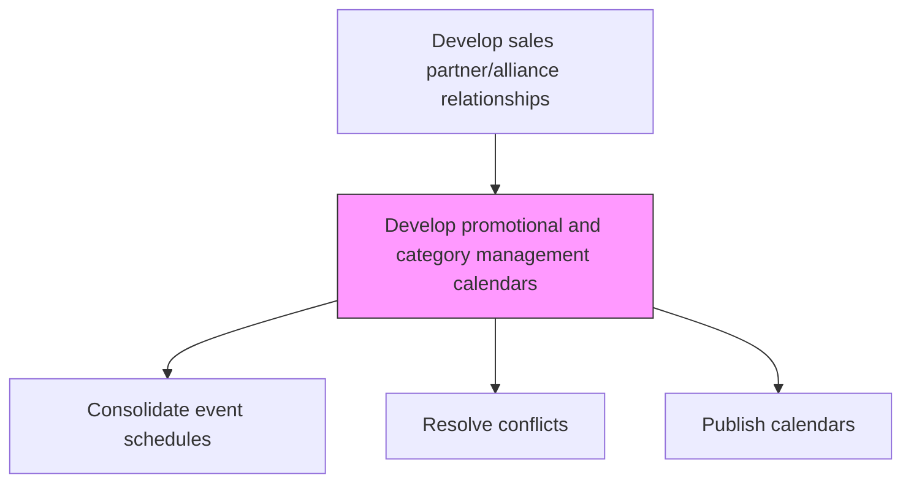
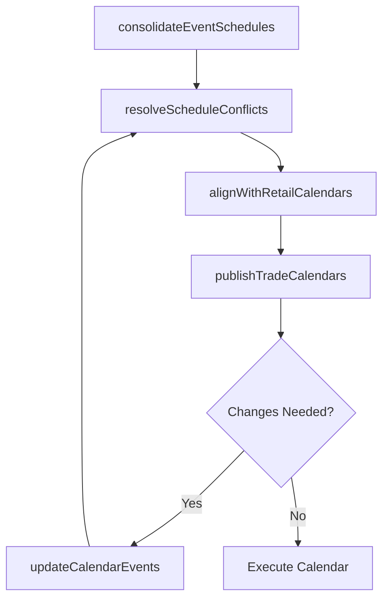

# Develop promotional and category management calendars (trade marketing calendars)

> Business-as-Code definition for promotional and trade marketing calendar development. Models the unification of promotional events, category management activities, and trade marketing initiatives into coordinated timetables.

## Overview

Combining scheduled promotional, category management and trade marketing events into unified timetables. Update the calendars. Register new events.

## Process Hierarchy



## GraphDL

```yaml
develop:
  object: Promotional And Category Management Calendars (trade Marketing Calendars)
  actor: TradeMarketingManager
  result: TradeMarketingCalendar
```

## Actions

| Action | Description |
|--------|-------------|
| consolidateEventSchedules | Merge promotional, category management, and trade marketing event schedules |
| resolveScheduleConflicts | Identify and resolve timing conflicts between overlapping events |
| alignWithRetailCalendars | Synchronize trade marketing calendars with key retailer event cycles |
| publishTradeCalendars | Distribute finalized calendars to sales teams and trade partners |
| updateCalendarEvents | Add, modify, or cancel events as plans evolve |

## Events

| Event | Description |
|-------|-------------|
| eventSchedulesConsolidated | Multiple event schedules merged into unified calendar |
| scheduleConflictsResolved | Timing conflicts between events addressed |
| retailCalendarsAligned | Trade calendars synchronized with retailer cycles |
| tradeCalendarsPublished | Finalized calendars distributed to stakeholders |
| calendarEventsUpdated | Calendar modifications communicated to teams |

## Searches

| Search | Description |
|--------|-------------|
| getTradeCalendar | Retrieve trade marketing calendar by period or customer |
| getUpcomingEvents | List upcoming promotional and category events |
| getCalendarConflicts | Identify scheduling conflicts in the trade calendar |

## Process Flow



## RACI Matrix

| Activity | Responsible | Accountable | Consulted | Informed |
|----------|-------------|-------------|-----------|----------|
| consolidateEventSchedules | TradeMarketingManager | VP Sales | Marketing | CategoryManagement |
| resolveScheduleConflicts | TradeMarketingManager | VP Sales | Sales | Marketing |
| publishTradeCalendars | TradeMarketingManager | VP Sales | Sales | Partners |

## Related Processes

| Process | Relationship |
|---------|-------------|
| 3.4.2.8 Collaborate with trade customers to create sales and promo plan | Upstream - joint plans feed into calendar |
| 3.4.3 Perform category management | Parallel - category events included in calendar |
| 3.3.6 Manage trade pricing, promotions and allowances | Parallel - promotional events coordinated with pricing |

## Related Departments

| Department | Role |
|-----------|------|
| Trade Marketing | Owns and manages the unified trade calendar |
| Sales | Executes planned events at customer level |
| Category Management | Contributes category-specific events and resets |
| Marketing | Aligns brand campaigns with trade promotional timing |

## Related Occupations

| Occupation | Involvement |
|-----------|-------------|
| Trade Marketing Manager | Creates and maintains trade marketing calendars |
| Category Manager | Contributes category event schedules |
| Sales Planner | Uses calendars to plan customer activities |

## KPIs

| KPI | Description | Unit |
|-----|-------------|------|
| Calendar Adherence | Percentage of planned events executed as scheduled | % |
| Schedule Conflict Rate | Number of unresolved conflicts per calendar cycle | Count |
| Calendar Publication Lead Time | Days between calendar finalization and distribution | Days |

## Usage

```typescript
import { developPromotionalAndCategoryManagementCalendarsTradeMarketingCalendars } from '@headlessly/develop-promotional-and-category-management-calendars-trade-marketing-calendars'

const calendar = developPromotionalAndCategoryManagementCalendarsTradeMarketingCalendars()

// Consolidate event schedules
const unified = await calendar.consolidateEventSchedules({
  sources: ['promotions', 'category-resets', 'trade-shows'],
  period: 'fiscal-year-2026'
})

// Publish to teams
await calendar.publishTradeCalendars({
  calendarId: unified.id,
  recipients: ['sales-teams', 'trade-partners', 'category-managers']
})
```
