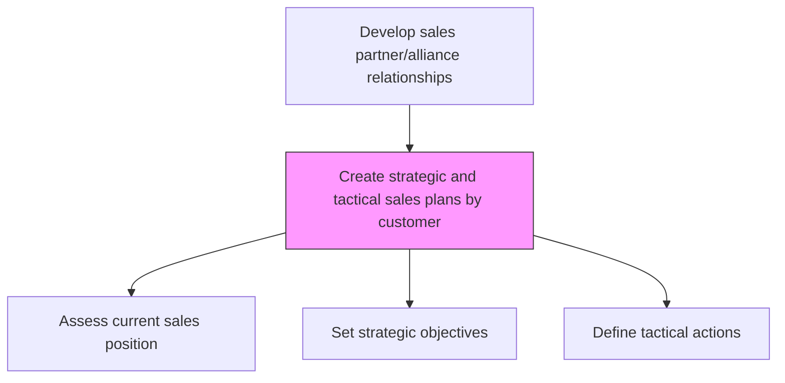
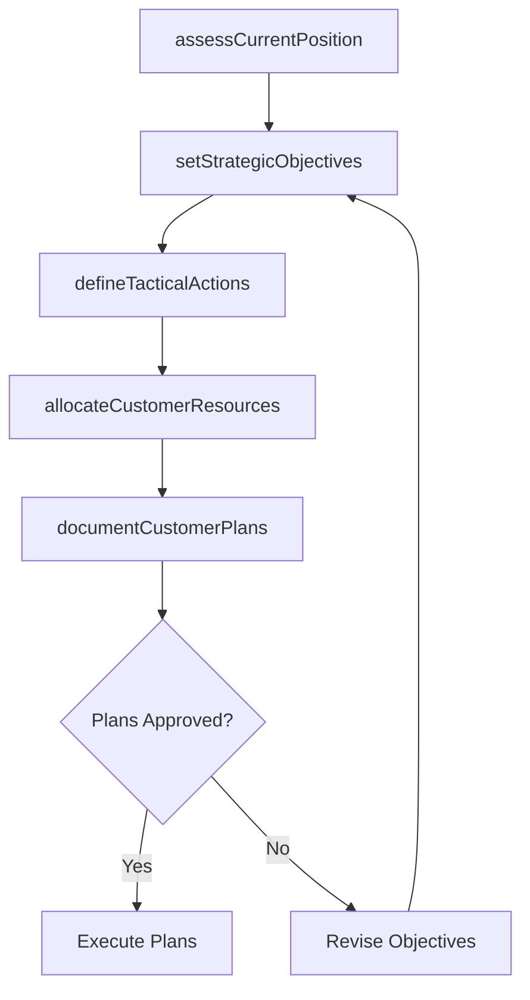

# Create strategic and tactical sales plans by customer

> Business-as-Code definition for customer-level sales plan creation. Models the development of both strategic long-term and tactical short-term sales plans for individual customer accounts.

## Overview

Establishing long term customer sales plans to assess current sales and to determine future sales objectives, strategies for achieving the goals, and available resources.

## Process Hierarchy



## GraphDL

```yaml
create:
  object: Strategic And Tactical Sales Plans By Customer
  actor: KeyAccountManager
  result: CustomerSalesPlan
```

## Actions

| Action | Description |
|--------|-------------|
| assessCurrentPosition | Evaluate current sales performance and share at each customer account |
| setStrategicObjectives | Define long-term growth, retention, and expansion goals per customer |
| defineTacticalActions | Identify short-term initiatives, promotions, and sales activities per customer |
| allocateCustomerResources | Assign sales team members, budgets, and support resources to each plan |
| documentCustomerPlans | Compile strategic and tactical plans into formal customer plan documents |

## Events

| Event | Description |
|-------|-------------|
| currentPositionAssessed | Customer sales baseline and performance evaluated |
| strategicObjectivesSet | Long-term customer growth goals established |
| tacticalActionsDefined | Short-term sales activities and initiatives planned |
| customerResourcesAllocated | Resources assigned to customer plans |
| customerPlansDocumented | Formal customer sales plans completed and distributed |

## Searches

| Search | Description |
|--------|-------------|
| getCustomerSalesPlan | Retrieve strategic or tactical plan for a specific customer |
| getCustomerPerformance | Access current sales performance data by customer |
| getPlanProgress | Track execution progress against customer plan objectives |

## Process Flow



## RACI Matrix

| Activity | Responsible | Accountable | Consulted | Informed |
|----------|-------------|-------------|-----------|----------|
| assessCurrentPosition | KeyAccountManager | SalesDirector | Finance | Marketing |
| setStrategicObjectives | KeyAccountManager | VP Sales | Strategy | Finance |
| defineTacticalActions | KeyAccountManager | SalesDirector | TradeMarketing | Operations |
| documentCustomerPlans | KeyAccountManager | SalesDirector | SalesOperations | VP Sales |

## Related Processes

| Process | Relationship |
|---------|-------------|
| 3.4.2.5 Develop customer trade strategy and customer objectives/targets | Upstream - trade strategy informs customer plans |
| 3.4.2.16 Communicate planning information to customer teams | Downstream - completed plans communicated to teams |
| 3.5.2 Manage customers and accounts | Downstream - plans guide account management activities |

## Related Departments

| Department | Role |
|-----------|------|
| Sales | Creates and executes customer-level sales plans |
| Trade Marketing | Contributes promotional tactics for customer plans |
| Finance | Validates revenue targets and resource allocations |
| Sales Operations | Provides performance data and plan templates |

## Related Occupations

| Occupation | Involvement |
|-----------|-------------|
| Key Account Manager | Creates strategic and tactical plans for assigned customers |
| Sales Director | Reviews and approves customer sales plans |
| Sales Planner | Supports plan development with data and templates |

## KPIs

| KPI | Description | Unit |
|-----|-------------|------|
| Plan Coverage | Percentage of key customers with documented sales plans | % |
| Strategic Objective Achievement | Percentage of long-term customer goals met | % |
| Tactical Execution Rate | Percentage of planned tactical actions completed | % |

## Usage

```typescript
import { createStrategicAndTacticalSalesPlansByCustomer } from '@headlessly/create-strategic-and-tactical-sales-plans-by-customer'

const plans = createStrategicAndTacticalSalesPlansByCustomer()

// Assess current position at a customer
const baseline = await plans.assessCurrentPosition({
  customerId: 'retailer-a',
  metrics: ['revenue', 'share-of-category', 'distribution-points']
})

// Set strategic objectives
const objectives = await plans.setStrategicObjectives({
  customerId: 'retailer-a',
  revenueGrowthTarget: 0.15,
  shareTarget: 0.30,
  horizon: '3-years'
})
```
