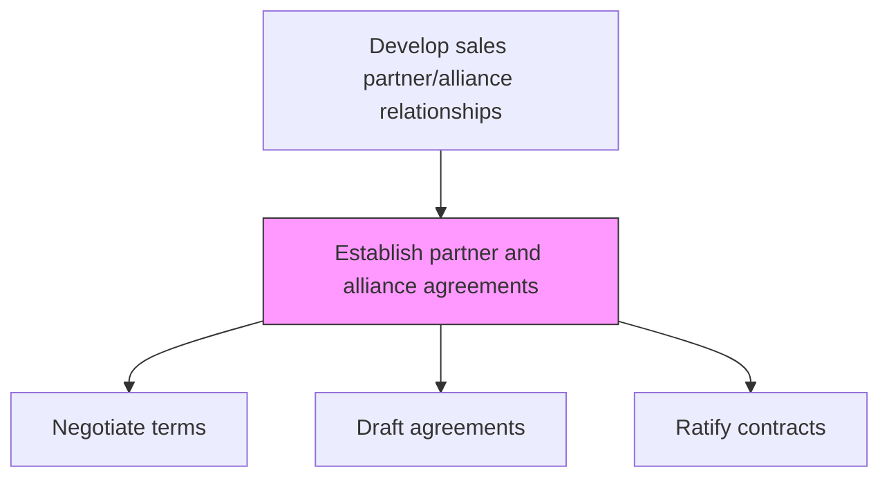
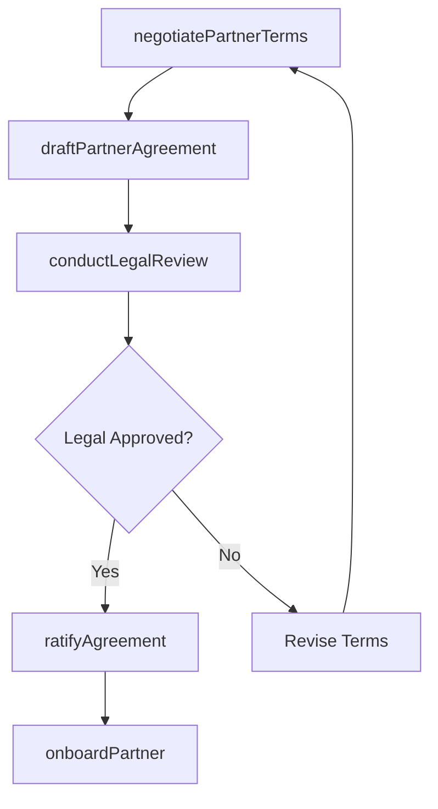

# Establish partner and alliance agreements

> Business-as-Code definition for partner agreement establishment. Models the negotiation, drafting, and ratification of strategic alliance contracts and partnership agreements with key trade partners.

## Overview

Setting up strategic alliances with key trade partners and ratifying partnership agreements.

## Process Hierarchy



## GraphDL

```yaml
establish:
  object: Partner And Alliance Agreements
  actor: PartnerDevelopmentManager
  result: PartnerAgreement
```

## Actions

| Action | Description |
|--------|-------------|
| negotiatePartnerTerms | Discuss and agree on commercial terms, obligations, and exclusivity clauses |
| draftPartnerAgreement | Create the formal partnership contract incorporating agreed terms |
| conductLegalReview | Submit agreement for legal review of compliance and risk provisions |
| ratifyAgreement | Obtain executive signatures and finalize the partnership contract |
| onboardPartner | Set up partner in systems, assign account team, and initiate enablement |

## Events

| Event | Description |
|-------|-------------|
| partnerTermsNegotiated | Commercial terms agreed with partner organization |
| partnerAgreementDrafted | Partnership contract document created |
| legalReviewCompleted | Legal review of agreement finished |
| agreementRatified | Partnership contract executed by both parties |
| partnerOnboarded | New partner set up in systems and enablement initiated |

## Searches

| Search | Description |
|--------|-------------|
| getPartnerAgreements | Retrieve partnership agreements by partner, status, or expiry date |
| getAgreementTerms | Access specific terms and conditions of a partner agreement |
| getAgreementRenewalSchedule | Query upcoming agreement renewal and expiration dates |

## Process Flow



## RACI Matrix

| Activity | Responsible | Accountable | Consulted | Informed |
|----------|-------------|-------------|-----------|----------|
| negotiatePartnerTerms | PartnerDevelopmentManager | VP Sales | Legal | Finance |
| draftPartnerAgreement | LegalCounsel | VP Sales | PartnerDevelopment | Finance |
| ratifyAgreement | VP Sales | CRO | Legal | ExecutiveTeam |

## Related Processes

| Process | Relationship |
|---------|-------------|
| 3.4.2.4 Select alliances | Upstream - selected partners proceed to agreement |
| 3.4.2.9 Develop partner and alliance management strategies | Parallel - management strategy informs agreement terms |
| 3.5.5 Manage sales partners and alliances | Downstream - executed agreements govern partner operations |

## Related Departments

| Department | Role |
|-----------|------|
| Partner Development | Leads negotiation and partner onboarding |
| Legal | Reviews and drafts partnership contracts |
| Finance | Validates commercial terms and revenue sharing |
| IT | Sets up partner access to systems and portals |

## Related Occupations

| Occupation | Involvement |
|-----------|-------------|
| Partner Development Manager | Negotiates and manages partnership agreements |
| Legal Counsel | Drafts and reviews partnership contracts |
| Contract Administrator | Manages agreement lifecycle and renewals |

## KPIs

| KPI | Description | Unit |
|-----|-------------|------|
| Agreement Cycle Time | Time from first negotiation to executed contract | Days |
| Agreement Renewal Rate | Percentage of partnerships renewed at contract expiry | % |
| Onboarding Time | Days from agreement execution to partner activation | Days |

## Usage

```typescript
import { establishPartnerAndAllianceAgreements } from '@headlessly/establish-partner-and-alliance-agreements'

const agreements = establishPartnerAndAllianceAgreements()

// Negotiate partnership terms
const terms = await agreements.negotiatePartnerTerms({
  partnerId: 'tech-partner-b',
  proposedTerms: {
    commissionRate: 0.20,
    exclusivity: 'non-exclusive',
    territory: 'north-america',
    duration: { months: 24 }
  }
})

// Ratify the agreement
const contract = await agreements.ratifyAgreement({
  agreementId: terms.agreementId,
  signatories: ['vp-sales', 'partner-ceo']
})
```
