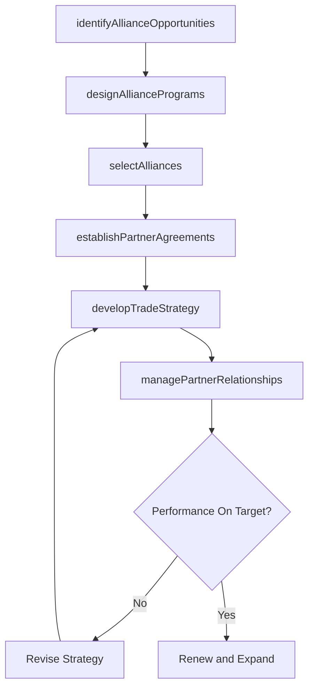

# Develop sales partner/alliance relationships

> Business-as-Code definition for sales partner and alliance relationship development. Models the identification, selection, program design, trade planning, and ongoing management of sales partnerships and strategic alliances to expand market reach and revenue.

## Overview

Cultivating an alliance of partners by identifying, analyzing, negotiating, and managing partnerships with other economic agents.

## Process Hierarchy

```mermaid
graph TD
    A[Develop sales partner/alliance relationships]
    A --> B[Manage data source vendors]
    A --> C[Identify alliance opportunities]
    A --> D[Design alliance programs and methods for selecting and managing relationships]
    A --> E[Select alliances]
    A --> F[Develop customer trade strategy and customer objectives/targets]
    A --> G[Define trade programs and funding options]
    A --> H[Conduct planning activities for major trade customers]
    A --> I[Collaborate with trade customers to create sales and promo plan]
    A --> J[Develop partner and alliance management strategies]
    A --> K[Establish partner and alliance management goals]
    A --> L[Establish partner and alliance agreements]
    A --> M[Manage database and fulfillment vendors]
    A --> N[Manage creative/media service providers]
    A --> O[Develop promotional and category management calendars (trade marketing calendars)]
    A --> P[Create strategic and tactical sales plans by customer]
    A --> Q[Communicate planning information to customer teams]
```

## GraphDL

```yaml
develop:
  object: Sales Partner/alliance Relationships
  actor: PartnerDevelopmentManager
  result: PartnerAlliancePortfolio
```

## Actions

| Action | Description |
|--------|-------------|
| identifyAllianceOpportunities | Evaluate potential partners for strategic fit and revenue potential |
| designAlliancePrograms | Create partner programs with tiering, incentives, and enablement frameworks |
| selectAlliances | Evaluate and choose alliance partners based on defined criteria |
| establishPartnerAgreements | Negotiate and formalize partnership contracts and terms |
| developTradeStrategy | Create customer-specific trade strategies and objectives |
| managePartnerRelationships | Oversee ongoing partner performance, communication, and planning |

## Events

| Event | Description |
|-------|-------------|
| allianceOpportunitiesIdentified | Potential partner opportunities evaluated and prioritized |
| allianceProgramsDesigned | Partner programs and selection criteria approved |
| alliancesSelected | Alliance partners chosen and notified |
| partnerAgreementsEstablished | Partner contracts executed |
| tradeStrategyDeveloped | Customer trade strategies and objectives published |
| partnerRelationshipsManaged | Partner performance review and planning cycle completed |

## Searches

| Search | Description |
|--------|-------------|
| getPartnerPortfolio | Retrieve current partner and alliance roster with status |
| getPartnerPerformance | Query partner revenue contribution and performance metrics |
| getTradePrograms | Access trade program definitions and funding allocations |
| getPartnerAgreements | Retrieve partner contract terms and renewal dates |
| getSalesPlans | Access strategic and tactical sales plans by partner or customer |

## Process Flow



## RACI Matrix

| Activity | Responsible | Accountable | Consulted | Informed |
|----------|-------------|-------------|-----------|----------|
| identifyAllianceOpportunities | PartnerDevelopmentManager | VP Sales | Marketing | Strategy |
| designAlliancePrograms | ChannelProgramManager | VP Sales | Finance | Legal |
| selectAlliances | PartnerDevelopmentManager | VP Sales | Legal | Finance |
| establishPartnerAgreements | PartnerDevelopmentManager | VP Sales | Legal | Finance |
| developTradeStrategy | TradeMarketingManager | VP Sales | Marketing | ChannelSales |

## Sub-Processes

| ID | Name | Description |
|----|------|-------------|
| 3.4.2.1 | Manage data source vendors | Selecting, contracting, and overseeing vendors that provide market data, consumer insights, and comp |
| 3.4.2.2 | Identify alliance opportunities | Identifying collaboration opportunities for selling, marketing, and distributing the organization's  |
| 3.4.2.3 | Design alliance programs and methods for selecting and managing relationships | Creating the frameworks needed to select alliance partners, and maintaining relationships with them. |
| 3.4.2.4 | Select alliances | Choosing alliance partners using the selected programs and methodology. Select the most feasible and |
| 3.4.2.5 | Develop customer trade strategy and customer objectives/targets | Implementing category management strategies for customers through the use of consumer insights and u |
| 3.4.2.6 | Define trade programs and funding options | Establishing business-to-business marketing campaigns and financial incentives for wholesalers, deal |
| 3.4.2.7 | Conduct planning activities for major trade customers | Arranging meetings with trade partners to coordinate logistics, manage critical resources, resolve b |
| 3.4.2.8 | Collaborate with trade customers to create sales and promo plan | Working jointly with trade customers to co-develop sales targets, promotional calendars, and marketi |
| 3.4.2.9 | Develop partner and alliance management strategies | Designing strategies for effectively managing, identifying, and countering any possible issues from  |
| 3.4.2.10 | Establish partner and alliance management goals | Setting targets for organizational achievement. This includes what the organization aims to achieve  |
| 3.4.2.11 | Establish partner and alliance agreements | Setting up strategic alliances with key trade partners and ratifying partnership agreements. |
| 3.4.2.12 | Manage database and fulfillment vendors | Overseeing vendors responsible for customer databases, mailing lists, order fulfillment, and logisti |
| 3.4.2.13 | Manage creative/media service providers | Managing relationships with advertising agencies, media buying firms, and creative production compan |
| 3.4.2.14 | Develop promotional and category management calendars (trade marketing calendars) | Combining scheduled promotional, category management and trade marketing events into unified timetab |
| 3.4.2.15 | Create strategic and tactical sales plans by customer | Establishing long term customer sales plans to assess current sales and to determine future sales ob |
| 3.4.2.16 | Communicate planning information to customer teams | Sending invitations and distributing information about upcoming events to customer teams and other i |

## Related Processes

| Process | Relationship |
|---------|-------------|
| 3.4.1 Develop sales forecast | Parallel - partner forecasts contribute to overall sales forecast |
| 3.5.5 Manage sales partners and alliances | Downstream - operational partner management follows strategy |
| 3.3.6 Manage trade pricing, promotions and allowances | Parallel - trade programs apply to partner channels |
| 3.2.4 Define and manage channel strategy | Upstream - channel strategy guides partner selection |

## Related Departments

| Department | Role |
|-----------|------|
| Partner Development | Identifies and recruits new alliance partners |
| Channel Sales | Manages day-to-day partner sales relationships |
| Legal | Negotiates and reviews partner agreements |
| Trade Marketing | Designs trade programs and promotional calendars |
| Finance | Approves partner investments and tracks ROI |

## Related Occupations

| Occupation | Involvement |
|-----------|-------------|
| Partner Development Manager | Leads partner identification and recruitment |
| Channel Program Manager | Designs partner programs and incentive structures |
| Trade Marketing Manager | Develops trade strategies and promotional plans |
| Alliance Manager | Manages ongoing partner relationships and planning |

## KPIs

| KPI | Description | Unit |
|-----|-------------|------|
| Partner Revenue Contribution | Revenue generated through partner channels | USD |
| Partner Recruitment Rate | Number of new partners onboarded per period | Count |
| Partner Satisfaction Score | Partner survey satisfaction rating | Score (1-10) |
| Partner Program Participation | Percentage of partners actively engaged in programs | % |
| Alliance ROI | Return on alliance investment including enablement costs | Ratio |

## Usage

```typescript
import { developSalesPartnerAllianceRelationships } from '@headlessly/develop-sales-partner-alliance-relationships'

const partners = developSalesPartnerAllianceRelationships()

// Identify alliance opportunities in a target market
const opportunities = await partners.identifyAllianceOpportunities({
  targetMarket: 'enterprise-saas',
  partnerTypes: ['reseller', 'technology', 'consulting'],
  minRevenueTarget: 1000000
})

// Establish partner agreement
const agreement = await partners.establishPartnerAgreements({
  partnerId: opportunities[0].id,
  tier: 'gold',
  revenueCommitment: 500000,
  contractDuration: { months: 24 }
})
```
