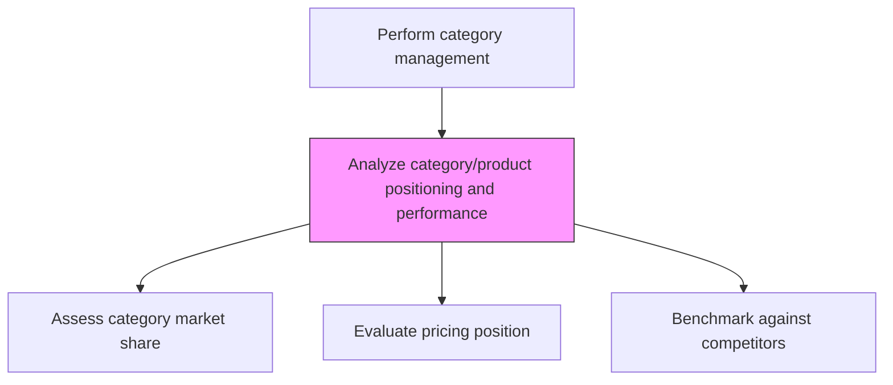
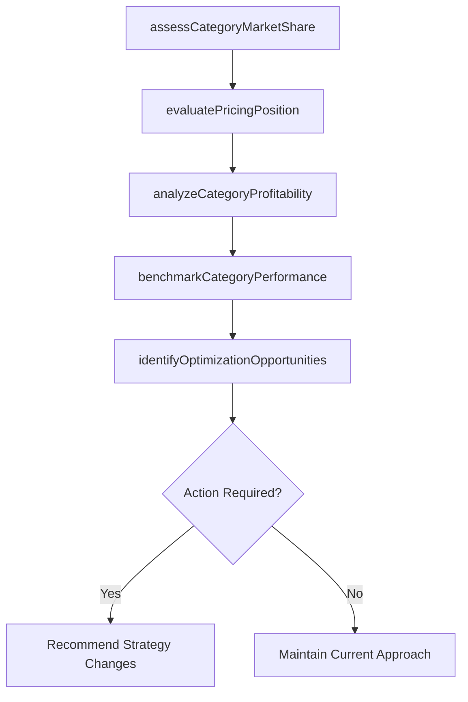

# Analyze category/product positioning and performance

> Business-as-Code definition for category and product positioning analysis. Models the evaluation of product category positioning relative to competitors and assessment of category performance metrics.

## Overview

Evaluating the competitive positioning and financial performance of product categories within the portfolio. Analyze category market share, shelf placement, pricing position, and consumer demand patterns. Compare category performance against industry benchmarks and competitor offerings to identify optimization opportunities.

## Process Hierarchy



## GraphDL

```yaml
analyze:
  object: Category/product Positioning And Performance
  actor: CategoryManager
  result: CategoryPerformanceReport
```

## Actions

| Action | Description |
|--------|-------------|
| assessCategoryMarketShare | Calculate market share by product category against total market |
| evaluatePricingPosition | Compare category price points against competitor benchmarks |
| analyzeCategoryProfitability | Assess gross margin, contribution, and ROI by category |
| benchmarkCategoryPerformance | Compare category metrics against industry standards and competitors |
| identifyOptimizationOpportunities | Flag categories with growth potential or underperformance |

## Events

| Event | Description |
|-------|-------------|
| categoryMarketShareAssessed | Market share by category calculated and documented |
| pricingPositionEvaluated | Category pricing compared to competitors |
| categoryProfitabilityAnalyzed | Category financial performance metrics computed |
| categoryBenchmarked | Performance compared against industry standards |
| optimizationOpportunitiesIdentified | Growth and improvement opportunities flagged |

## Searches

| Search | Description |
|--------|-------------|
| getCategoryPerformance | Retrieve performance metrics by product category |
| getCategoryMarketShare | Access market share data by category and region |
| getCategoryBenchmarks | Query industry benchmarks for category comparison |

## Process Flow



## RACI Matrix

| Activity | Responsible | Accountable | Consulted | Informed |
|----------|-------------|-------------|-----------|----------|
| assessCategoryMarketShare | CategoryManager | VP Marketing | MarketResearch | Sales |
| analyzeCategoryProfitability | CategoryManager | VP Marketing | Finance | ProductManagement |
| identifyOptimizationOpportunities | CategoryManager | VP Sales | Strategy | Marketing |

## Related Processes

| Process | Relationship |
|---------|-------------|
| 3.4.3.2 Select category/product strategy | Downstream - analysis informs strategy selection |
| 3.4.1.4 Analyze point of sales (POS) data and market/competitive information | Upstream - POS data feeds category analysis |
| 3.1.1 Perform customer and market intelligence analysis | Upstream - market intelligence provides context |

## Related Departments

| Department | Role |
|-----------|------|
| Category Management | Owns category analysis and optimization |
| Marketing | Provides market data and competitive intelligence |
| Finance | Validates profitability and ROI metrics |
| Sales | Provides sell-through data and customer feedback |

## Related Occupations

| Occupation | Involvement |
|-----------|-------------|
| Category Manager | Performs category positioning and performance analysis |
| Market Research Analyst | Provides market share and competitive data |
| Pricing Analyst | Evaluates category pricing competitiveness |

## KPIs

| KPI | Description | Unit |
|-----|-------------|------|
| Category Market Share | Share of total market sales by category | % |
| Category Profitability | Gross margin contribution by product category | % |
| Price Competitiveness Index | Category price position vs. key competitors | Index |

## Usage

```typescript
import { analyzeCategoryProductPositioningAndPerformance } from '@headlessly/analyze-category-product-positioning-and-performance'

const category = analyzeCategoryProductPositioningAndPerformance()

// Assess category market share
const share = await category.assessCategoryMarketShare({
  categories: ['enterprise-platform', 'analytics', 'integrations'],
  market: 'north-america',
  period: 'last-4-quarters'
})

// Benchmark against competitors
const benchmarks = await category.benchmarkCategoryPerformance({
  category: 'enterprise-platform',
  competitors: ['competitor-a', 'competitor-b'],
  metrics: ['market-share', 'price-index', 'growth-rate']
})
```
