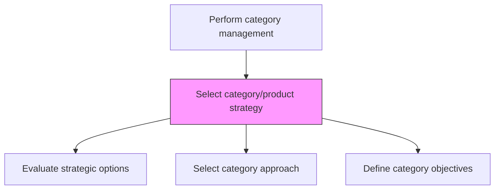
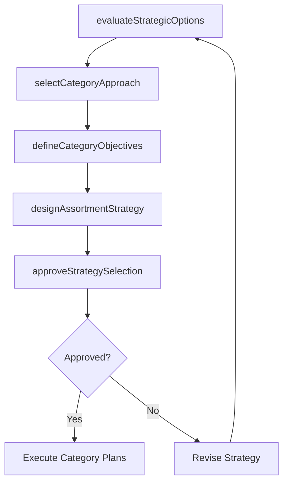

# Select category/product strategy

> Business-as-Code definition for category strategy selection. Models the decision process for choosing growth, harvest, maintain, or divest strategies for each product category based on performance analysis.

## Overview

Selecting the optimal strategic approach for each product category based on positioning analysis and performance data. Evaluate whether to grow, maintain, harvest, or divest each category. Define category-level objectives, assortment strategies, pricing approaches, and promotional tactics that align with overall business goals.

## Process Hierarchy



## GraphDL

```yaml
select:
  object: Category/product Strategy
  actor: CategoryManager
  result: CategoryStrategyPlan
```

## Actions

| Action | Description |
|--------|-------------|
| evaluateStrategicOptions | Assess grow, maintain, harvest, and divest options for each category |
| selectCategoryApproach | Choose the strategic direction for each product category |
| defineCategoryObjectives | Set specific targets for revenue, margin, and market share by category |
| designAssortmentStrategy | Determine optimal product mix and SKU rationalization per category |
| approveStrategySelection | Obtain leadership sign-off on selected category strategies |

## Events

| Event | Description |
|-------|-------------|
| strategicOptionsEvaluated | Category strategy alternatives analyzed and compared |
| categoryApproachSelected | Strategic direction chosen for each category |
| categoryObjectivesDefined | Category-level targets established |
| assortmentStrategyDesigned | Product mix and SKU plan finalized per category |
| strategySelectionApproved | Category strategies approved by leadership |

## Searches

| Search | Description |
|--------|-------------|
| getCategoryStrategy | Retrieve selected strategy for a specific category |
| getCategoryObjectives | Access targets and objectives by product category |
| getAssortmentPlan | Query product mix and SKU decisions per category |

## Process Flow



## RACI Matrix

| Activity | Responsible | Accountable | Consulted | Informed |
|----------|-------------|-------------|-----------|----------|
| evaluateStrategicOptions | CategoryManager | VP Marketing | Finance | ProductManagement |
| selectCategoryApproach | CategoryManager | VP Sales | Strategy | ExecutiveTeam |
| defineCategoryObjectives | CategoryManager | VP Sales | Finance | Sales |

## Related Processes

| Process | Relationship |
|---------|-------------|
| 3.4.3.1 Analyze category/product positioning and performance | Upstream - performance analysis informs strategy selection |
| 3.4.2.5 Develop customer trade strategy and customer objectives/targets | Downstream - category strategy feeds customer-level planning |
| 2.5.1 Develop product/service strategy | Upstream - product strategy provides portfolio direction |

## Related Departments

| Department | Role |
|-----------|------|
| Category Management | Selects and executes category strategies |
| Product Management | Aligns product roadmap with category strategy |
| Sales | Executes category strategy at customer level |
| Finance | Validates category financial targets |

## Related Occupations

| Occupation | Involvement |
|-----------|-------------|
| Category Manager | Selects and manages category strategies |
| Product Manager | Contributes product lifecycle inputs to strategy |
| Strategic Planner | Aligns category strategy with corporate objectives |

## KPIs

| KPI | Description | Unit |
|-----|-------------|------|
| Category Revenue Growth | Year-over-year revenue change by category | % |
| SKU Rationalization Rate | Percentage of underperforming SKUs removed or replaced | % |
| Strategy Execution Score | Rating of how well selected strategies are being implemented | Score (1-10) |

## Usage

```typescript
import { selectCategoryProductStrategy } from '@headlessly/select-category-product-strategy'

const categoryStrategy = selectCategoryProductStrategy()

// Evaluate strategic options
const options = await categoryStrategy.evaluateStrategicOptions({
  category: 'analytics',
  options: ['grow', 'maintain', 'harvest', 'divest'],
  criteria: ['market-growth', 'profitability', 'competitive-position']
})

// Select category approach
const selected = await categoryStrategy.selectCategoryApproach({
  category: 'analytics',
  strategy: 'grow',
  investmentLevel: 'high'
})
```
