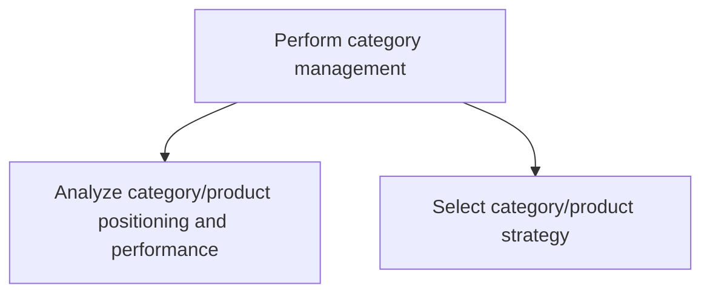
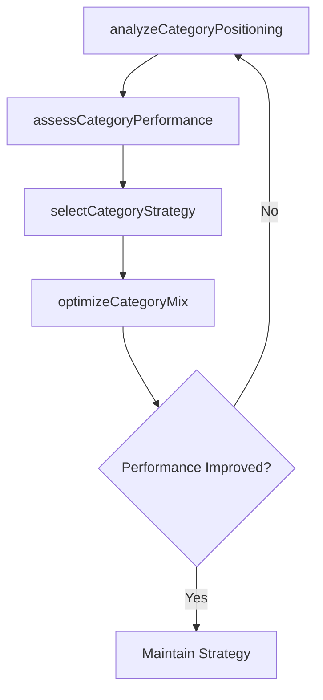

# Perform category management

> Business-as-Code definition for product category management. Models the analysis of category positioning and performance, and the selection of category strategies to optimize product portfolio contribution to revenue and profitability.

## Overview

Managing product categories as strategic business units to optimize assortment, pricing, and shelf placement. Analyze the positioning and performance of each product category relative to competitors and market expectations. Select strategies to grow, harvest, or divest categories based on data-driven insights. Coordinate with marketing, merchandising, and supply chain to execute category plans.

## Process Hierarchy



## GraphDL

```yaml
perform:
  object: Category Management
  actor: CategoryManager
  result: CategoryStrategyPlan
```

## Actions

| Action | Description |
|--------|-------------|
| analyzeCategoryPositioning | Evaluate product category positioning versus competitors and market benchmarks |
| assessCategoryPerformance | Measure category revenue, margin, and growth performance |
| selectCategoryStrategy | Choose growth, maintain, or harvest strategies per category |
| optimizeCategoryMix | Adjust product assortment and placement within categories |

## Events

| Event | Description |
|-------|-------------|
| categoryPositioningAnalyzed | Category positioning assessment completed |
| categoryPerformanceAssessed | Category performance metrics analyzed and reported |
| categoryStrategySelected | Category strategies approved for implementation |
| categoryMixOptimized | Product assortment adjustments implemented |

## Searches

| Search | Description |
|--------|-------------|
| getCategoryPerformance | Retrieve category performance metrics by product line or period |
| getCategoryBenchmarks | Access competitive benchmark data by category |
| getCategoryStrategy | Query current category strategies and plans |

## Process Flow



## RACI Matrix

| Activity | Responsible | Accountable | Consulted | Informed |
|----------|-------------|-------------|-----------|----------|
| analyzeCategoryPositioning | CategoryManager | VP Marketing | MarketResearch | Sales |
| assessCategoryPerformance | CategoryAnalyst | CategoryManager | Finance | ProductManagement |
| selectCategoryStrategy | CategoryManager | VP Sales | Marketing | ExecutiveTeam |
| optimizeCategoryMix | CategoryManager | VP Sales | Merchandising | SupplyChain |

## Sub-Processes

| ID | Name | Description |
|----|------|-------------|
| 3.4.3.1 | Analyze category/product positioning and performance | Evaluating the positioning and performance of each product category relative to competitors, market benchmarks, and revenue contribution targets. |
| 3.4.3.2 | Select category/product strategy | Choosing grow, maintain, harvest, or divest strategies for each product category based on positioning analysis, profitability data, and market opportunity. |

## Related Processes

| Process | Relationship |
|---------|-------------|
| 3.4.1 Develop sales forecast | Upstream - forecast data informs category performance expectations |
| 3.3.4 Develop and manage pricing | Parallel - category pricing aligns with overall pricing strategy |
| 3.4.2 Develop sales partner/alliance relationships | Parallel - partner strategies include category management plans |
| 3.3.9 Develop and manage packaging strategy | Downstream - category decisions influence packaging |

## Related Departments

| Department | Role |
|-----------|------|
| Category Management | Leads category analysis and strategy selection |
| Product Management | Provides product lifecycle and portfolio data |
| Merchandising | Executes category assortment and placement decisions |
| Marketing | Supports category positioning and promotional planning |
| Finance | Validates category profitability and investment decisions |

## Related Occupations

| Occupation | Involvement |
|-----------|-------------|
| Category Manager | Analyzes and develops category strategies |
| Category Analyst | Provides data analysis for category decisions |
| Merchandising Manager | Executes category assortment plans |
| Product Portfolio Manager | Manages product lifecycle within categories |

## KPIs

| KPI | Description | Unit |
|-----|-------------|------|
| Category Revenue Growth | Year-over-year revenue change by category | % |
| Category Margin | Gross margin contribution by product category | % |
| Category Market Share | Organization share of category sales versus competitors | % |
| Assortment Efficiency | Revenue per SKU within each category | USD |

## Usage

```typescript
import { performCategoryManagement } from '@headlessly/perform-category-management'

const categories = performCategoryManagement()

// Analyze category positioning
const positioning = await categories.analyzeCategoryPositioning({
  categories: ['analytics', 'integrations', 'platform-core'],
  benchmarkAgainst: ['top-3-competitors'],
  dimensions: ['pricing', 'features', 'marketShare']
})

// Select strategy for each category
const strategy = await categories.selectCategoryStrategy({
  positioningId: positioning.id,
  options: ['grow', 'maintain', 'harvest', 'divest']
})
```
