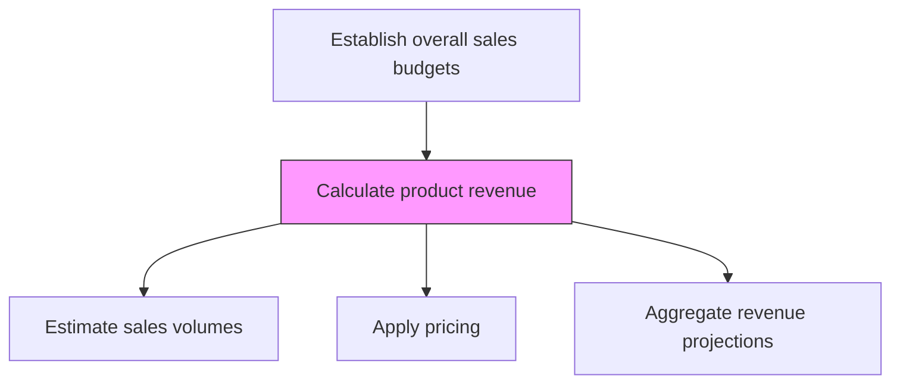
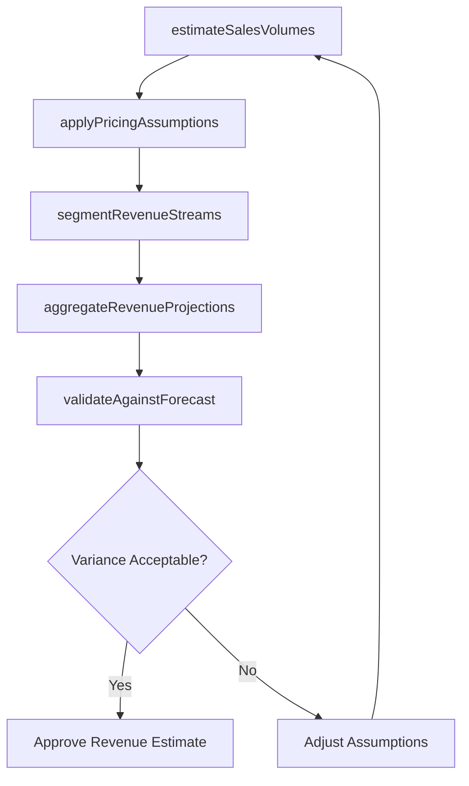

# Calculate product revenue

> Business-as-Code definition for product revenue calculation. Models the estimation of revenue from product and service sales by multiplying anticipated volumes by selling prices across the portfolio.

## Overview

Estimating revenue from the sale of products/services. Approximate the anticipated sale of products/services and multiply it by the selling price of the respective offering. (This represents the total amount of money that the organization receives from the sale of its portfolio of offerings.)

## Process Hierarchy



## GraphDL

```yaml
calculate:
  object: Product Revenue
  actor: FinancialPlanningAnalyst
  result: ProductRevenueProjection
```

## Actions

| Action | Description |
|--------|-------------|
| estimateSalesVolumes | Project unit volumes by product using forecast and pipeline data |
| applyPricingAssumptions | Multiply estimated volumes by current and planned selling prices |
| segmentRevenueStreams | Break down revenue by product line, geography, and customer segment |
| aggregateRevenueProjections | Consolidate product-level projections into total revenue estimate |
| validateAgainstForecast | Cross-check revenue calculations against approved sales forecast |

## Events

| Event | Description |
|-------|-------------|
| salesVolumesEstimated | Product volume projections completed |
| pricingAssumptionsApplied | Revenue calculated using selling price models |
| revenueStreamsSegmented | Revenue broken down by product, geography, and segment |
| revenueProjectionsAggregated | Total revenue projection consolidated |
| revenueValidatedAgainstForecast | Revenue calculations verified against sales forecast |

## Searches

| Search | Description |
|--------|-------------|
| getProductRevenue | Retrieve revenue projections by product, period, or geography |
| getRevenueBySegment | Access revenue breakdowns by customer segment |
| getRevenueVsForecast | Compare revenue projections against approved forecast |

## Process Flow



## RACI Matrix

| Activity | Responsible | Accountable | Consulted | Informed |
|----------|-------------|-------------|-----------|----------|
| estimateSalesVolumes | SalesForecastAnalyst | SalesOperationsManager | Sales | Marketing |
| applyPricingAssumptions | FinancialPlanningAnalyst | CFO | Pricing | Sales |
| aggregateRevenueProjections | FinancialPlanningAnalyst | CFO | VP Sales | ExecutiveTeam |

## Related Processes

| Process | Relationship |
|---------|-------------|
| 3.4.4.3 Determine variable costs | Downstream - revenue minus variable costs informs margin |
| 3.4.4.1 Calculate product market share | Parallel - market share context for revenue projections |
| 3.4.1.3 Generate sales forecast | Upstream - forecast provides volume assumptions |

## Related Departments

| Department | Role |
|-----------|------|
| Finance | Calculates and validates revenue projections |
| Sales Operations | Provides volume estimates and forecast data |
| Pricing | Supplies current and planned pricing models |
| Product Management | Contributes product lifecycle revenue expectations |

## Related Occupations

| Occupation | Involvement |
|-----------|-------------|
| Financial Planning Analyst | Builds product revenue projections |
| Sales Forecast Analyst | Provides volume estimates for revenue calculation |
| Pricing Analyst | Supplies pricing assumptions and models |

## KPIs

| KPI | Description | Unit |
|-----|-------------|------|
| Revenue Projection Accuracy | Variance between projected and actual product revenue | % |
| Revenue Growth Rate | Year-over-year revenue change by product | % |
| Average Selling Price | Mean transaction price across product sales | USD |

## Usage

```typescript
import { calculateProductRevenue } from '@headlessly/calculate-product-revenue'

const revenue = calculateProductRevenue()

// Estimate product revenue
const projection = await revenue.estimateSalesVolumes({
  products: ['platform-standard', 'platform-enterprise', 'analytics-add-on'],
  method: 'forecast-based',
  period: 'fiscal-year-2026'
})

// Aggregate revenue projections
const total = await revenue.aggregateRevenueProjections({
  projections: projection.map(p => p.id),
  segmentBy: ['product-line', 'geography']
})
```
