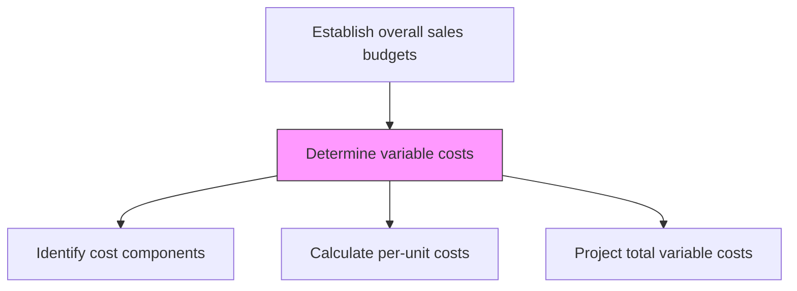
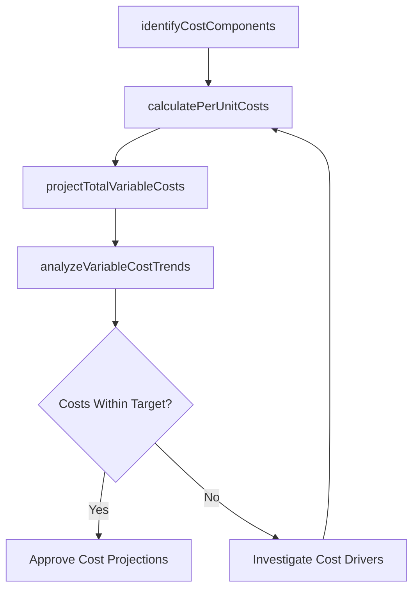

# Determine variable costs

> Business-as-Code definition for variable cost determination. Models the calculation of costs that fluctuate with production and sales volume, including materials, commissions, and transaction fees.

## Overview

Calculating the variable costs of production. Approximate those costs that depend on the volume of products/services produced by the organization.

## Process Hierarchy



## GraphDL

```yaml
determine:
  object: Variable Costs
  actor: FinancialPlanningAnalyst
  result: VariableCostProjection
```

## Actions

| Action | Description |
|--------|-------------|
| identifyCostComponents | Catalog all cost elements that vary with production or sales volume |
| calculatePerUnitCosts | Determine the variable cost per unit for each product or service |
| projectTotalVariableCosts | Multiply per-unit costs by forecasted volumes to get total variable costs |
| analyzeVariableCostTrends | Track changes in variable cost rates over time |

## Events

| Event | Description |
|-------|-------------|
| costComponentsIdentified | Variable cost elements cataloged for all products |
| perUnitCostsCalculated | Per-unit variable costs determined by product |
| totalVariableCostsProjected | Total variable cost projections completed |
| variableCostTrendsAnalyzed | Cost rate trends documented and reported |

## Searches

| Search | Description |
|--------|-------------|
| getVariableCosts | Retrieve variable cost data by product or cost component |
| getPerUnitCost | Access per-unit variable cost for a specific product |
| getCostTrends | Query variable cost trends over time |

## Process Flow



## RACI Matrix

| Activity | Responsible | Accountable | Consulted | Informed |
|----------|-------------|-------------|-----------|----------|
| identifyCostComponents | FinancialPlanningAnalyst | CFO | Operations | Procurement |
| calculatePerUnitCosts | CostAccountant | CFO | Manufacturing | Finance |
| projectTotalVariableCosts | FinancialPlanningAnalyst | CFO | SalesOperations | VP Sales |

## Related Processes

| Process | Relationship |
|---------|-------------|
| 3.4.4.2 Calculate product revenue | Upstream - revenue projections provide volume assumptions |
| 3.4.4.4 Determine overhead and fixed costs | Parallel - both feed into net profit calculation |
| 3.4.4.5 Calculate net profit | Downstream - variable costs subtracted from revenue |

## Related Departments

| Department | Role |
|-----------|------|
| Finance | Calculates and validates variable cost projections |
| Operations | Provides manufacturing and delivery cost data |
| Procurement | Supplies raw material and component pricing |
| Sales | Contributes commission and incentive cost data |

## Related Occupations

| Occupation | Involvement |
|-----------|-------------|
| Financial Planning Analyst | Projects total variable costs |
| Cost Accountant | Calculates per-unit variable costs |
| Procurement Analyst | Provides material cost inputs |

## KPIs

| KPI | Description | Unit |
|-----|-------------|------|
| Variable Cost Per Unit | Average variable cost per unit produced or sold | USD |
| Variable Cost Ratio | Variable costs as percentage of revenue | % |
| Cost Projection Accuracy | Variance between projected and actual variable costs | % |

## Usage

```typescript
import { determineVariableCosts } from '@headlessly/determine-variable-costs'

const costs = determineVariableCosts()

// Calculate per-unit costs
const unitCosts = await costs.calculatePerUnitCosts({
  products: ['platform-standard', 'platform-enterprise'],
  components: ['hosting', 'support', 'commissions', 'payment-processing']
})

// Project total variable costs
const projection = await costs.projectTotalVariableCosts({
  costModel: unitCosts.id,
  forecastedVolumes: { 'platform-standard': 10000, 'platform-enterprise': 2000 }
})
```
