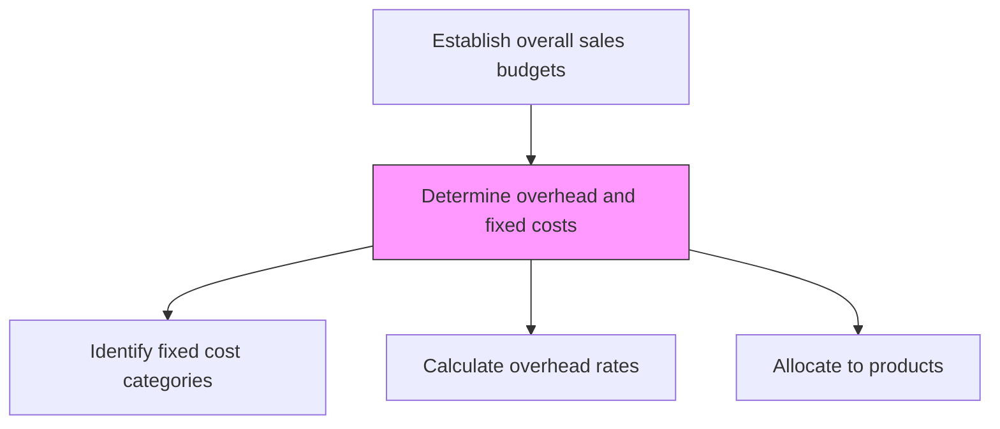
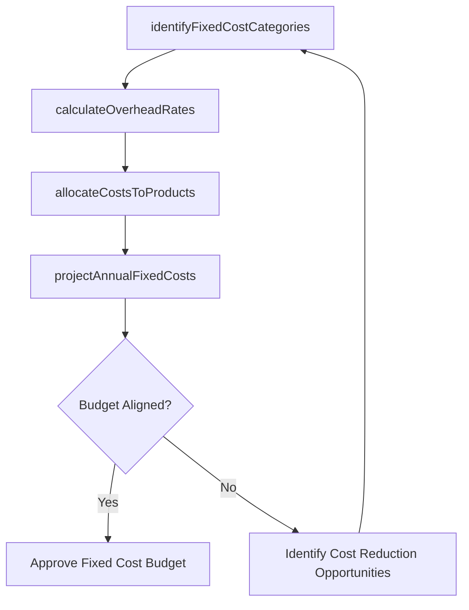

# Determine overhead and fixed costs

> Business-as-Code definition for overhead and fixed cost determination. Models the identification and calculation of costs that remain constant regardless of sales volume, including facilities, salaries, and equipment.

## Overview

Calculating the overhead costs associated with selling the organization's products/services. Determine fixed costs that are not directly related to the volume of products/services processed or the sale of these offerings (e.g., expense over machinery and equipment).

## Process Hierarchy



## GraphDL

```yaml
determine:
  object: Overhead And Fixed Costs
  actor: CostAccountant
  result: OverheadFixedCostProjection
```

## Actions

| Action | Description |
|--------|-------------|
| identifyFixedCostCategories | Catalog all costs that do not vary with production or sales volume |
| calculateOverheadRates | Determine overhead allocation rates for facilities, equipment, and admin |
| allocateCostsToProducts | Distribute fixed and overhead costs across product lines using allocation basis |
| projectAnnualFixedCosts | Estimate total fixed costs for the budget period |

## Events

| Event | Description |
|-------|-------------|
| fixedCostCategoriesIdentified | Fixed cost elements cataloged and classified |
| overheadRatesCalculated | Overhead allocation rates computed |
| costsAllocatedToProducts | Fixed costs distributed across product lines |
| annualFixedCostsProjected | Total fixed cost projections completed for budget period |

## Searches

| Search | Description |
|--------|-------------|
| getFixedCosts | Retrieve fixed cost data by category or department |
| getOverheadRates | Access overhead allocation rates by cost center |
| getCostAllocations | Query how fixed costs are distributed across products |

## Process Flow



## RACI Matrix

| Activity | Responsible | Accountable | Consulted | Informed |
|----------|-------------|-------------|-----------|----------|
| identifyFixedCostCategories | CostAccountant | CFO | Operations | HR |
| calculateOverheadRates | CostAccountant | CFO | Finance | Facilities |
| projectAnnualFixedCosts | FinancialPlanningAnalyst | CFO | VP Sales | ExecutiveTeam |

## Related Processes

| Process | Relationship |
|---------|-------------|
| 3.4.4.3 Determine variable costs | Parallel - both feed into net profit calculation |
| 3.4.4.5 Calculate net profit | Downstream - fixed costs subtracted from gross profit |
| 3.4.4.6 Create budget | Downstream - fixed costs incorporated into sales budget |

## Related Departments

| Department | Role |
|-----------|------|
| Finance | Manages fixed cost accounting and projections |
| Facilities | Provides facility and infrastructure cost data |
| HR | Supplies salary and benefits cost information |
| IT | Contributes technology infrastructure cost data |

## Related Occupations

| Occupation | Involvement |
|-----------|-------------|
| Cost Accountant | Classifies and calculates overhead costs |
| Financial Planning Analyst | Projects total fixed costs for budgeting |
| Controller | Validates cost allocations and overhead rates |

## KPIs

| KPI | Description | Unit |
|-----|-------------|------|
| Fixed Cost Ratio | Fixed costs as percentage of total revenue | % |
| Overhead Rate | Overhead costs per unit of allocation basis | USD |
| Fixed Cost Projection Accuracy | Variance between projected and actual fixed costs | % |

## Usage

```typescript
import { determineOverheadAndFixedCosts } from '@headlessly/determine-overhead-and-fixed-costs'

const overhead = determineOverheadAndFixedCosts()

// Identify fixed cost categories
const categories = await overhead.identifyFixedCostCategories({
  departments: ['sales', 'marketing', 'operations'],
  includeDepreciation: true
})

// Project annual fixed costs
const fixedCosts = await overhead.projectAnnualFixedCosts({
  categories: categories.map(c => c.id),
  period: 'fiscal-year-2026',
  adjustForInflation: true
})
```
