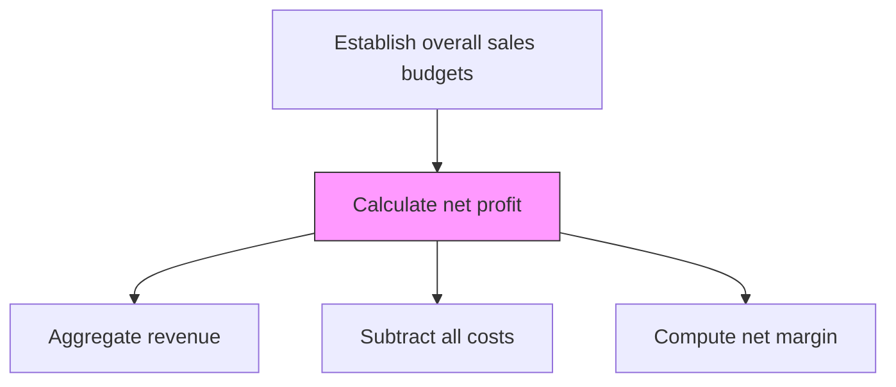
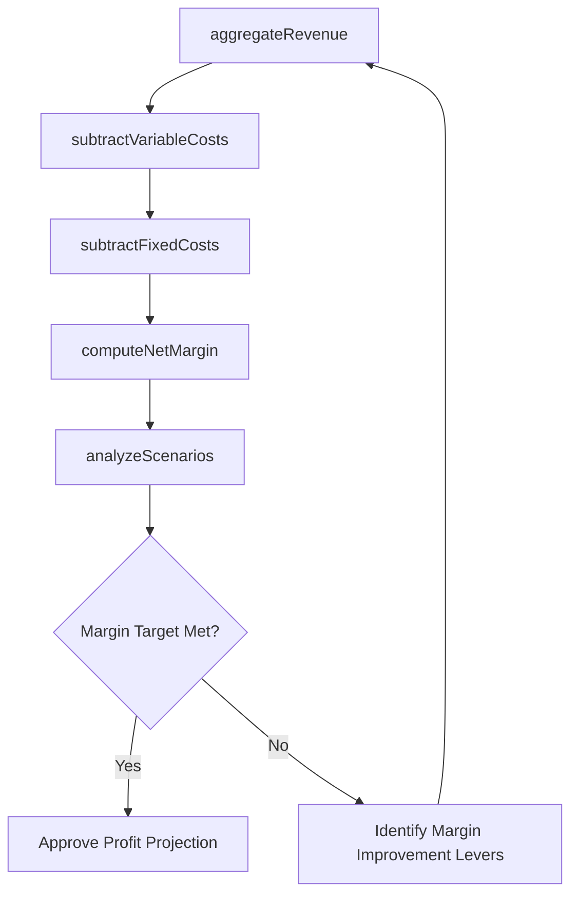

# Calculate net profit

> Business-as-Code definition for net profit calculation. Models the determination of organizational profitability by subtracting variable costs, fixed costs, and overhead from total revenue.

## Overview

Calculating the net income. Calculate the organization's profitability by accounting for Determine overhead and fixed costs [10145] and Determine variable costs [10144].

## Process Hierarchy



## GraphDL

```yaml
calculate:
  object: Net Profit
  actor: FinancialPlanningAnalyst
  result: NetProfitProjection
```

## Actions

| Action | Description |
|--------|-------------|
| aggregateRevenue | Consolidate total revenue projections across all products and channels |
| subtractVariableCosts | Deduct projected variable costs from total revenue to get gross profit |
| subtractFixedCosts | Deduct overhead and fixed costs from gross profit |
| computeNetMargin | Calculate net profit margin as percentage of revenue |
| analyzeScenarios | Model best-case, worst-case, and baseline net profit scenarios |

## Events

| Event | Description |
|-------|-------------|
| revenueAggregated | Total revenue projections consolidated |
| variableCostsSubtracted | Gross profit calculated after variable cost deduction |
| fixedCostsSubtracted | Net profit calculated after all cost deductions |
| netMarginComputed | Net profit margin percentage determined |
| scenariosAnalyzed | Multiple profit scenarios modeled and compared |

## Searches

| Search | Description |
|--------|-------------|
| getNetProfit | Retrieve net profit projections by product or period |
| getNetMargin | Access net profit margin data by product or segment |
| getProfitScenarios | Query scenario analysis results for profit projections |

## Process Flow



## RACI Matrix

| Activity | Responsible | Accountable | Consulted | Informed |
|----------|-------------|-------------|-----------|----------|
| aggregateRevenue | FinancialPlanningAnalyst | CFO | SalesOperations | VP Sales |
| subtractVariableCosts | FinancialPlanningAnalyst | CFO | CostAccountant | Operations |
| computeNetMargin | FinancialPlanningAnalyst | CFO | VP Sales | ExecutiveTeam |

## Related Processes

| Process | Relationship |
|---------|-------------|
| 3.4.4.2 Calculate product revenue | Upstream - revenue figures feed profit calculation |
| 3.4.4.3 Determine variable costs | Upstream - variable cost data for deduction |
| 3.4.4.4 Determine overhead and fixed costs | Upstream - fixed cost data for deduction |
| 3.4.4.6 Create budget | Downstream - profit targets inform budget creation |

## Related Departments

| Department | Role |
|-----------|------|
| Finance | Owns net profit calculation and projections |
| Sales Operations | Provides revenue and volume inputs |
| Operations | Supplies cost data for profit computation |
| Executive Leadership | Reviews and approves profit targets |

## Related Occupations

| Occupation | Involvement |
|-----------|-------------|
| Financial Planning Analyst | Calculates and projects net profit |
| Controller | Validates profit calculations and assumptions |
| CFO | Approves net profit targets and scenarios |

## KPIs

| KPI | Description | Unit |
|-----|-------------|------|
| Net Profit Margin | Net profit as percentage of total revenue | % |
| Gross Profit Margin | Revenue minus variable costs as percentage of revenue | % |
| Profit Projection Accuracy | Variance between projected and actual net profit | % |

## Usage

```typescript
import { calculateNetProfit } from '@headlessly/calculate-net-profit'

const profit = calculateNetProfit()

// Compute net profit projection
const netProfit = await profit.computeNetMargin({
  revenueProjection: 25000000,
  variableCosts: 10000000,
  fixedCosts: 8000000
})

// Analyze scenarios
const scenarios = await profit.analyzeScenarios({
  scenarios: ['optimistic', 'baseline', 'conservative'],
  revenueVariance: 0.15,
  costVariance: 0.10
})
```
