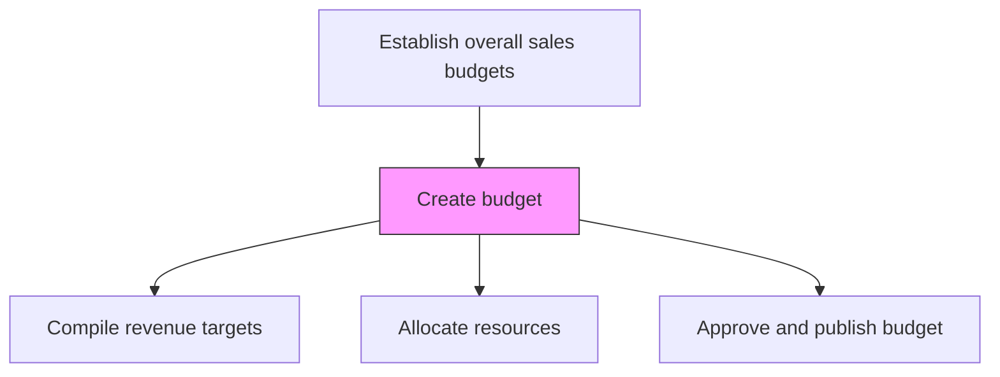
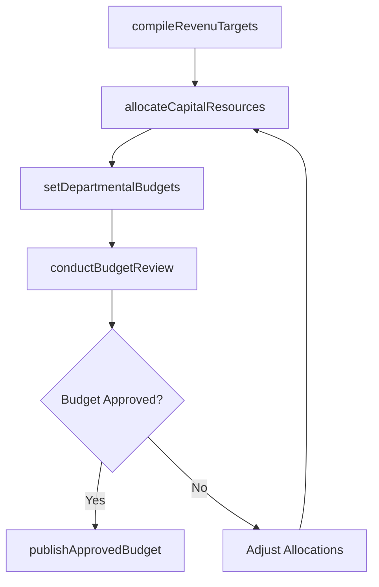

# Create budget

> Business-as-Code definition for sales budget creation. Models the development of a financial plan allocating capital, personnel, and resources needed to achieve sales targets.

## Overview

Creating a plan in measurable terms for the financial outlay that best captures resource allocation for the sales forecast. Consider the outlay of capital, HR, raw materials, and provisions needed to reach sales targets.

## Process Hierarchy



## GraphDL

```yaml
create:
  object: Budget
  actor: SalesOperationsManager
  result: SalesBudget
```

## Actions

| Action | Description |
|--------|-------------|
| compileRevenuTargets | Bring together revenue, cost, and profit projections into a unified plan |
| allocateCapitalResources | Distribute budget across headcount, tools, travel, and programs |
| setDepartmentalBudgets | Assign budget allocations to sales regions, teams, and support functions |
| conductBudgetReview | Present budget to leadership for review and adjustment |
| publishApprovedBudget | Finalize and distribute the approved sales budget to all stakeholders |

## Events

| Event | Description |
|-------|-------------|
| revenueTargetsCompiled | Revenue and cost projections consolidated into budget framework |
| capitalResourcesAllocated | Budget distributed across resource categories |
| departmentalBudgetsSet | Regional and team-level budgets assigned |
| budgetReviewConducted | Budget reviewed and adjusted by leadership |
| approvedBudgetPublished | Final budget approved and distributed |

## Searches

| Search | Description |
|--------|-------------|
| getSalesBudget | Retrieve the approved sales budget by region or team |
| getBudgetAllocations | Access budget distribution across resource categories |
| getBudgetVsActual | Compare budget allocations against actual spend |

## Process Flow



## RACI Matrix

| Activity | Responsible | Accountable | Consulted | Informed |
|----------|-------------|-------------|-----------|----------|
| compileRevenuTargets | SalesOperationsManager | VP Sales | Finance | SalesForecastAnalyst |
| allocateCapitalResources | SalesOperationsManager | VP Sales | CFO | HR |
| publishApprovedBudget | SalesOperationsManager | CFO | VP Sales | AllSalesTeams |

## Related Processes

| Process | Relationship |
|---------|-------------|
| 3.4.4.5 Calculate net profit | Upstream - profit projections inform budget constraints |
| 3.4.4.7 Allocate marketing budget | Downstream - marketing budget carved from overall sales budget |
| 3.4.5 Establish sales goals and measures | Downstream - budget constraints inform goal setting |

## Related Departments

| Department | Role |
|-----------|------|
| Sales Operations | Manages budget creation process |
| Finance | Validates budget assumptions and approves allocations |
| HR | Provides headcount and compensation cost inputs |
| Executive Leadership | Reviews and approves final budget |

## Related Occupations

| Occupation | Involvement |
|-----------|-------------|
| Sales Operations Manager | Leads the sales budget creation process |
| Financial Planning Analyst | Models budget scenarios and allocations |
| VP Sales | Approves final budget and resource allocations |

## KPIs

| KPI | Description | Unit |
|-----|-------------|------|
| Budget Variance | Actual spend vs. budgeted amount | % |
| Budget Cycle Time | Time from budget initiation to approval | Days |
| Revenue Per Budget Dollar | Revenue generated per dollar of sales budget | Ratio |

## Usage

```typescript
import { createBudget } from '@headlessly/create-budget'

const budget = createBudget()

// Allocate resources across categories
const allocations = await budget.allocateCapitalResources({
  totalBudget: 5000000,
  categories: {
    headcount: 0.55,
    tools: 0.15,
    travel: 0.10,
    events: 0.10,
    programs: 0.10
  }
})

// Set departmental budgets
const deptBudgets = await budget.setDepartmentalBudgets({
  regions: {
    'north-america': 2500000,
    'europe': 1500000,
    'asia-pacific': 1000000
  }
})
```
