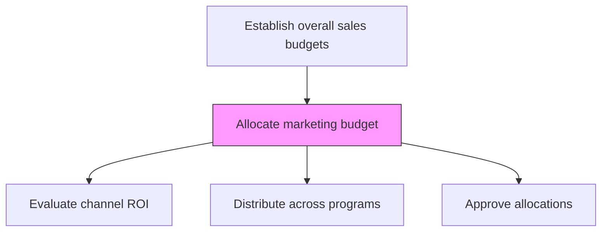
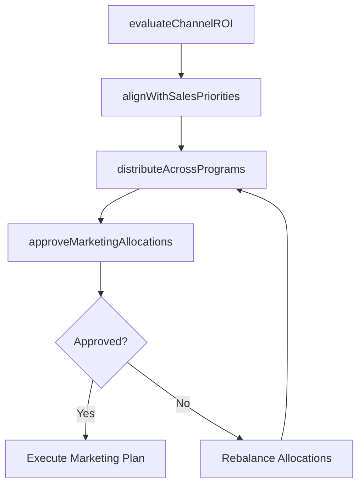

# Allocate marketing budget

> Business-as-Code definition for marketing budget allocation. Models the distribution of marketing funds across channels, programs, and campaigns to support sales targets.

## Overview

Distributing the marketing budget across advertising channels, demand generation programs, trade marketing activities, and brand building campaigns. Align investment with sales priorities, evaluate channel ROI, and ensure spending supports customer acquisition and revenue growth targets.

## Process Hierarchy



## GraphDL

```yaml
allocate:
  object: Marketing Budget
  actor: MarketingDirector
  result: MarketingBudgetAllocation
```

## Actions

| Action | Description |
|--------|-------------|
| evaluateChannelROI | Assess return on investment across marketing channels and programs |
| distributeAcrossPrograms | Allocate budget to demand generation, brand, content, and trade marketing |
| alignWithSalesPriorities | Ensure marketing spend supports key sales growth objectives |
| approveMarketingAllocations | Obtain leadership approval for marketing budget distribution |

## Events

| Event | Description |
|-------|-------------|
| channelROIEvaluated | Marketing channel ROI analysis completed |
| budgetDistributed | Marketing funds allocated across programs and channels |
| salesPrioritiesAligned | Marketing investment validated against sales objectives |
| marketingAllocationsApproved | Marketing budget distribution approved by leadership |

## Searches

| Search | Description |
|--------|-------------|
| getMarketingBudget | Retrieve marketing budget allocation by program or channel |
| getChannelROI | Access ROI metrics for marketing channels |
| getMarketingSpend | Query marketing spend against approved budget |

## Process Flow



## RACI Matrix

| Activity | Responsible | Accountable | Consulted | Informed |
|----------|-------------|-------------|-----------|----------|
| evaluateChannelROI | MarketingAnalyst | MarketingDirector | Finance | Sales |
| distributeAcrossPrograms | MarketingDirector | VP Marketing | Finance | VP Sales |
| approveMarketingAllocations | VP Marketing | CFO | VP Sales | ExecutiveTeam |

## Related Processes

| Process | Relationship |
|---------|-------------|
| 3.4.4.6 Create budget | Upstream - overall sales budget carves out marketing allocation |
| 3.3 Develop and manage marketing plans | Downstream - budget allocation funds marketing plan execution |
| 3.4.2.6 Define trade programs and funding options | Parallel - trade marketing budget feeds program funding |

## Related Departments

| Department | Role |
|-----------|------|
| Marketing | Owns marketing budget allocation and execution |
| Finance | Approves budget levels and tracks spend |
| Sales | Validates alignment with sales growth priorities |
| Executive Leadership | Reviews and approves final allocations |

## Related Occupations

| Occupation | Involvement |
|-----------|-------------|
| Marketing Director | Leads marketing budget allocation decisions |
| Marketing Analyst | Evaluates channel ROI and spending effectiveness |
| Financial Planning Analyst | Models budget scenarios and tracks spend |

## KPIs

| KPI | Description | Unit |
|-----|-------------|------|
| Marketing ROI | Revenue generated per dollar of marketing spend | Ratio |
| Budget Utilization | Percentage of allocated marketing budget spent | % |
| Cost Per Lead | Marketing cost to generate a qualified lead | USD |

## Usage

```typescript
import { allocateMarketingBudget } from '@headlessly/allocate-marketing-budget'

const marketingBudget = allocateMarketingBudget()

// Evaluate channel performance
const roi = await marketingBudget.evaluateChannelROI({
  channels: ['digital-ads', 'content', 'events', 'trade-marketing'],
  period: 'last-fiscal-year'
})

// Distribute budget across programs
const allocation = await marketingBudget.distributeAcrossPrograms({
  totalBudget: 2000000,
  programs: {
    'demand-generation': 0.35,
    'brand-awareness': 0.20,
    'trade-marketing': 0.25,
    'content-marketing': 0.15,
    'events': 0.05
  }
})
```
