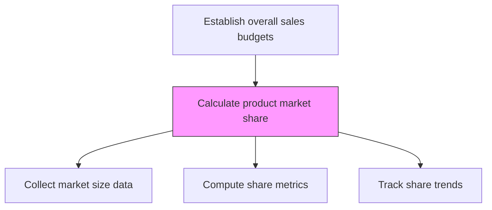
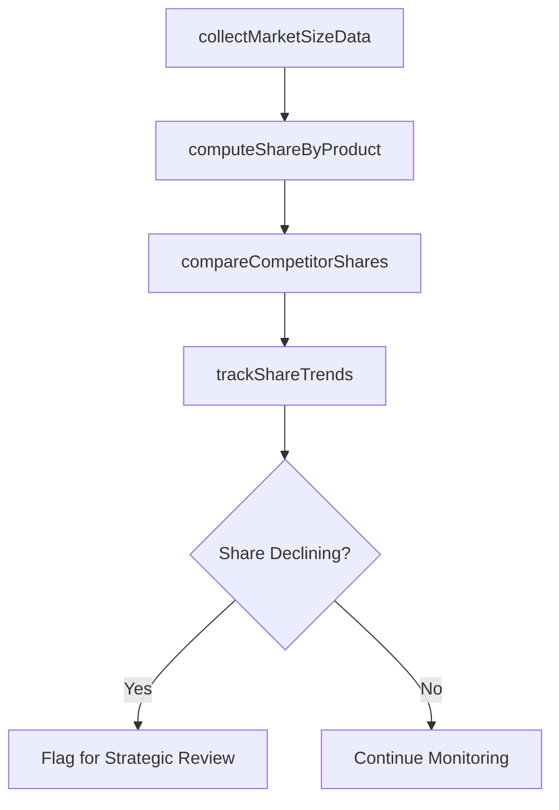

# Calculate product market share

> Business-as-Code definition for product market share calculation. Models the determination of the organization's percentage of total market sales volume for each product in the portfolio.

## Overview

Determining the percentage of total sales volume in the market for a particular product.

## Process Hierarchy



## GraphDL

```yaml
calculate:
  object: Product Market Share
  actor: MarketAnalyst
  result: ProductMarketShareReport
```

## Actions

| Action | Description |
|--------|-------------|
| collectMarketSizeData | Gather total addressable market volume from syndicated and internal sources |
| computeShareByProduct | Calculate market share percentage for each product against total market |
| trackShareTrends | Monitor market share changes over time to identify gains or losses |
| compareCompetitorShares | Benchmark product shares against key competitor positions |

## Events

| Event | Description |
|-------|-------------|
| marketSizeDataCollected | Total market volume data gathered and validated |
| shareByProductComputed | Market share percentages calculated for all products |
| shareTrendsTracked | Market share movement over time documented |
| competitorSharesCompared | Competitive share benchmarks updated |

## Searches

| Search | Description |
|--------|-------------|
| getProductMarketShare | Retrieve market share data by product and geography |
| getShareTrends | Access market share trends over time for a product |
| getCompetitorShares | Query competitor market share positions |

## Process Flow



## RACI Matrix

| Activity | Responsible | Accountable | Consulted | Informed |
|----------|-------------|-------------|-----------|----------|
| collectMarketSizeData | MarketAnalyst | SalesOperationsManager | IT | Finance |
| computeShareByProduct | MarketAnalyst | VP Sales | Finance | Marketing |
| trackShareTrends | MarketAnalyst | VP Sales | Strategy | ExecutiveTeam |

## Related Processes

| Process | Relationship |
|---------|-------------|
| 3.4.4.2 Calculate product revenue | Parallel - revenue data feeds share calculation |
| 3.4.1.4 Analyze point of sales (POS) data and market/competitive information | Upstream - POS and market data sourced here |
| 1.1.1 Assess the external environment | Upstream - market sizing from external analysis |

## Related Departments

| Department | Role |
|-----------|------|
| Sales Operations | Manages market share tracking processes |
| Marketing | Provides market size estimates and competitive data |
| Finance | Validates revenue figures used in share calculations |
| Strategy | Uses market share data for strategic planning |

## Related Occupations

| Occupation | Involvement |
|-----------|-------------|
| Market Analyst | Calculates and tracks product market share |
| Competitive Intelligence Analyst | Provides competitor share data |
| Financial Analyst | Validates revenue inputs for share computation |

## KPIs

| KPI | Description | Unit |
|-----|-------------|------|
| Market Share | Product revenue as percentage of total market | % |
| Share Change | Period-over-period market share movement | Percentage Points |
| Data Currency | Age of most recent market size data used | Days |

## Usage

```typescript
import { calculateProductMarketShare } from '@headlessly/calculate-product-market-share'

const marketShare = calculateProductMarketShare()

// Compute share by product
const share = await marketShare.computeShareByProduct({
  products: ['platform-standard', 'platform-enterprise'],
  market: 'enterprise-saas',
  period: 'last-4-quarters'
})

// Track share trends
const trends = await marketShare.trackShareTrends({
  product: 'platform-enterprise',
  granularity: 'quarterly',
  lookback: '3-years'
})
```
