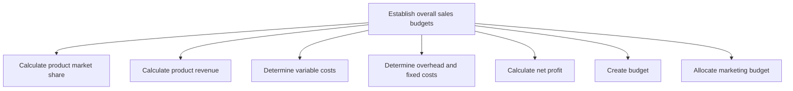
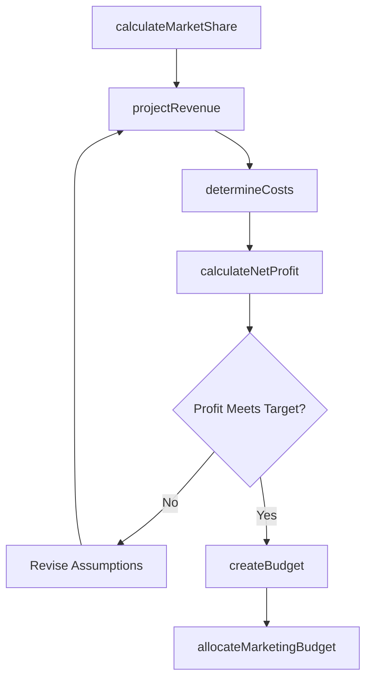

# Establish overall sales budgets

> Business-as-Code definition for sales budget establishment. Models the calculation of market share, revenue projections, cost analysis, net profit estimation, and budget creation to fund the sales organization and align marketing investment.

## Overview

Setting up a financial plan for the sales function. Calculate the estimated sales revenue and costs, which helps in calculating the overall net profit. Create a sound plan for resource outlay by comparing the forecast with historical data.

## Process Hierarchy



## GraphDL

```yaml
establish:
  object: Overall Sales Budgets
  actor: SalesFinanceManager
  result: ApprovedSalesBudget
```

## Actions

| Action | Description |
|--------|-------------|
| calculateMarketShare | Determine product market share based on industry data and sales volumes |
| projectRevenue | Estimate product revenue by combining forecast volumes with pricing |
| determineCosts | Calculate variable, overhead, and fixed costs for sales operations |
| calculateNetProfit | Compute net profit projections from revenue minus all costs |
| createBudget | Build detailed sales budget with line-item allocations |
| allocateMarketingBudget | Distribute marketing-related budget across sales support activities |

## Events

| Event | Description |
|-------|-------------|
| marketShareCalculated | Product market share estimates completed |
| revenueProjected | Product revenue projections delivered |
| costsDetermined | Variable and fixed cost analysis completed |
| netProfitCalculated | Net profit projections finalized |
| budgetCreated | Sales budget submitted for approval |
| marketingBudgetAllocated | Marketing budget distributed across sales support activities |

## Searches

| Search | Description |
|--------|-------------|
| getSalesBudget | Retrieve sales budget allocations by product, territory, or team |
| getBudgetVsActual | Compare budgeted to actual sales performance |
| getCostBreakdown | Query cost analysis by variable, fixed, and overhead categories |
| getProfitProjections | Access net profit projections by product or territory |

## Process Flow



## RACI Matrix

| Activity | Responsible | Accountable | Consulted | Informed |
|----------|-------------|-------------|-----------|----------|
| calculateMarketShare | MarketAnalyst | VP Sales | Marketing | Finance |
| projectRevenue | SalesFinanceManager | VP Sales | SalesOperations | Finance |
| determineCosts | FinancialAnalyst | CFO | SalesOperations | VP Sales |
| createBudget | SalesFinanceManager | CFO | VP Sales | ExecutiveTeam |
| allocateMarketingBudget | SalesFinanceManager | VP Sales | CMO | Finance |

## Sub-Processes

| ID | Name | Description |
|----|------|-------------|
| 3.4.4.1 | Calculate product market share | Determining the percentage of total sales volume in the market for a particular product. |
| 3.4.4.2 | Calculate product revenue | Estimating revenue from the sale of products/services. Approximate the anticipated sale of products/ |
| 3.4.4.3 | Determine variable costs | Calculating the variable costs of production. Approximate those costs that depend on the volume of p |
| 3.4.4.4 | Determine overhead and fixed costs | Calculating the overhead costs associated with selling the organization's products/services. Determi |
| 3.4.4.5 | Calculate net profit | Calculating the net income. Calculate the organization's profitability by accounting for Determine o |
| 3.4.4.6 | Create budget | Creating a plan in measurable terms for the financial outlay that best captures resource allocation  |
| 3.4.4.7 | Allocate marketing budget | Distributing the marketing-related portion of the sales budget across demand generation, brand awareness, events, and partner marketing support activities. |

## Related Processes

| Process | Relationship |
|---------|-------------|
| 3.4.1 Develop sales forecast | Upstream - forecast drives revenue projections for budgets |
| 3.3.2 Establish marketing budgets | Parallel - sales and marketing budgets must align |
| 3.4.5 Establish sales goals and measures | Downstream - budget funds goal achievement |
| 3.5 Develop and manage sales plans | Downstream - budget constrains sales plan execution |

## Related Departments

| Department | Role |
|-----------|------|
| Sales Operations | Provides pipeline data and cost estimates |
| Finance | Reviews, approves, and monitors budget compliance |
| Sales | Provides territory-level requirements and justifications |
| Marketing | Coordinates on shared demand generation budgets |
| Executive Management | Approves final budget allocation |

## Related Occupations

| Occupation | Involvement |
|-----------|-------------|
| Sales Finance Manager | Builds budget models and tracks utilization |
| VP Sales | Defines budget priorities and secures approval |
| Financial Planning Analyst | Validates assumptions and profit projections |
| Sales Operations Manager | Provides cost and resource utilization data |

## KPIs

| KPI | Description | Unit |
|-----|-------------|------|
| Sales Budget Efficiency | Revenue generated per dollar of sales budget spent | Ratio |
| Budget Variance | Deviation between planned and actual sales spend | % |
| Revenue to Cost Ratio | Total revenue divided by total sales costs | Ratio |
| Quota Coverage | Percentage of total quota funded by approved budget | % |
| Budget Cycle Time | Days from budget request to final approval | Days |

## Usage

```typescript
import { establishOverallSalesBudgets } from '@headlessly/establish-overall-sales-budgets'

const budgets = establishOverallSalesBudgets()

// Project revenue by product line
const revenue = await budgets.projectRevenue({
  products: ['platform-standard', 'platform-enterprise', 'analytics'],
  forecastSource: 'pipeline-weighted',
  period: 'FY2026'
})

// Create the sales budget
const budget = await budgets.createBudget({
  revenueProjectionId: revenue.id,
  costCategories: ['headcount', 'travel', 'tools', 'events'],
  targetMargin: 0.68
})
```
