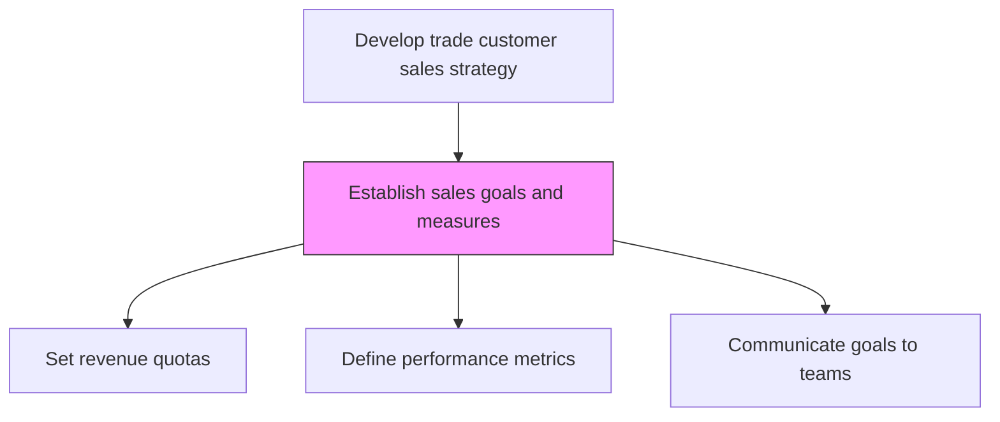
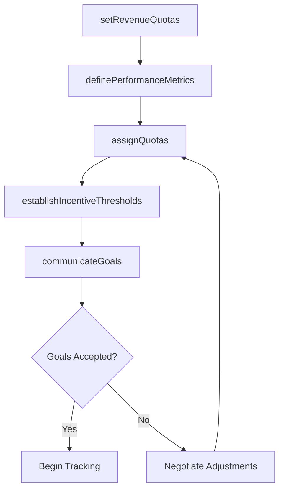

# Establish sales goals and measures

> Business-as-Code definition for sales goal and measure establishment. Models the creation of quantitative targets, quota assignments, and performance metrics to track sales team progress toward revenue objectives.

## Overview

Establishing specific quantitative and qualitative measures of realizing sales targets. Create sales targets by analyzing historical sales data and comparing the forecasts to results, in light of customer and market intelligence. Examine the performance of sales personnel in light of market opportunities. Based on this review, establish sales targets along with metrics to quantify these goals, corresponding with the overall business strategy.

## Process Hierarchy



## GraphDL

```yaml
establish:
  object: Sales Goals And Measures
  actor: SalesOperationsManager
  result: SalesGoalsAndMetrics
```

## Actions

| Action | Description |
|--------|-------------|
| setRevenueQuotas | Establish territory, team, and individual sales quotas based on forecasts |
| definePerformanceMetrics | Select KPIs to measure progress toward sales targets |
| assignQuotas | Distribute quotas to sales regions, teams, and individual representatives |
| establishIncentiveThresholds | Set performance thresholds that trigger compensation and bonus payouts |
| communicateGoals | Present approved goals, quotas, and metrics to sales organization |

## Events

| Event | Description |
|-------|-------------|
| revenueQuotasSet | Sales quotas established for all territories and individuals |
| performanceMetricsDefined | Sales KPIs selected and documented |
| quotasAssigned | Quotas distributed to teams and individuals |
| incentiveThresholdsEstablished | Compensation thresholds tied to performance levels |
| goalsCommunicated | Sales goals and metrics published to the organization |

## Searches

| Search | Description |
|--------|-------------|
| getSalesQuotas | Retrieve quota assignments by territory, team, or individual |
| getPerformanceMetrics | Access defined sales performance metrics and targets |
| getGoalProgress | Track actual performance against established goals |

## Process Flow



## RACI Matrix

| Activity | Responsible | Accountable | Consulted | Informed |
|----------|-------------|-------------|-----------|----------|
| setRevenueQuotas | SalesOperationsManager | VP Sales | Finance | HR |
| definePerformanceMetrics | SalesOperationsManager | VP Sales | Strategy | Marketing |
| assignQuotas | SalesDirector | VP Sales | SalesOperations | HR |
| communicateGoals | VP Sales | CRO | HR | AllSalesTeams |

## Related Processes

| Process | Relationship |
|---------|-------------|
| 3.4.4 Establish overall sales budgets | Upstream - budget constraints inform goal setting |
| 3.4.1 Develop sales forecast | Upstream - forecast provides basis for quota calculation |
| 3.4.7 Establish customer management measures | Parallel - customer metrics complement sales goals |
| 3.5.1 Manage leads/opportunities | Downstream - goals drive pipeline management priorities |

## Related Departments

| Department | Role |
|-----------|------|
| Sales Operations | Designs quotas and performance metrics |
| Sales | Receives and works toward assigned goals |
| HR | Aligns compensation plans with sales targets |
| Finance | Validates quota feasibility against budget |

## Related Occupations

| Occupation | Involvement |
|-----------|-------------|
| Sales Operations Manager | Designs sales goals and measurement framework |
| Sales Director | Assigns quotas and manages team performance |
| Compensation Analyst | Links incentive plans to sales metrics |

## KPIs

| KPI | Description | Unit |
|-----|-------------|------|
| Quota Attainment | Percentage of sales reps achieving their quota | % |
| Goal Coverage Ratio | Total quota assigned vs. revenue target | Ratio |
| Incentive Plan Effectiveness | Correlation between incentives and performance improvement | Score (1-10) |

## Usage

```typescript
import { establishSalesGoalsAndMeasures } from '@headlessly/establish-sales-goals-and-measures'

const goals = establishSalesGoalsAndMeasures()

// Set revenue quotas
const quotas = await goals.setRevenueQuotas({
  totalTarget: 25000000,
  allocationMethod: 'territory-potential-weighted',
  period: 'fiscal-year-2026'
})

// Assign quotas to teams
const assignments = await goals.assignQuotas({
  quotaModel: quotas.id,
  teams: ['north-team', 'south-team', 'west-team', 'east-team']
})
```
