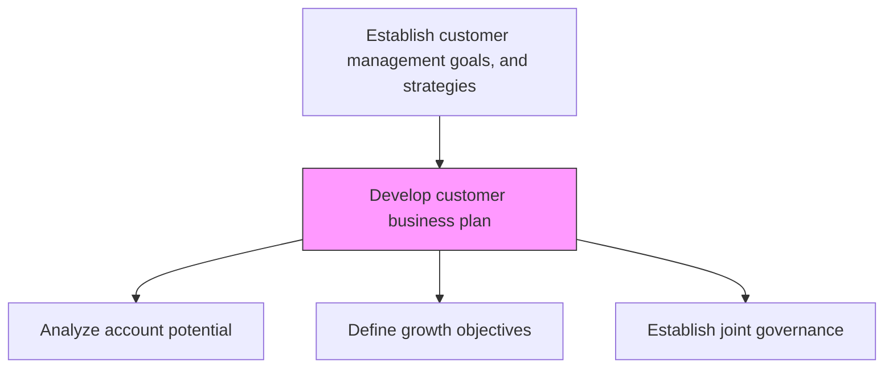
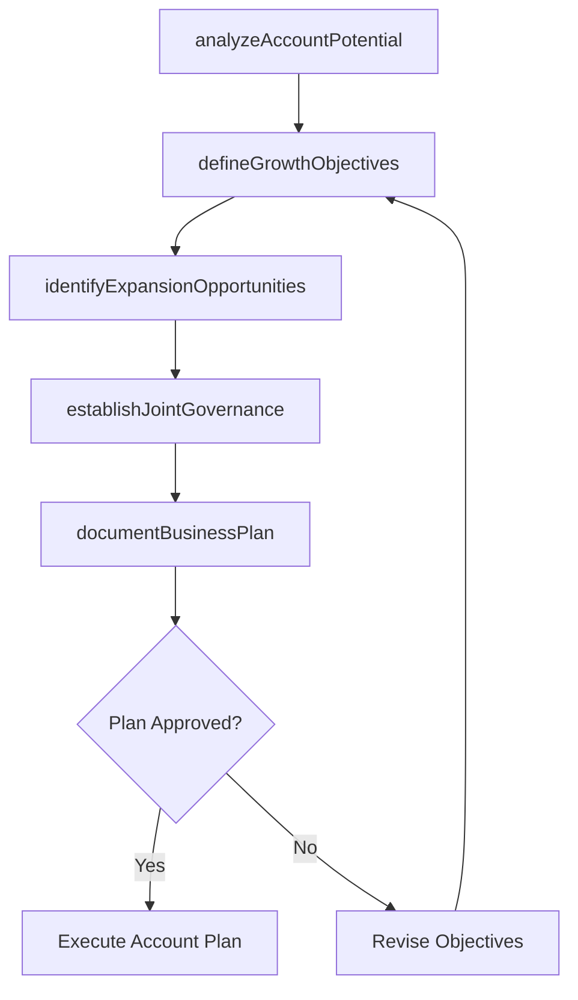

# Develop customer business plan

> Business-as-Code definition for customer business plan development. Models the creation of account-level business plans that define growth strategies, investment priorities, and mutual objectives for major customer accounts.

## Overview

Creating comprehensive business plans for major customer accounts that outline mutual growth objectives, investment commitments, and joint go-to-market strategies. Analyze customer potential, define account-level revenue targets, identify expansion opportunities, and establish governance structures for the customer relationship.

## Process Hierarchy



## GraphDL

```yaml
develop:
  object: Customer Business Plan
  actor: KeyAccountManager
  result: CustomerBusinessPlan
```

## Actions

| Action | Description |
|--------|-------------|
| analyzeAccountPotential | Assess customer size, growth trajectory, and whitespace opportunities |
| defineGrowthObjectives | Set mutual revenue, share, and expansion targets for the account |
| identifyExpansionOpportunities | Map cross-sell, upsell, and new product opportunities at the account |
| establishJointGovernance | Define executive sponsorship, review cadence, and escalation processes |
| documentBusinessPlan | Compile the customer business plan with timelines and milestones |

## Events

| Event | Description |
|-------|-------------|
| accountPotentialAnalyzed | Customer account assessment completed |
| growthObjectivesDefined | Mutual revenue and growth targets agreed |
| expansionOpportunitiesIdentified | Cross-sell and upsell opportunities mapped |
| jointGovernanceEstablished | Executive sponsorship and review cadence confirmed |
| businessPlanDocumented | Formal customer business plan completed and distributed |

## Searches

| Search | Description |
|--------|-------------|
| getCustomerBusinessPlan | Retrieve the business plan for a specific customer account |
| getAccountPotential | Access account sizing and whitespace analysis data |
| getExpansionOpportunities | List identified expansion opportunities by account |

## Process Flow



## RACI Matrix

| Activity | Responsible | Accountable | Consulted | Informed |
|----------|-------------|-------------|-----------|----------|
| analyzeAccountPotential | KeyAccountManager | SalesDirector | Finance | Marketing |
| defineGrowthObjectives | KeyAccountManager | VP Sales | Finance | Strategy |
| documentBusinessPlan | KeyAccountManager | SalesDirector | SalesOperations | VP Sales |

## Related Processes

| Process | Relationship |
|---------|-------------|
| 3.4.6 Establish customer management goals and strategies | Parent - business plans implement customer management strategy |
| 3.5.2 Manage customers and accounts | Downstream - business plan guides account management |
| 3.4.2.15 Create strategic and tactical sales plans by customer | Parallel - customer sales plans align with business plans |

## Related Departments

| Department | Role |
|-----------|------|
| Sales | Creates and executes customer business plans |
| Finance | Validates revenue targets and investment levels |
| Strategy | Ensures alignment with corporate growth priorities |
| Customer Success | Supports retention and expansion objectives |

## Related Occupations

| Occupation | Involvement |
|-----------|-------------|
| Key Account Manager | Authors and manages customer business plans |
| Sales Director | Reviews and approves account-level plans |
| Customer Success Manager | Supports retention goals within the plan |

## KPIs

| KPI | Description | Unit |
|-----|-------------|------|
| Plan Coverage | Percentage of top accounts with documented business plans | % |
| Account Growth Rate | Year-over-year revenue growth at planned accounts | % |
| Expansion Revenue | Revenue from cross-sell and upsell at planned accounts | USD |

## Usage

```typescript
import { developCustomerBusinessPlan } from '@headlessly/develop-customer-business-plan'

const businessPlan = developCustomerBusinessPlan()

// Analyze account potential
const potential = await businessPlan.analyzeAccountPotential({
  customerId: 'enterprise-customer-a',
  dimensions: ['wallet-share', 'whitespace', 'competitive-landscape']
})

// Define growth objectives
const objectives = await businessPlan.defineGrowthObjectives({
  customerId: 'enterprise-customer-a',
  revenueTarget: 5000000,
  expansionTarget: 0.25,
  horizon: '3-years'
})
```
