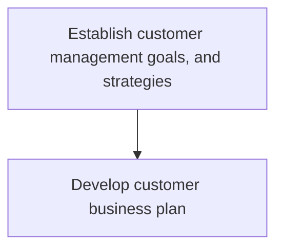
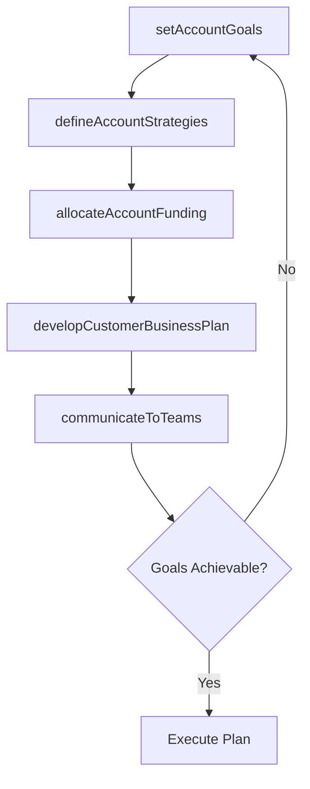

# Establish customer management goals, and strategies

> Business-as-Code definition for customer management goal and strategy establishment. Models the development of business plans, strategic targets, and funding options for major customer accounts, including coordinated sales and promotional planning with key accounts.

## Overview

Developing the business plan, strategy, targets, and funding options for major customer accounts.  Planning activities are conducted and in collaboration with these key accounts, sales and promotional plans are created.  For each account, promotional and category management calendars are created as well as strategic and tactical sales plans, all of which is communicated to the customer account teams.

## Process Hierarchy



## GraphDL

```yaml
establish:
  object: Customer Management Goals, And Strategies
  actor: AccountDirector
  result: CustomerManagementPlan
```

## Actions

| Action | Description |
|--------|-------------|
| developCustomerBusinessPlan | Create comprehensive business plans for major customer accounts |
| setAccountGoals | Define revenue, growth, and satisfaction targets by account |
| defineAccountStrategies | Develop strategies for retention, expansion, and engagement |
| allocateAccountFunding | Determine budget and resource allocation for key accounts |
| communicateToTeams | Distribute account plans and objectives to customer teams |

## Events

| Event | Description |
|-------|-------------|
| customerBusinessPlanDeveloped | Customer business plan created and approved |
| accountGoalsSet | Account-level revenue and growth targets established |
| accountStrategiesDefined | Customer management strategies formalized |
| accountFundingAllocated | Account budgets and resources assigned |
| teamsCommunicated | Account plans distributed to customer-facing teams |

## Searches

| Search | Description |
|--------|-------------|
| getAccountPlan | Retrieve customer business plan by account or tier |
| getAccountGoals | Access account-level targets and progress metrics |
| getAccountFunding | Query account budget allocations and utilization |

## Process Flow



## RACI Matrix

| Activity | Responsible | Accountable | Consulted | Informed |
|----------|-------------|-------------|-----------|----------|
| developCustomerBusinessPlan | AccountDirector | VP Sales | CustomerSuccess | Finance |
| setAccountGoals | AccountDirector | VP Sales | Finance | SalesOperations |
| defineAccountStrategies | AccountDirector | VP Sales | Marketing | ProductManagement |
| allocateAccountFunding | SalesFinanceManager | CFO | VP Sales | AccountDirector |
| communicateToTeams | AccountDirector | VP Sales | SalesOperations | Marketing |

## Sub-Processes

| ID | Name | Description |
|----|------|-------------|
| 3.4.6.1 | Develop customer business plan | Creating comprehensive business plans for major customer accounts including revenue targets, growth strategies, promotional calendars, and tactical sales plans communicated to account teams. |

## Related Processes

| Process | Relationship |
|---------|-------------|
| 3.4.7 Establish customer management measures | Downstream - goals drive measurement criteria |
| 3.5.2 Manage customers and accounts | Downstream - strategies guide account management execution |
| 3.4.4 Establish overall sales budgets | Upstream - budget constrains account investment |
| 3.3.7 Track customer management measures | Parallel - tracking validates goal achievement |

## Related Departments

| Department | Role |
|-----------|------|
| Sales | Develops and executes account strategies for key customers |
| Customer Success | Aligns retention strategies with customer management goals |
| Finance | Approves account-level budgets and funding options |
| Marketing | Supports account-specific promotional and engagement plans |
| Executive Management | Approves strategies for top-tier accounts |

## Related Occupations

| Occupation | Involvement |
|-----------|-------------|
| Account Director | Develops comprehensive business plans for strategic accounts |
| Key Account Manager | Manages day-to-day execution of account strategies |
| Customer Success Manager | Ensures customer health and retention goals are met |
| Sales Operations Manager | Provides analytics and tools for account planning |

## KPIs

| KPI | Description | Unit |
|-----|-------------|------|
| Account Plan Completion Rate | Percentage of key accounts with approved business plans | % |
| Account Revenue Growth | Year-over-year revenue growth for managed accounts | % |
| Account Goal Attainment | Percentage of account-level targets achieved | % |
| Account Retention Rate | Percentage of key accounts retained annually | % |
| Customer Satisfaction Score | Average satisfaction score for managed accounts | Score (1-10) |

## Usage

```typescript
import { establishCustomerManagementGoalsAndStrategies } from '@headlessly/establish-customer-management-goals-and-strategies'

const customerGoals = establishCustomerManagementGoalsAndStrategies()

// Set goals for a strategic account
const goals = await customerGoals.setAccountGoals({
  accountId: 'enterprise-client-001',
  revenueTarget: 2000000,
  growthTarget: 0.20,
  retentionTarget: 1.0,
  satisfactionTarget: 9.0
})

// Develop comprehensive business plan
const plan = await customerGoals.developCustomerBusinessPlan({
  accountId: 'enterprise-client-001',
  goalsId: goals.id,
  strategies: ['upsell-analytics', 'expand-departments', 'executive-sponsorship']
})
```
