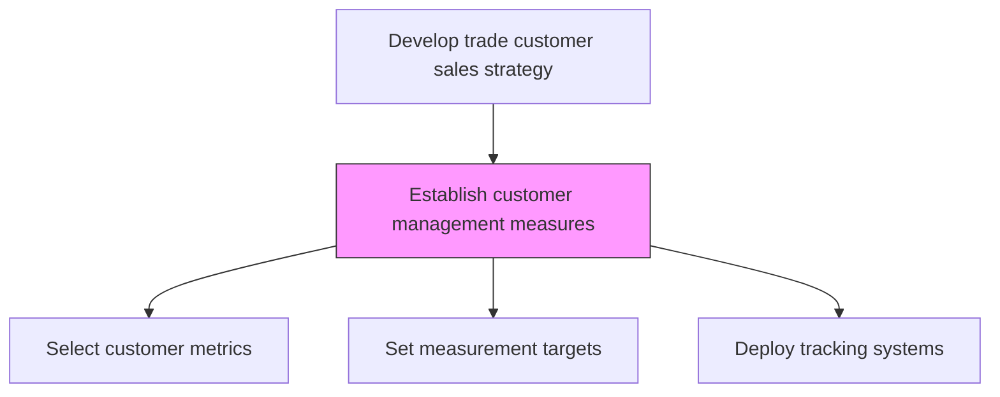
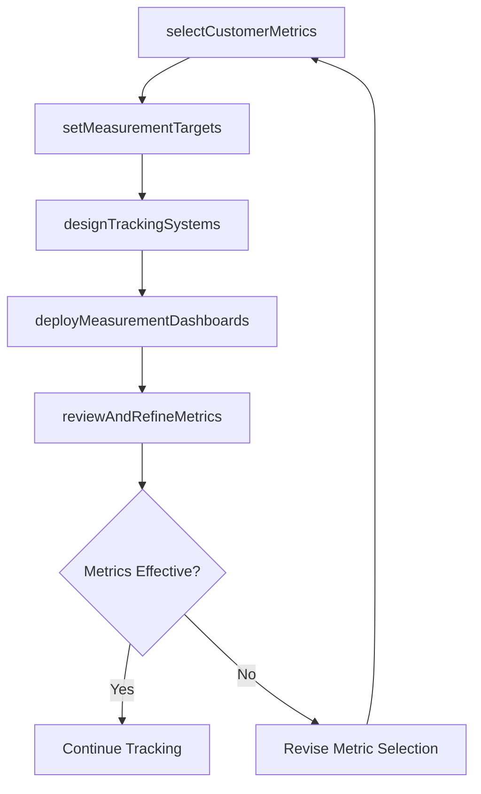

# Establish customer management measures

> Business-as-Code definition for customer management measure establishment. Models the selection and implementation of metrics that track customer activity, satisfaction, responsiveness, and account health across the customer base.

## Overview

Identifying the appropriate measures that can represent key attributes of the customer management function. Select measures to track customer activity, feedback, satisfaction, organizational responsiveness to customer needs, and general data on how the organization is managing customer accounts, leads, and contacts. Build on customer and market intelligence to identify metrics gauging aspects related to customer management. Select measures based on the nature of the business, the type and size of customer base, strategic goals, and the model used to structure sales and customer relationships.

## Process Hierarchy



## GraphDL

```yaml
establish:
  object: Customer Management Measures
  actor: SalesOperationsManager
  result: CustomerManagementMeasurementFramework
```

## Actions

| Action | Description |
|--------|-------------|
| selectCustomerMetrics | Choose KPIs that track customer satisfaction, retention, and account health |
| setMeasurementTargets | Establish target levels for each selected customer management metric |
| designTrackingSystems | Configure CRM and analytics to capture and report customer measures |
| deployMeasurementDashboards | Publish dashboards that visualize customer management performance |
| reviewAndRefineMetrics | Periodically evaluate metric relevance and adjust as needed |

## Events

| Event | Description |
|-------|-------------|
| customerMetricsSelected | Customer management KPIs chosen and documented |
| measurementTargetsSet | Target levels established for all customer metrics |
| trackingSystemsDesigned | CRM and analytics configured for customer measurement |
| dashboardsDeployed | Customer management dashboards published |
| metricsReviewCompleted | Periodic review of metric relevance and effectiveness completed |

## Searches

| Search | Description |
|--------|-------------|
| getCustomerMetrics | Retrieve customer management metrics and current values |
| getMeasurementTargets | Access target levels for customer management KPIs |
| getCustomerDashboard | Query customer management dashboard data |

## Process Flow



## RACI Matrix

| Activity | Responsible | Accountable | Consulted | Informed |
|----------|-------------|-------------|-----------|----------|
| selectCustomerMetrics | SalesOperationsManager | VP Sales | CustomerSuccess | Marketing |
| setMeasurementTargets | SalesOperationsManager | VP Sales | Finance | Strategy |
| deployMeasurementDashboards | SalesOperationsManager | VP Sales | IT | AllSalesTeams |

## Related Processes

| Process | Relationship |
|---------|-------------|
| 3.4.5 Establish sales goals and measures | Parallel - sales goals complement customer management metrics |
| 3.4.6 Establish customer management goals, and strategies | Upstream - strategy defines what to measure |
| 3.5.2 Manage customers and accounts | Downstream - measures track account management effectiveness |

## Related Departments

| Department | Role |
|-----------|------|
| Sales Operations | Designs and manages customer measurement framework |
| Customer Success | Provides customer satisfaction and retention data |
| IT | Implements tracking systems and dashboards |
| Marketing | Contributes customer engagement metrics |

## Related Occupations

| Occupation | Involvement |
|-----------|-------------|
| Sales Operations Manager | Designs customer management measurement framework |
| Business Intelligence Analyst | Builds customer management dashboards |
| Customer Success Manager | Provides input on customer health metrics |

## KPIs

| KPI | Description | Unit |
|-----|-------------|------|
| Customer Satisfaction Score | Overall customer satisfaction rating | Score (1-10) |
| Customer Retention Rate | Percentage of customers retained period over period | % |
| Net Promoter Score | Customer likelihood to recommend the organization | NPS (-100 to 100) |
| Account Health Score | Composite measure of account engagement and risk | Score (1-100) |

## Usage

```typescript
import { establishCustomerManagementMeasures } from '@headlessly/establish-customer-management-measures'

const measures = establishCustomerManagementMeasures()

// Select customer metrics
const metrics = await measures.selectCustomerMetrics({
  categories: ['satisfaction', 'retention', 'engagement', 'account-health'],
  customerSegments: ['enterprise', 'mid-market', 'smb']
})

// Deploy measurement dashboards
const dashboard = await measures.deployMeasurementDashboards({
  metrics: metrics.map(m => m.id),
  audiences: ['sales-leadership', 'account-managers', 'customer-success']
})
```
