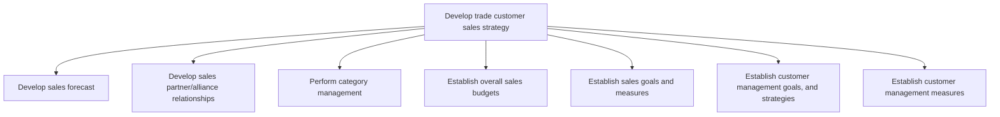
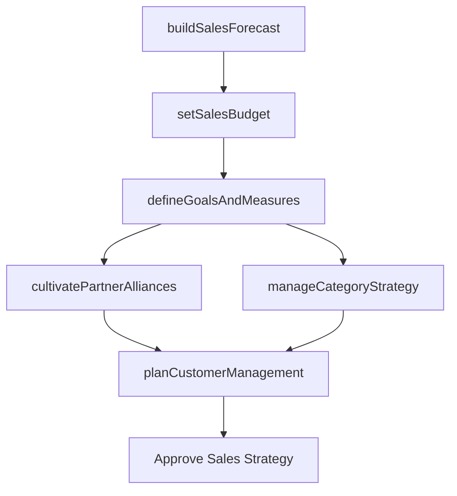

# Develop trade customer sales strategy

> Business-as-Code definition for trade customer sales strategy development. Models the planning framework for sales forecasting, partner management, category optimization, budgeting, goal setting, and customer management.

## Overview

Developing concrete plans for guiding and providing support to the sales function. Chart a road map for the sales function, including an analysis of historical sales data to create forecasts for anticipated sales, forming sales targets, forging partnerships with other economic agents to boost sales, devising a budget for this function, and determining metrics to measure customer management activities as well as progress in achieving sales targets.

## Process Hierarchy



## GraphDL

```yaml
develop:
  object: Trade Customer Sales Strategy
  actor: SalesStrategyDirector
  result: SalesStrategyPlan
```

## Actions

| Action | Description |
|--------|-------------|
| buildSalesForecast | Analyze historical data and market trends to project future sales |
| cultivatePartnerAlliances | Identify, negotiate, and manage sales partner relationships |
| manageCategoryStrategy | Optimize product category positioning and performance |
| setSalesBudget | Establish revenue targets and cost allocations for sales operations |
| defineGoalsAndMeasures | Create quantitative sales targets and tracking metrics |
| planCustomerManagement | Develop strategies and goals for key customer accounts |

## Events

| Event | Description |
|-------|-------------|
| salesForecastBuilt | Sales forecast model completed and approved |
| partnerAlliancesCultivated | Partner agreements executed or renewed |
| categoryStrategyManaged | Category management plans finalized |
| salesBudgetSet | Sales budget approved and allocated |
| goalsAndMeasuresDefined | Sales goals and KPIs published to teams |
| customerManagementPlanned | Customer management strategy formalized |

## Searches

| Search | Description |
|--------|-------------|
| getSalesForecast | Retrieve sales forecast by product, channel, or territory |
| getPartnerPerformance | Query partner and alliance performance metrics |
| getSalesBudget | Access sales budget allocations and actuals |
| getCustomerPlans | Retrieve customer management strategies by account tier |

## Process Flow



## RACI Matrix

| Activity | Responsible | Accountable | Consulted | Informed |
|----------|-------------|-------------|-----------|----------|
| buildSalesForecast | SalesAnalyst | VP Sales | Finance | Marketing |
| cultivatePartnerAlliances | PartnerManager | VP Sales | Legal | Marketing |
| setSalesBudget | SalesOperationsManager | VP Sales | CFO | ExecutiveTeam |
| defineGoalsAndMeasures | SalesStrategyDirector | VP Sales | HR | SalesTeam |
| planCustomerManagement | AccountDirector | VP Sales | CustomerSuccess | Marketing |

## Sub-Processes

| ID | Name | Description |
|----|------|-------------|
| 3.4.1 | Develop sales forecast | Developing a sales forecast for the organization's portfolio of offerings, bearing in mind the effec |
| 3.4.2 | Develop sales partner/alliance relationships | Cultivating an alliance of partners by identifying, analyzing, negotiating, and managing partnership |
| 3.4.3 | Perform category management | Analyzing product category positioning and performance to select optimal category strategies that ma |
| 3.4.4 | Establish overall sales budgets | Setting up a financial plan for the sales function. Calculate the estimated sales revenue and costs, |
| 3.4.5 | Establish sales goals and measures | Establishing specific quantitative and qualitative measures of realizing sales targets. Create sales |
| 3.4.6 | Establish customer management goals, and strategies | Developing the business plan, strategy, targets, and funding options for major customer accounts.  P |
| 3.4.7 | Establish customer management measures | Identifying the appropriate measures that can represent key attributes of the customer management fu |

## Related Processes

| Process | Relationship |
|---------|-------------|
| 3.1 Understand markets, customers, and capabilities | Upstream - market intelligence informs sales strategy |
| 3.3 Develop and manage marketing plans | Parallel - marketing and sales plans must align |
| 3.5 Develop and manage sales plans | Downstream - strategy guides sales plan execution |

## Related Departments

| Department | Role |
|-----------|------|
| Sales Operations | Develops forecasts, budgets, and performance frameworks |
| Sales | Executes sales strategy and manages customer relationships |
| Partner Management | Manages sales alliances and channel partners |
| Finance | Approves budgets and validates forecast assumptions |
| Marketing | Aligns marketing programs with sales objectives |

## Related Occupations

| Occupation | Involvement |
|-----------|-------------|
| Sales Strategy Director | Orchestrates overall sales strategy development |
| Sales Operations Manager | Manages forecasting, budgeting, and performance tracking |
| Partner Manager | Cultivates and manages sales partner alliances |
| Key Account Manager | Develops strategies for major customer accounts |

## KPIs

| KPI | Description | Unit |
|-----|-------------|------|
| Forecast Accuracy | Variance between forecast and actual sales | % |
| Sales Budget Efficiency | Revenue generated per dollar of sales budget spent | Ratio |
| Partner Revenue Contribution | Revenue generated through partner channels | USD |
| Customer Management Effectiveness | Score tracking account plan execution | Score (1-10) |
| Sales Goal Attainment | Percentage of sales team achieving quota | % |

## Usage

```typescript
import { developTradeCustomerSalesStrategy } from '@headlessly/develop-trade-customer-sales-strategy'

const salesStrategy = developTradeCustomerSalesStrategy()

// Build sales forecast from historical data
const forecast = await salesStrategy.buildSalesForecast({
  horizon: '12-months',
  products: ['platform', 'analytics', 'integrations'],
  methods: ['time-series', 'pipeline-weighted']
})

// Set sales budget based on forecast
const budget = await salesStrategy.setSalesBudget({
  forecastId: forecast.id,
  marginTarget: 0.70,
  investmentAreas: ['headcount', 'tools', 'events', 'partnerships']
})
```
