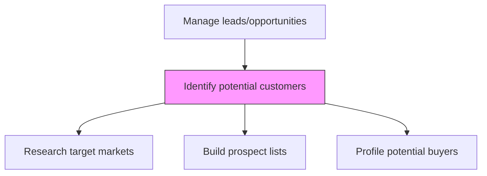
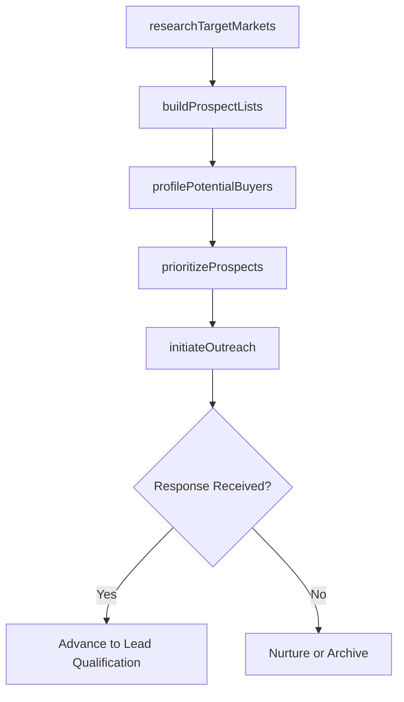

# Identify potential customers

> Business-as-Code definition for potential customer identification. Models the prospecting process of discovering, researching, and profiling potential customers using market data, professional networks, and business intelligence databases.

## Overview

Identifying people who can be converted into customers. Leverage personal and professional networks, business research over databases and directories, and secondary research.

## Process Hierarchy



## GraphDL

```yaml
identify:
  object: Potential Customers
  actor: SalesDevelopmentRep
  result: ProspectList
```

## Actions

| Action | Description |
|--------|-------------|
| researchTargetMarkets | Survey market segments to identify organizations matching the ideal customer profile |
| buildProspectLists | Compile lists of potential customers from databases, directories, and professional networks |
| profilePotentialBuyers | Create detailed profiles of prospects including firmographics and buying signals |
| prioritizeProspects | Rank prospects based on fit, intent, and revenue potential |
| initiateOutreach | Execute initial contact campaigns to engage high-priority prospects |

## Events

| Event | Description |
|-------|-------------|
| targetMarketsResearched | Market segments surveyed and target criteria defined |
| prospectListsBuilt | Prospect lists compiled and enriched with contact data |
| potentialBuyersProfiled | Prospect profiles created with firmographic and behavioral data |
| prospectsPrioritized | Prospects ranked by fit and potential value |
| outreachInitiated | Initial contact campaigns launched to priority prospects |

## Searches

| Search | Description |
|--------|-------------|
| getProspectList | Retrieve prospect lists filtered by market segment or priority |
| getProspectProfile | Access detailed profile for a specific prospect |
| getTargetMarkets | Query defined target market segments and criteria |

## Process Flow



## RACI Matrix

| Activity | Responsible | Accountable | Consulted | Informed |
|----------|-------------|-------------|-----------|----------|
| researchTargetMarkets | SalesDevelopmentRep | SalesDevelopmentManager | Marketing | Strategy |
| buildProspectLists | SalesDevelopmentRep | SalesDevelopmentManager | MarketingOps | IT |
| profilePotentialBuyers | SalesDevelopmentRep | SalesDevelopmentManager | Marketing | ProductManagement |
| prioritizeProspects | SalesDevelopmentManager | VP Sales | SalesOperations | Marketing |

## Related Processes

| Process | Relationship |
|---------|-------------|
| 3.5.1.2 Identify/receive leads/opportunities | Downstream - identified prospects become leads |
| 3.1.1 Perform customer and market intelligence analysis | Upstream - market intelligence informs prospecting |
| 3.3.3 Design and execute brand and product marketing programs | Parallel - marketing campaigns generate inbound prospects |

## Related Departments

| Department | Role |
|-----------|------|
| Sales Development | Executes prospecting and outreach activities |
| Marketing | Provides market intelligence and inbound lead flow |
| Sales Operations | Maintains CRM and prospect data infrastructure |
| Strategy | Defines ideal customer profile and target market criteria |

## Related Occupations

| Occupation | Involvement |
|-----------|-------------|
| Sales Development Representative | Researches and contacts potential customers |
| Market Research Analyst | Provides market segmentation data for prospecting |
| Business Development Manager | Identifies strategic prospect opportunities |

## KPIs

| KPI | Description | Unit |
|-----|-------------|------|
| Prospect Volume | Number of new prospects identified per period | Count |
| Prospect-to-Lead Conversion | Percentage of prospects advancing to lead status | % |
| Outreach Response Rate | Percentage of prospects responding to initial contact | % |

## Usage

```typescript
import { identifyPotentialCustomers } from '@headlessly/identify-potential-customers'

const prospecting = identifyPotentialCustomers()

// Build prospect list from target market
const prospects = await prospecting.buildProspectLists({
  targetMarket: 'enterprise-saas',
  firmographics: { minRevenue: 10000000, industries: ['technology', 'finance'] },
  sources: ['database', 'linkedin', 'industry-directories']
})

// Prioritize prospects
const prioritized = await prospecting.prioritizeProspects({
  prospects: prospects.map(p => p.id),
  criteria: ['fit-score', 'intent-signals', 'deal-size-potential']
})
```
